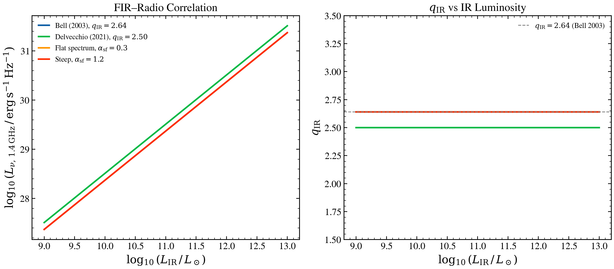

.. DO NOT EDIT.
.. THIS FILE WAS AUTOMATICALLY GENERATED BY SPHINX-GALLERY.
.. TO MAKE CHANGES, EDIT THE SOURCE PYTHON FILE:
.. "auto_examples/multiwavelength/plot_fir_radio_correlation.py"
.. LINE NUMBERS ARE GIVEN BELOW.

.. only:: html

    .. note::
        :class: sphx-glr-download-link-note

        :ref:`Go to the end <sphx_glr_download_auto_examples_multiwavelength_plot_fir_radio_correlation.py>`
        to download the full example code.

.. rst-class:: sphx-glr-example-title

.. _sphx_glr_auto_examples_multiwavelength_plot_fir_radio_correlation.py:

FIR–radio correlation across IR luminosity and spectral shape
==============================================================

The FIR–radio correlation (van der Kruit 1971; Helou et al. 1985)
holds over five decades in galaxy luminosity. Sweeps IR luminosity
and radio spectral index to show the tight linear correlation and
how the empirical parameter q_IR varies with model calibration.

.. GENERATED FROM PYTHON SOURCE LINES 10-74

.. code-block:: Python

    import warnings

    import jax.numpy as jnp
    import matplotlib.pyplot as plt
    import numpy as np

    import tengri
    from tengri.analysis.plotting import setup_style

    setup_style()
    warnings.filterwarnings("ignore", message=".*BakedInBackend.*")

    # 1.4 GHz reference wavelength
    c_light = 2.99792458e18
    nu_1p4ghz = 1.4e9
    wave_1p4ghz = c_light / nu_1p4ghz

    # Sweep IR luminosity
    log_lir_lsun = np.linspace(9, 13, 60)
    l_sun_erg = 3.839e33
    l_ir_erg = 10**log_lir_lsun * l_sun_erg

    # Radio calibrations
    calibrations = [
        {"label": r"Bell (2003)", "q_ir": 2.64, "alpha": 0.8, "color": "C0"},
        {"label": r"Delvecchio (2021)", "q_ir": 2.50, "alpha": 0.8, "color": "C1"},
        {"label": r"Flat ($\alpha=0.3$)", "q_ir": 2.64, "alpha": 0.3, "color": "C2"},
        {"label": r"Steep ($\alpha=1.2$)", "q_ir": 2.64, "alpha": 1.2, "color": "C3"},
    ]

    fig, (ax_corr, ax_qir) = plt.subplots(1, 2, figsize=(11, 5.2))

    wave_ref = jnp.array([wave_1p4ghz])

    for cal in calibrations:
        l_radio_arr = []
        for lir in l_ir_erg:
            l_nu = tengri.radio.radio_star_forming(
                wave_ref, L_ir=float(lir), q_ir=cal["q_ir"], alpha_sf=cal["alpha"]
            )
            l_radio_arr.append(float(np.asarray(l_nu).ravel()[0]))
        l_radio = np.array(l_radio_arr)

        # Correlation: L_radio vs L_IR
        log_l_radio = np.log10(np.maximum(l_radio, 1e10))
        ax_corr.plot(log_lir_lsun, log_l_radio, color=cal["color"], lw=2.0, label=cal["label"])

        # q_IR parameter
        log_l_ir_erg = np.log10(l_ir_erg)
        q_ir_vals = log_l_ir_erg - np.log10(3.75e12) - log_l_radio
        ax_qir.plot(log_lir_lsun, q_ir_vals, color=cal["color"], lw=2.0)

    ax_corr.set_xlabel(r"$\log_{10}(L_{\rm IR}\,/\,L_\odot)$")
    ax_corr.set_ylabel(r"$\log_{10}(L_{\nu,\,1.4\,{\rm GHz}}\,/\,{\rm erg\,s^{-1}\,Hz^{-1}})$")
    ax_corr.legend(frameon=False, fontsize=9)

    ax_qir.axhline(2.64, color="0.5", ls="--", lw=1.0)
    ax_qir.set_xlabel(r"$\log_{10}(L_{\rm IR}\,/\,L_\odot)$")
    ax_qir.set_ylabel(r"$q_{\rm IR}$")
    ax_qir.set_ylim(1.5, 3.5)

    fig.tight_layout()
    plt.savefig("plot_fir_radio_correlation.png", dpi=150, bbox_inches="tight")

.. _sphx_glr_download_auto_examples_multiwavelength_plot_fir_radio_correlation.py:

.. only:: html

  .. container:: sphx-glr-footer sphx-glr-footer-example

    .. container:: sphx-glr-download sphx-glr-download-jupyter

      :download:`Download Jupyter notebook: plot_fir_radio_correlation.ipynb <plot_fir_radio_correlation.ipynb>`

    .. container:: sphx-glr-download sphx-glr-download-python

      :download:`Download Python source code: plot_fir_radio_correlation.py <plot_fir_radio_correlation.py>`

    .. container:: sphx-glr-download sphx-glr-download-zip

      :download:`Download zipped: plot_fir_radio_correlation.zip <plot_fir_radio_correlation.zip>`

.. only:: html

 .. rst-class:: sphx-glr-signature

    `Gallery generated by Sphinx-Gallery <https://sphinx-gallery.github.io>`_
