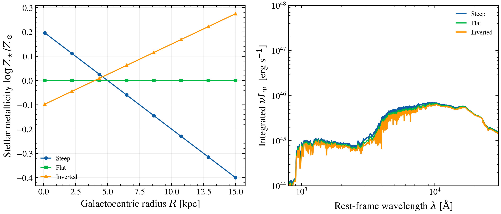

.. DO NOT EDIT.
.. THIS FILE WAS AUTOMATICALLY GENERATED BY SPHINX-GALLERY.
.. TO MAKE CHANGES, EDIT THE SOURCE PYTHON FILE:
.. "auto_examples/multiwavelength/plot_metallicity_radial_gradient.py"
.. LINE NUMBERS ARE GIVEN BELOW.

.. only:: html

    .. note::
        :class: sphx-glr-download-link-note

        :ref:`Go to the end <sphx_glr_download_auto_examples_multiwavelength_plot_metallicity_radial_gradient.py>`
        to download the full example code.

.. rst-class:: sphx-glr-example-title

.. _sphx_glr_auto_examples_multiwavelength_plot_metallicity_radial_gradient.py:

Radial metallicity gradients and integrated-light SED
======================================================

Spiral galaxies exhibit radial metallicity gradients: metal-rich centres
and metal-poor discs (e.g. NGC 891, Searle 1971). three common gradient scenarios—steep positive, flat, and inverted
depletion—reshape the integrated SED when weighted by disc area.

Left panel: metallicity profile Z(R) for a radial grid from 0–15 kpc.
Right panel: integrated nu*L_nu for each scenario, computed by summing
SEDs from annular zones weighted by 2*pi*R*dR (exponential disc).

Each annulus uses an identical SFH, varying only stellar metallicity per
the gradient. The colour shift between gradients illustrates how central
metal enrichment (stellar line blanketing) affects the integrated UV-optical.

Reference: Searle, L. 1971, ApJ, 168, 327 (radial gradients in galaxies);
Henry, R. B. C., & Worthey, G. 1999, PASP, 111, 919 (abundance gradients).

.. GENERATED FROM PYTHON SOURCE LINES 20-168

.. image-sg:: /auto_examples/multiwavelength/images/sphx_glr_plot_metallicity_radial_gradient_001.png
   :alt: plot metallicity radial gradient
   :srcset: /auto_examples/multiwavelength/images/sphx_glr_plot_metallicity_radial_gradient_001.png
   :class: sphx-glr-single-img

.. code-block:: Python

    import os

    os.environ["TF_CPP_MIN_LOG_LEVEL"] = "2"  # suppress XLA/PjRt C++ INFO+WARNING logs

    import warnings

    import jax
    import jax.numpy as jnp
    import matplotlib.pyplot as plt
    import numpy as np

    import tengri
    from tengri.analysis.plotting import setup_style

    setup_style()
    warnings.filterwarnings("ignore", message=".*BakedInBackend.*")

    ssp = tengri.load_ssp("fsps_prsc_miles_chabrier")

    base_model_config = dict(
        sfh={
            "type": "dpl",
            "*": tengri.FIXED,
            "alpha": 2.0,
            "beta": 2.5,
            "tau_gyr": 1.5,
            "log_total_mass": 10.0,
        },
        dust={
            "type": "two_component",
            "*": tengri.FIXED,
            "tau_bc": 0.3,
            "tau_diff": 0.2,
        },
        redshift=tengri.Fixed(0.05),
    )

    n_annuli = 8
    r_grid_kpc = np.linspace(0.1, 15.0, n_annuli)
    dr_kpc = r_grid_kpc[1] - r_grid_kpc[0]

    def metallicity_profile(r_kpc, scenario):
        """
        Radial metallicity profile [dex relative to solar].

        Parameters
        ----------
        r_kpc : float
            Galactocentric radius in kpc.
        scenario : str
            Profile variant: 'steep' (NGC 891-like), 'flat', or 'inverted'.

        Returns
        -------
        met_logzsol : float
            log10(Z_* / Z_sun) at radius r_kpc.
        """
        if scenario == "steep":
            return 0.2 - 0.04 * r_kpc
        elif scenario == "flat":
            return 0.0
        elif scenario == "inverted":
            return -0.1 + 0.025 * r_kpc
        else:
            raise ValueError(f"Unknown scenario: {scenario}")

    def compute_integrated_sed(scenario):
        """
        Integrate SED across radial annuli weighted by disc area.

        For each annulus at radius r, build a SEDModel with met_logzsol
        from the radial profile, compute its rest-frame SED, and sum with
        weight 2*pi*r*dr (exponential disc geometry).

        Parameters
        ----------
        scenario : str
            Metallicity profile scenario.

        Returns
        -------
        wave : ndarray, shape (n_wave,)
            Rest-frame wavelengths [Å].
        sed_integrated : ndarray, shape (n_wave,)
            Integrated nu*L_nu [erg s^-1], summed over annuli.
        """
        wave_ref = None
        sed_sum = None

        for i, r in enumerate(r_grid_kpc):
            met_logzsol = metallicity_profile(r, scenario)
            model = tengri.SEDModel.build(ssp, **base_model_config)
            params = dict(model.spec.sample(jax.random.PRNGKey(i)))
            params["met_logzsol"] = jnp.float64(met_logzsol)

            out = model.predict_rest_sed(params)
            wave = np.asarray(out.wavelength)
            sed = np.asarray(out.sed)

            if wave_ref is None:
                wave_ref = wave
                sed_sum = np.zeros_like(wave_ref)

            nu = 2.998e18 / wave_ref
            nu_l_nu = nu * sed
            weight = 2.0 * np.pi * r * dr_kpc
            sed_sum = sed_sum + nu_l_nu * weight

        return wave_ref, sed_sum

    z_profile_steep = np.array([metallicity_profile(r, "steep") for r in r_grid_kpc])
    z_profile_flat = np.array([metallicity_profile(r, "flat") for r in r_grid_kpc])
    z_profile_inverted = np.array([metallicity_profile(r, "inverted") for r in r_grid_kpc])

    sed_steep, _ = compute_integrated_sed("steep")
    sed_integrated_steep = _

    wave, sed_integrated_flat = compute_integrated_sed("flat")
    _, sed_integrated_inverted = compute_integrated_sed("inverted")

    fig, (ax_left, ax_right) = plt.subplots(1, 2, figsize=(10.0, 4.5))

    ax_left.plot(r_grid_kpc, z_profile_steep, "o-", lw=1.4, ms=4.0, label="Steep")
    ax_left.plot(r_grid_kpc, z_profile_flat, "s-", lw=1.4, ms=4.0, label="Flat")
    ax_left.plot(r_grid_kpc, z_profile_inverted, "^-", lw=1.4, ms=4.0, label="Inverted")

    ax_left.set_xlabel(r"Galactocentric radius $R$ [kpc]")
    ax_left.set_ylabel(r"Stellar metallicity $\log Z_\star / Z_\odot$")
    ax_left.grid(True, alpha=0.2)
    ax_left.legend(frameon=False, fontsize=9)

    ax_right.loglog(wave, sed_integrated_steep, lw=1.6, label="Steep")
    ax_right.loglog(wave, sed_integrated_flat, lw=1.6, label="Flat")
    ax_right.loglog(wave, sed_integrated_inverted, lw=1.6, label="Inverted")

    ax_right.set_xlim(800, 3e4)
    ax_right.set_ylim(1e44, 1e48)
    ax_right.set_xlabel(r"Rest-frame wavelength $\lambda$ [$\mathrm{\AA}$]")
    ax_right.set_ylabel(r"Integrated $\nu L_\nu$  [erg s$^{-1}$]")
    ax_right.legend(frameon=False, fontsize=9)

    fig.tight_layout()
    plt.savefig("plot_metallicity_radial_gradient.png", dpi=150, bbox_inches="tight")

.. _sphx_glr_download_auto_examples_multiwavelength_plot_metallicity_radial_gradient.py:

.. only:: html

  .. container:: sphx-glr-footer sphx-glr-footer-example

    .. container:: sphx-glr-download sphx-glr-download-jupyter

      :download:`Download Jupyter notebook: plot_metallicity_radial_gradient.ipynb <plot_metallicity_radial_gradient.ipynb>`

    .. container:: sphx-glr-download sphx-glr-download-python

      :download:`Download Python source code: plot_metallicity_radial_gradient.py <plot_metallicity_radial_gradient.py>`

    .. container:: sphx-glr-download sphx-glr-download-zip

      :download:`Download zipped: plot_metallicity_radial_gradient.zip <plot_metallicity_radial_gradient.zip>`

.. only:: html

 .. rst-class:: sphx-glr-signature

    `Gallery generated by Sphinx-Gallery <https://sphinx-gallery.github.io>`_
