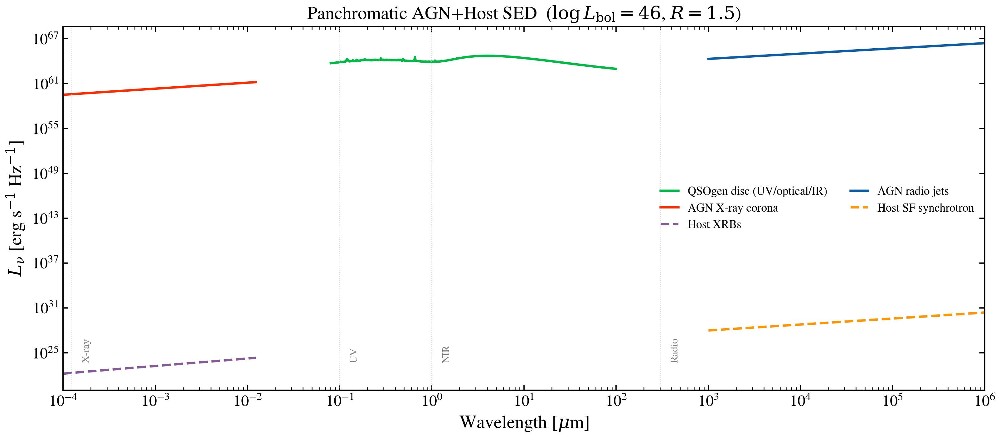

.. DO NOT EDIT.
.. THIS FILE WAS AUTOMATICALLY GENERATED BY SPHINX-GALLERY.
.. TO MAKE CHANGES, EDIT THE SOURCE PYTHON FILE:
.. "auto_examples/multiwavelength/plot_panchromatic_agn.py"
.. LINE NUMBERS ARE GIVEN BELOW.

.. only:: html

    .. note::
        :class: sphx-glr-download-link-note

        :ref:`Go to the end <sphx_glr_download_auto_examples_multiwavelength_plot_panchromatic_agn.py>`
        to download the full example code.

.. rst-class:: sphx-glr-example-title

.. _sphx_glr_auto_examples_multiwavelength_plot_panchromatic_agn.py:

X-ray to radio SED of a luminous AGN
====================================

Panchromatic SED spanning hard X-rays through centimeter radio of a
luminous quasar with radio-loud jets. Combines AGN disc continuum,
X-ray corona, and radio components, showing how AGN dominate across
0.1 keV through centimeter wavelengths.

.. GENERATED FROM PYTHON SOURCE LINES 10-81

.. code-block:: Python

    import os

    os.environ["TF_CPP_MIN_LOG_LEVEL"] = "2"  # suppress XLA/PjRt C++ INFO+WARNING logs

    import warnings

    import jax.numpy as jnp
    import matplotlib.pyplot as plt
    import numpy as np

    import tengri
    from tengri.analysis.plotting import setup_style

    setup_style()

    warnings.filterwarnings("ignore", message=".*BakedInBackend.*")

    # Wavelength grid: hard X-ray to radio
    wave = jnp.logspace(0, 10, 3000)
    wave_um = np.array(wave) / 1e4

    # Physical parameters: typical radio-loud AGN
    log_lbol_lsun = 46.0
    l_agn_bol_erg = 10**log_lbol_lsun * 3.839e33
    sfr = 30.0
    stellar_mass = 5e10
    l_ir = 3e11 * 3.839e33
    radio_loudness = 1.5

    # AGN disc (QSOgen)
    wave_uv = wave[(wave >= 800) & (wave <= 1e6)]
    l_disc = np.array(
        tengri.components.agn.compute_qsogen_sed(jnp.asarray(wave_uv), agn_log_lbol=log_lbol_lsun)
    )

    # X-ray: AGN corona + host XRBs
    l_xray_agn = np.array(tengri.xray.xray_agn_corona(wave, L_agn_bol=l_agn_bol_erg))
    l_xrb = np.array(tengri.xray.xray_xrb(wave, sfr=sfr, stellar_mass=stellar_mass))

    # Radio: AGN jets + host star formation
    l_radio_agn = np.array(
        tengri.radio.radio_agn(wave, L_agn_bol=l_agn_bol_erg, radio_loudness=radio_loudness)
    )
    l_radio_sf = np.array(tengri.radio.radio_star_forming(wave, L_ir=l_ir, alpha_sf=0.8))

    fig, ax = plt.subplots(figsize=(11, 5.2))

    # Plot components
    components = [
        (np.array(wave_uv) / 1e4, l_disc, "C1", "-", "QSOgen disc"),
        (wave_um, l_xray_agn, "C3", "-", "AGN X-ray"),
        (wave_um, l_xrb, "C4", "--", "Host XRBs"),
        (wave_um, l_radio_agn, "C0", "-", "AGN radio jets"),
        (wave_um, l_radio_sf, "C2", "--", "Host radio"),
    ]

    for ww, ll, color, ls, label in components:
        mask = ll > 0
        if not np.any(mask):
            continue
        ax.loglog(ww[mask], ll[mask], color=color, ls=ls, lw=1.8, label=label)

    ax.set_xlim(1e-4, 1e6)
    ax.set_xlabel(r"Rest-frame wavelength $\lambda$ [$\mu$m]")
    ax.set_ylabel(r"$L_\nu$ [erg s$^{-1}$ Hz$^{-1}$]")
    ax.legend(frameon=False, fontsize=9, ncol=2)

    fig.tight_layout()
    plt.savefig("plot_panchromatic_agn.png", dpi=150, bbox_inches="tight")

.. _sphx_glr_download_auto_examples_multiwavelength_plot_panchromatic_agn.py:

.. only:: html

  .. container:: sphx-glr-footer sphx-glr-footer-example

    .. container:: sphx-glr-download sphx-glr-download-jupyter

      :download:`Download Jupyter notebook: plot_panchromatic_agn.ipynb <plot_panchromatic_agn.ipynb>`

    .. container:: sphx-glr-download sphx-glr-download-python

      :download:`Download Python source code: plot_panchromatic_agn.py <plot_panchromatic_agn.py>`

    .. container:: sphx-glr-download sphx-glr-download-zip

      :download:`Download zipped: plot_panchromatic_agn.zip <plot_panchromatic_agn.zip>`

.. only:: html

 .. rst-class:: sphx-glr-signature

    `Gallery generated by Sphinx-Gallery <https://sphinx-gallery.github.io>`_
