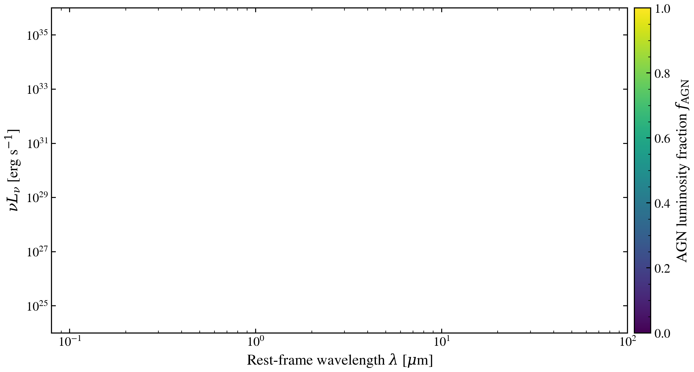

.. DO NOT EDIT.
.. THIS FILE WAS AUTOMATICALLY GENERATED BY SPHINX-GALLERY.
.. TO MAKE CHANGES, EDIT THE SOURCE PYTHON FILE:
.. "auto_examples/multiwavelength/plot_panchromatic_agn_fraction.py"
.. LINE NUMBERS ARE GIVEN BELOW.

.. only:: html

    .. note::
        :class: sphx-glr-download-link-note

        :ref:`Go to the end <sphx_glr_download_auto_examples_multiwavelength_plot_panchromatic_agn_fraction.py>`
        to download the full example code.

.. rst-class:: sphx-glr-example-title

.. _sphx_glr_auto_examples_multiwavelength_plot_panchromatic_agn_fraction.py:

Blending star-forming galaxy and AGN accretion disc continua
=============================================================

Active galactic nuclei dominate UV to infrared SEDs. Sweeps AGN
luminosity fraction from pure starburst to pure AGN, showing the
transition in SED morphology as the accretion disc continuum
increasingly dominates stellar and dust emission.

.. GENERATED FROM PYTHON SOURCE LINES 10-92

.. code-block:: Python

    import warnings

    import jax
    import jax.numpy as jnp
    import matplotlib.pyplot as plt
    import numpy as np

    import tengri
    from tengri.analysis.plotting import setup_style

    setup_style()
    warnings.filterwarnings("ignore", message=".*BakedInBackend.*")

    ssp = tengri.load_ssp()
    model = tengri.SEDModel.build(
        ssp,
        sfh={
            "type": "dpl",
            "*": tengri.FIXED,
            "alpha": 2.0,
            "beta": 2.5,
            "tau_gyr": 1.0,
            "log_peak_sfr": 1.0,
        },
        dust={
            "type": "two_component",
            "*": tengri.FIXED,
            "tau_bc": 0.3,
            "tau_diff": 0.2,
            "emission": {"type": "dale2014", "*": tengri.FIXED},
        },
        redshift=tengri.Fixed(0.05),
    )

    baseline = dict(model.spec.sample(jax.random.PRNGKey(42)))
    out_star = model.predict_rest_sed(baseline)
    wave = np.asarray(out_star.wavelength)
    sed_stellar = np.asarray(out_star.sed)
    wave_um = wave / 1e4

    # AGN continuum at fixed L_bol
    log_lbol_agn = 11.0
    sed_agn = np.array(
        tengri.components.agn.compute_qsogen_sed(jnp.asarray(wave), agn_log_lbol=log_lbol_agn)
    )

    # Normalize AGN to match stellar luminosity scale
    agn_peak = np.nanmax(sed_agn[sed_agn > 0])
    stellar_peak = np.nanmax(sed_stellar[sed_stellar > 0])
    sed_agn_norm = sed_agn * (stellar_peak / agn_peak)

    # AGN fractions to sweep
    agn_fracs = np.array([0.0, 0.1, 0.3, 0.5, 0.8, 1.0])
    cmap = plt.get_cmap("viridis")
    norm = plt.Normalize(vmin=agn_fracs.min(), vmax=agn_fracs.max())

    fig, ax = plt.subplots(figsize=(10, 5.2))

    for agn_frac in agn_fracs:
        sed_composite = (1.0 - agn_frac) * sed_stellar + agn_frac * sed_agn_norm
        nu = 2.998e18 / wave
        nu_l_nu = nu * sed_composite

        mask = sed_composite > 0
        ax.loglog(
            wave_um[mask],
            nu_l_nu[mask],
            color=cmap(norm(agn_frac)),
            lw=2.0,
        )

    ax.set_xlim(0.08, 1e2)
    ax.set_ylim(1e24, 1e36)
    ax.set_xlabel(r"Rest-frame wavelength $\lambda$ [$\mu$m]")
    ax.set_ylabel(r"$\nu L_\nu$ [erg s$^{-1}$]")

    cbar = fig.colorbar(plt.cm.ScalarMappable(norm=norm, cmap=cmap), ax=ax, pad=0.01)
    cbar.set_label(r"AGN luminosity fraction $f_{\rm AGN}$")

    fig.tight_layout()
    plt.savefig("plot_panchromatic_agn_fraction.png", dpi=150, bbox_inches="tight")

.. _sphx_glr_download_auto_examples_multiwavelength_plot_panchromatic_agn_fraction.py:

.. only:: html

  .. container:: sphx-glr-footer sphx-glr-footer-example

    .. container:: sphx-glr-download sphx-glr-download-jupyter

      :download:`Download Jupyter notebook: plot_panchromatic_agn_fraction.ipynb <plot_panchromatic_agn_fraction.ipynb>`

    .. container:: sphx-glr-download sphx-glr-download-python

      :download:`Download Python source code: plot_panchromatic_agn_fraction.py <plot_panchromatic_agn_fraction.py>`

    .. container:: sphx-glr-download sphx-glr-download-zip

      :download:`Download zipped: plot_panchromatic_agn_fraction.zip <plot_panchromatic_agn_fraction.zip>`

.. only:: html

 .. rst-class:: sphx-glr-signature

    `Gallery generated by Sphinx-Gallery <https://sphinx-gallery.github.io>`_
