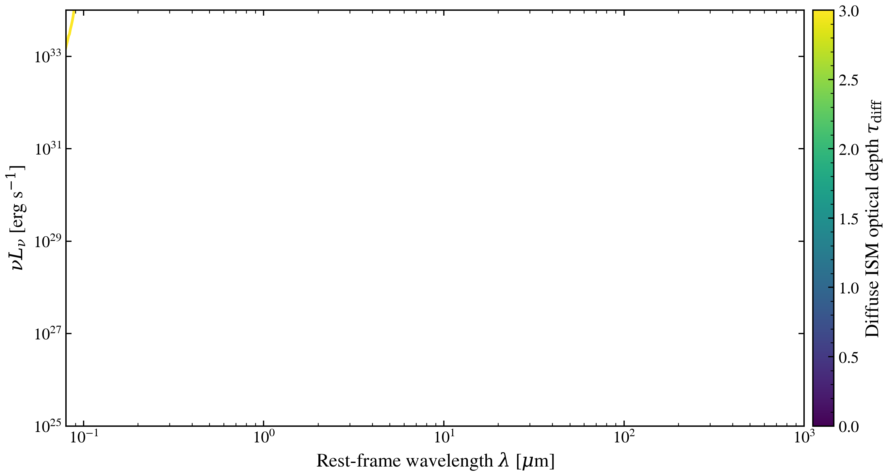

.. DO NOT EDIT.
.. THIS FILE WAS AUTOMATICALLY GENERATED BY SPHINX-GALLERY.
.. TO MAKE CHANGES, EDIT THE SOURCE PYTHON FILE:
.. "auto_examples/multiwavelength/plot_panchromatic_dust_balance.py"
.. LINE NUMBERS ARE GIVEN BELOW.

.. only:: html

    .. note::
        :class: sphx-glr-download-link-note

        :ref:`Go to the end <sphx_glr_download_auto_examples_multiwavelength_plot_panchromatic_dust_balance.py>`
        to download the full example code.

.. rst-class:: sphx-glr-example-title

.. _sphx_glr_auto_examples_multiwavelength_plot_panchromatic_dust_balance.py:

UV attenuation and infrared re-emission balance dust energy
===========================================================

Dust absorbs UV and optical photons and re-emits at infrared wavelengths.
Sweeping diffuse ISM optical depth τ_diff shows how UV absorption
transfers energy into the infrared, demonstrating energy conservation
between the attenuation and emission components.

.. GENERATED FROM PYTHON SOURCE LINES 10-84

.. code-block:: Python

    import os

    os.environ["TF_CPP_MIN_LOG_LEVEL"] = "2"  # suppress XLA/PjRt C++ INFO+WARNING logs

    import warnings

    import jax
    import jax.numpy as jnp
    import matplotlib.pyplot as plt
    import numpy as np

    import tengri
    from tengri.analysis.plotting import setup_style

    setup_style()
    warnings.filterwarnings("ignore", message=".*BakedInBackend.*")

    ssp = tengri.load_ssp()
    model = tengri.SEDModel.build(
        ssp,
        sfh={
            "type": "dpl",
            "*": tengri.FIXED,
            "alpha": 2.0,
            "beta": 2.5,
            "tau_gyr": 1.0,
            "log_total_mass": 10.0,
        },
        dust={
            "type": "two_component",
            "*": tengri.FIXED,
            "tau_bc": 0.5,
            "tau_diff": tengri.Uniform(0.0, 3.0),
            "emission": {"type": "dale2014", "*": tengri.FIXED},
        },
        redshift=tengri.Fixed(0.05),
    )

    baseline = dict(model.spec.sample(jax.random.PRNGKey(42)))

    # Dust optical depths to sweep
    tau_diffs = np.array([0.0, 0.3, 0.7, 1.5, 3.0])
    cmap = plt.get_cmap("viridis")
    norm = plt.Normalize(vmin=tau_diffs.min(), vmax=tau_diffs.max())

    fig, ax = plt.subplots(figsize=(10, 5.2))

    for tau_diff in tau_diffs:
        params = {**baseline, "dust_tau_diff": jnp.float64(tau_diff)}
        out = model.predict_rest_sed(params)
        wave = np.asarray(out.wavelength)
        sed = np.asarray(out.sed)
        nu = 2.998e18 / wave
        nu_l_nu = nu * sed

        mask = sed > 0
        ax.loglog(
            wave[mask] / 1e4,
            nu_l_nu[mask],
            color=cmap(norm(tau_diff)),
            lw=2.0,
        )

    ax.set_xlim(0.08, 1e3)
    ax.set_ylim(1e25, 1e34)
    ax.set_xlabel(r"Rest-frame wavelength $\lambda$ [$\mu$m]")
    ax.set_ylabel(r"$\nu L_\nu$ [erg s$^{-1}$]")

    cbar = fig.colorbar(plt.cm.ScalarMappable(norm=norm, cmap=cmap), ax=ax, pad=0.01)
    cbar.set_label(r"Diffuse ISM optical depth $\tau_{\rm diff}$")

    fig.tight_layout()
    plt.savefig("plot_panchromatic_dust_balance.png", dpi=150, bbox_inches="tight")

.. _sphx_glr_download_auto_examples_multiwavelength_plot_panchromatic_dust_balance.py:

.. only:: html

  .. container:: sphx-glr-footer sphx-glr-footer-example

    .. container:: sphx-glr-download sphx-glr-download-jupyter

      :download:`Download Jupyter notebook: plot_panchromatic_dust_balance.ipynb <plot_panchromatic_dust_balance.ipynb>`

    .. container:: sphx-glr-download sphx-glr-download-python

      :download:`Download Python source code: plot_panchromatic_dust_balance.py <plot_panchromatic_dust_balance.py>`

    .. container:: sphx-glr-download sphx-glr-download-zip

      :download:`Download zipped: plot_panchromatic_dust_balance.zip <plot_panchromatic_dust_balance.zip>`

.. only:: html

 .. rst-class:: sphx-glr-signature

    `Gallery generated by Sphinx-Gallery <https://sphinx-gallery.github.io>`_
