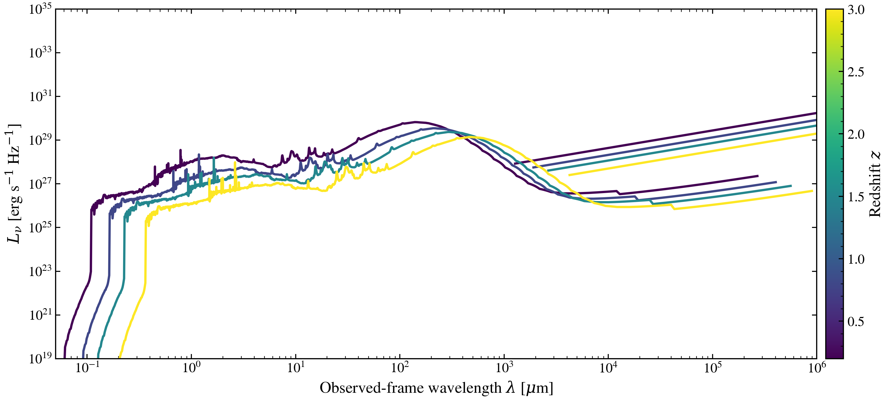

.. DO NOT EDIT.
.. THIS FILE WAS AUTOMATICALLY GENERATED BY SPHINX-GALLERY.
.. TO MAKE CHANGES, EDIT THE SOURCE PYTHON FILE:
.. "auto_examples/multiwavelength/plot_panchromatic_redshift_sweep.py"
.. LINE NUMBERS ARE GIVEN BELOW.

.. only:: html

    .. note::
        :class: sphx-glr-download-link-note

        :ref:`Go to the end <sphx_glr_download_auto_examples_multiwavelength_plot_panchromatic_redshift_sweep.py>`
        to download the full example code.

.. rst-class:: sphx-glr-example-title

.. _sphx_glr_auto_examples_multiwavelength_plot_panchromatic_redshift_sweep.py:

Rest-to-observer-frame transformation of panchromatic SEDs with redshift
=========================================================================

Same galaxy rest-frame panchromatic SED (UV through radio) observed at
increasing redshifts. Cosmological redshift transforms rest-frame wavelengths
and dims luminosity, shifting spectral features to infrared bands at high
redshift where ground-based surveys probe star formation epochs.

.. GENERATED FROM PYTHON SOURCE LINES 10-105

.. code-block:: Python

    import warnings

    import jax
    import jax.numpy as jnp
    import matplotlib.pyplot as plt
    import numpy as np

    import tengri
    from tengri.analysis.plotting import setup_style

    setup_style()
    warnings.filterwarnings("ignore", message=".*BakedInBackend.*")

    ssp = tengri.load_ssp()

    # Redshifts to sweep
    redshifts = np.array([0.2, 0.8, 1.5, 3.0])
    cmap = plt.get_cmap("viridis")
    norm = plt.Normalize(vmin=redshifts.min(), vmax=redshifts.max())

    fig, ax = plt.subplots(figsize=(12, 5.2))

    key = jax.random.PRNGKey(0)

    for z in redshifts:
        model = tengri.SEDModel.build(
            ssp,
            sfh={
                "type": "dpl",
                "*": tengri.FIXED,
                "alpha": 2.0,
                "beta": 2.5,
                "tau_gyr": 1.5,
                "log_peak_sfr": 1.2,
            },
            dust={
                "type": "two_component",
                "*": tengri.FIXED,
                "tau_bc": 0.5,
                "tau_diff": 0.3,
                "emission": {"type": "dale2014", "*": tengri.FIXED},
            },
            redshift=tengri.Fixed(z),
        )

        baseline = dict(model.spec.sample(key))
        params = {**baseline}

        # Predict rest-frame SED
        out = model.predict_rest_sed(params)
        wave_rest = np.asarray(out.wavelength)
        sed_rest = np.asarray(out.sed)

        # Shift to observed frame
        wave_obs_um = (wave_rest / 1e4) * (1 + z)
        l_nu_obs = sed_rest / (1 + z)

        # Radio component (rest-frame)
        wave_radio_rest = jnp.logspace(7, 11, 150)
        l_ir_erg = 3e11 * 3.839e33
        l_radio_rest = np.array(
            tengri.radio.radio_star_forming(wave_radio_rest, L_ir=l_ir_erg, alpha_sf=0.8)
        )
        wave_radio_obs_um = (wave_radio_rest / 1e4) * (1 + z)
        l_radio_obs = l_radio_rest / (1 + z)

        # Plot stellar + dust SED
        mask = sed_rest > 0
        ax.loglog(
            wave_obs_um[mask],
            l_nu_obs[mask],
            lw=2.0,
            color=cmap(norm(z)),
        )

        # Plot radio component
        mask_r = l_radio_rest > 0
        ax.loglog(
            wave_radio_obs_um[mask_r],
            l_radio_obs[mask_r],
            lw=2.0,
            color=cmap(norm(z)),
        )

    ax.set_xlim(0.05, 1e6)
    ax.set_ylim(1e19, 1e35)
    ax.set_xlabel(r"Observed-frame wavelength $\lambda$ [$\mu$m]")
    ax.set_ylabel(r"$L_\nu$ [erg s$^{-1}$ Hz$^{-1}$]")

    cbar = fig.colorbar(plt.cm.ScalarMappable(norm=norm, cmap=cmap), ax=ax, pad=0.01)
    cbar.set_label(r"Redshift $z$")

    fig.tight_layout()
    fig.savefig("plot_panchromatic_redshift_sweep.png", dpi=150, bbox_inches="tight")

.. _sphx_glr_download_auto_examples_multiwavelength_plot_panchromatic_redshift_sweep.py:

.. only:: html

  .. container:: sphx-glr-footer sphx-glr-footer-example

    .. container:: sphx-glr-download sphx-glr-download-jupyter

      :download:`Download Jupyter notebook: plot_panchromatic_redshift_sweep.ipynb <plot_panchromatic_redshift_sweep.ipynb>`

    .. container:: sphx-glr-download sphx-glr-download-python

      :download:`Download Python source code: plot_panchromatic_redshift_sweep.py <plot_panchromatic_redshift_sweep.py>`

    .. container:: sphx-glr-download sphx-glr-download-zip

      :download:`Download zipped: plot_panchromatic_redshift_sweep.zip <plot_panchromatic_redshift_sweep.zip>`

.. only:: html

 .. rst-class:: sphx-glr-signature

    `Gallery generated by Sphinx-Gallery <https://sphinx-gallery.github.io>`_
