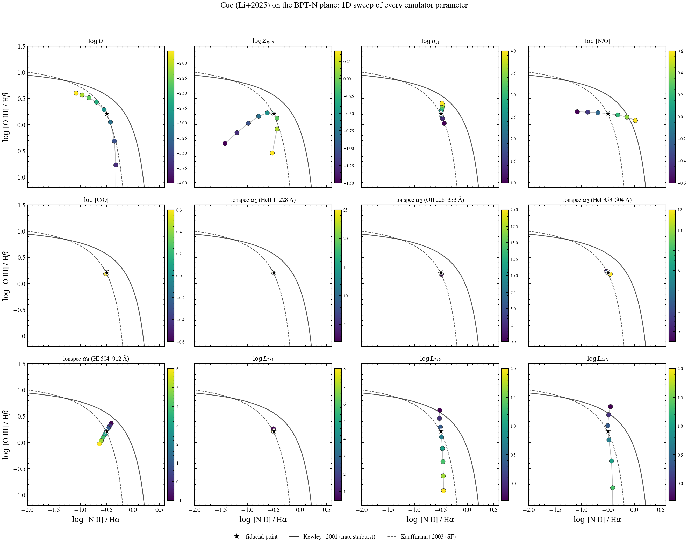

.. DO NOT EDIT.
.. THIS FILE WAS AUTOMATICALLY GENERATED BY SPHINX-GALLERY.
.. TO MAKE CHANGES, EDIT THE SOURCE PYTHON FILE:
.. "auto_examples/nebular/plot_bpt_cue_flexibility.py"
.. LINE NUMBERS ARE GIVEN BELOW.

.. only:: html

    .. note::
        :class: sphx-glr-download-link-note

        :ref:`Go to the end <sphx_glr_download_auto_examples_nebular_plot_bpt_cue_flexibility.py>`
        to download the full example code.

.. rst-class:: sphx-glr-example-title

.. _sphx_glr_auto_examples_nebular_plot_bpt_cue_flexibility.py:

BPT with Cue: Every Knob, One Panel Each
==========================================

Cue (Li+2025) emulates a 12-dimensional photoionization grid. This figure
sweeps **each Cue parameter individually** at fixed fiducial values for
the rest, showing how each one moves a single galaxy's locus on the
BPT-N plane (``log [O III]/Hβ`` vs ``log [N II]/Hα``).

Three families, four panels each:

* **Gas conditions** (top row): ``log U``, ``log Z_gas``, ``log n_H``,
  ``[N/O]``.
* **Abundances + escape** (middle row): ``[C/O]``, ``log Z_gas`` overlay
  with ``[N/O]``, plus ``log U`` × ``log Z_gas`` mesh for context.
* **Ionizing-spectrum slopes** (bottom row): ``ionspec_index{1..4}``
  driving the four EUV segments (HeII, OII, HeI, HI).
* **Ionizing-spectrum amplitudes**: ``ionspec_logLratio{1..3}``.

Kewley+2001 (solid) and Kauffmann+2003 (dashed) demarcations on every
panel for reference. Fiducial point shown as a black star.

.. sphx-glr-precomputed-img:

.. GENERATED FROM PYTHON SOURCE LINES 30-223

.. code-block:: Python

    from pathlib import Path

    import jax
    import matplotlib.pyplot as plt
    import numpy as np

    jax.config.update("jax_enable_x64", True)

    from tengri import Fixed, Parameters, SEDModel, Uniform, load_ssp_data
    from tengri.analysis.plotting import setup_style

    setup_style()

    def _find(rel: str) -> Path | None:
        for d in [Path(rel), Path("..") / rel, Path("../..") / rel, Path("../../..") / rel]:
            if d.exists():
                return d
        return None

    SSP_PATH = _find("data/fsps_prsc_miles_chabrier.h5")
    CUE_PATH = _find("data/cue_weights.npz")
    if SSP_PATH is None or CUE_PATH is None:
        raise FileNotFoundError("SSP or Cue weights not found")

    ssp = load_ssp_data(str(SSP_PATH))

    # BPT-N line wavelengths (vacuum, Angstrom)
    TARGETS = np.array([4862.7, 5008.2, 6564.6, 6585.3])  # Hβ, [O III], Hα, [N II]

    # Fiducial values (typical young HII region)
    FIDUCIAL = dict(
        neb_logU=-3.0,
        neb_logZ_gas=-0.3,
        neb_fesc=0.0,
        gas_logn=2.0,
        gas_logno=0.0,
        gas_logco=0.0,
        ionspec_index1=15.0,
        ionspec_index2=8.0,
        ionspec_index3=4.0,
        ionspec_index4=2.0,
        ionspec_logLratio1=4.0,
        ionspec_logLratio2=0.5,
        ionspec_logLratio3=0.5,
    )

    # All Cue knobs declared as free Uniform priors so they're registered in
    # param_map; SEDModel is built ONCE so weights load + JIT compile happen
    # only the first call. Subsequent predict_line_fluxes calls are ~1 ms.
    spec = Parameters(
        sfh_tsnorm_log_peak_sfr=Fixed(1.0),
        sfh_tsnorm_peak_lbt_gyr=Fixed(0.05),
        sfh_tsnorm_width_gyr=Fixed(0.02),
        sfh_tsnorm_skew=Fixed(0.0),
        sfh_tsnorm_trunc=Fixed(0.5),
        met_logzsol=Fixed(-0.3),
        dust_tau_bc=Fixed(0.0),
        dust_tau_diff=Fixed(0.0),
        dust_slope=Fixed(-0.7),
        redshift=Fixed(0.05),
        neb_logU=Uniform(-4.5, -1.5),
        neb_logZ_gas=Uniform(-2.0, 0.5),
        neb_fesc=Fixed(0.0),
        gas_logn=Uniform(0.5, 4.5),
        gas_logno=Uniform(-1.0, 1.0),
        gas_logco=Uniform(-1.0, 1.0),
        ionspec_index1=Uniform(0.0, 30.0),
        ionspec_index2=Uniform(0.0, 25.0),
        ionspec_index3=Uniform(-1.0, 15.0),
        ionspec_index4=Uniform(-1.0, 8.0),
        ionspec_logLratio1=Uniform(0.0, 10.0),
        ionspec_logLratio2=Uniform(-0.5, 2.5),
        ionspec_logLratio3=Uniform(-0.5, 2.5),
        nebular="cue",
        cue_weights_path=str(CUE_PATH),
    )
    model = SEDModel(spec, ssp)

    def _bpt(params: dict) -> tuple[float, float]:
        """Return (log [N II]/Hα, log [O III]/Hβ)."""
        f = np.asarray(model.predict_line_fluxes(params, target_wavelengths=TARGETS))
        f_hb, f_o3, f_ha, f_n2 = f
        if f_hb <= 0 or f_ha <= 0:
            return np.nan, np.nan
        return float(np.log10(f_n2 / f_ha)), float(np.log10(f_o3 / f_hb))

    def _sweep(name: str, values: np.ndarray) -> np.ndarray:
        """Sweep one parameter through `values`, holding others at fiducial."""
        out = np.empty((len(values), 2))
        for i, v in enumerate(values):
            p = dict(FIDUCIAL)
            p[name] = float(v)
            out[i] = _bpt(p)
        return out

    # Sweep ranges per parameter (chosen to bracket the registered prior)
    SWEEPS = {
        r"$\log U$": ("neb_logU", np.linspace(-4.0, -1.8, 9)),
        r"$\log Z_{\rm gas}$": ("neb_logZ_gas", np.linspace(-1.5, 0.4, 9)),
        r"$\log n_{\rm H}$": ("gas_logn", np.linspace(1.0, 4.0, 9)),
        r"$\log\,$[N/O]": ("gas_logno", np.linspace(-0.6, 0.6, 7)),
        r"$\log\,$[C/O]": ("gas_logco", np.linspace(-0.6, 0.6, 7)),
        r"ionspec $\alpha_1$ (HeII 1–228 Å)": ("ionspec_index1", np.linspace(2.0, 25.0, 8)),
        r"ionspec $\alpha_2$ (OII 228–353 Å)": ("ionspec_index2", np.linspace(0.0, 20.0, 8)),
        r"ionspec $\alpha_3$ (HeI 353–504 Å)": ("ionspec_index3", np.linspace(-1.0, 12.0, 8)),
        r"ionspec $\alpha_4$ (HI 504–912 Å)": ("ionspec_index4", np.linspace(-1.0, 6.0, 8)),
        r"$\log L_{2/1}$": ("ionspec_logLratio1", np.linspace(0.5, 8.0, 8)),
        r"$\log L_{3/2}$": ("ionspec_logLratio2", np.linspace(-0.3, 2.0, 8)),
        r"$\log L_{4/3}$": ("ionspec_logLratio3", np.linspace(-0.3, 2.0, 8)),
    }

    # Compute fiducial point
    fid_xy = _bpt(FIDUCIAL)

    # Compute all sweeps
    results = {label: (key, vals, _sweep(key, vals)) for label, (key, vals) in SWEEPS.items()}

    # --- Demarcations ---------------------------------------------------
    def kewley01(x):
        return 0.61 / (x - 0.47) + 1.19

    def kauff03(x):
        return 0.61 / (x - 0.05) + 1.30

    nh_grid = np.linspace(-2.0, 0.45, 200)

    # --- Plot 3×4 panels ------------------------------------------------
    fig, axes = plt.subplots(3, 4, figsize=(18, 14), sharex=True, sharey=True)
    axes_flat = axes.flatten()

    def _draw_demarc(ax):
        m = nh_grid < 0.47
        ax.plot(nh_grid[m], kewley01(nh_grid[m]), "-", color="0.15", lw=1.4, alpha=0.8)
        m2 = nh_grid < 0.05
        ax.plot(nh_grid[m2], kauff03(nh_grid[m2]), "--", color="0.15", lw=1.2, alpha=0.8)

    for ax, (label, (key, vals, xy)) in zip(axes_flat, results.items()):
        cmap = plt.cm.viridis
        n = len(vals)
        # Plot connecting line + colored markers per parameter value
        ax.plot(xy[:, 0], xy[:, 1], "-", color="0.55", lw=1.2, alpha=0.6, zorder=2)
        sc = ax.scatter(
            xy[:, 0], xy[:, 1], c=vals, cmap=cmap, s=70, edgecolor="0.15", lw=0.5,
            zorder=4, vmin=vals.min(), vmax=vals.max(),
        )
        # Fiducial as black star for reference
        ax.scatter([fid_xy[0]], [fid_xy[1]], marker="*", s=180, color="black",
                   edgecolor="white", lw=1.0, zorder=5, label="fiducial")
        _draw_demarc(ax)
        ax.set_title(label, fontsize=11, pad=6)
        cbar = fig.colorbar(sc, ax=ax, fraction=0.045, pad=0.02)
        cbar.ax.tick_params(labelsize=8)

    # Axis labels only on outer panels (sharex/sharey)
    for ax in axes[-1, :]:
        ax.set_xlabel(r"$\log\,$[N II] / H$\alpha$")
    for ax in axes[:, 0]:
        ax.set_ylabel(r"$\log\,$[O III] / H$\beta$")
    for ax in axes_flat:
        ax.set_xlim(-2.0, 0.6)
        ax.set_ylim(-1.2, 1.5)

    # Single global legend (just the fiducial marker + demarcations)
    import matplotlib.lines as mlines
    fid_handle = mlines.Line2D([], [], marker="*", color="black", markersize=14,
                                markeredgecolor="white", lw=0, label="fiducial point")
    kewley_handle = mlines.Line2D([], [], color="0.15", lw=1.4, label="Kewley+2001 (max starburst)")
    kauff_handle = mlines.Line2D([], [], color="0.15", lw=1.2, ls="--", label="Kauffmann+2003 (SF)")
    fig.legend(handles=[fid_handle, kewley_handle, kauff_handle],
               loc="lower center", ncol=3, frameon=False, fontsize=11,
               bbox_to_anchor=(0.5, -0.005))

    fig.suptitle(
        "Cue (Li+2025) on the BPT-N plane: 1D sweep of every emulator parameter",
        fontsize=15, y=0.995,
    )
    fig.tight_layout(rect=[0, 0.02, 1, 0.97])
    plt.savefig("plot_bpt_cue_flexibility.png", dpi=150, bbox_inches="tight")
    plt.show()

.. _sphx_glr_download_auto_examples_nebular_plot_bpt_cue_flexibility.py:

.. only:: html

  .. container:: sphx-glr-footer sphx-glr-footer-example

    .. container:: sphx-glr-download sphx-glr-download-jupyter

      :download:`Download Jupyter notebook: plot_bpt_cue_flexibility.ipynb <plot_bpt_cue_flexibility.ipynb>`

    .. container:: sphx-glr-download sphx-glr-download-python

      :download:`Download Python source code: plot_bpt_cue_flexibility.py <plot_bpt_cue_flexibility.py>`

    .. container:: sphx-glr-download sphx-glr-download-zip

      :download:`Download zipped: plot_bpt_cue_flexibility.zip <plot_bpt_cue_flexibility.zip>`

.. only:: html

 .. rst-class:: sphx-glr-signature

    `Gallery generated by Sphinx-Gallery <https://sphinx-gallery.github.io>`_
