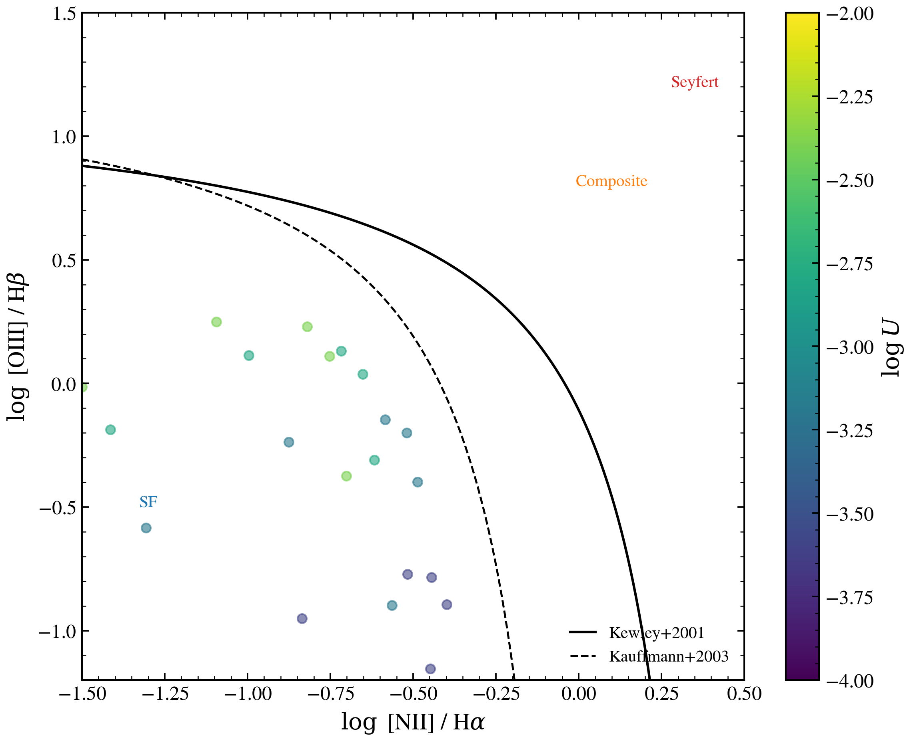

.. DO NOT EDIT.
.. THIS FILE WAS AUTOMATICALLY GENERATED BY SPHINX-GALLERY.
.. TO MAKE CHANGES, EDIT THE SOURCE PYTHON FILE:
.. "auto_examples/nebular/plot_bpt_cue_grid.py"
.. LINE NUMBERS ARE GIVEN BELOW.

.. only:: html

    .. note::
        :class: sphx-glr-download-link-note

        :ref:`Go to the end <sphx_glr_download_auto_examples_nebular_plot_bpt_cue_grid.py>`
        to download the full example code.

.. rst-class:: sphx-glr-example-title

.. _sphx_glr_auto_examples_nebular_plot_bpt_cue_grid.py:

Cue nebular grid on BPT diagram
================================

Show how the Cue neural emulator (Li+2025) maps the 2D parameter space
(log U, log Z_gas) onto three classical BPT diagnostic diagrams. Lines of
constant log U (varying metallicity) and constant log Z (varying ionization)
show the full grid's coverage and demarcation positions.

.. GENERATED FROM PYTHON SOURCE LINES 10-102

.. code-block:: Python

    import os

    os.environ["TF_CPP_MIN_LOG_LEVEL"] = "2"  # suppress XLA/PjRt C++ INFO+WARNING logs

    import warnings

    import jax
    import matplotlib.pyplot as plt
    import numpy as np

    import tengri
    from tengri.analysis.plotting import setup_style

    setup_style()
    warnings.filterwarnings("ignore", message=".*BakedInBackend.*")
    warnings.filterwarnings("ignore", message=".*deprecated.*")

    ssp = tengri.load_ssp("fsps_prsc_miles_chabrier")

    logu_grid = np.array([-4.0, -3.5, -3.0, -2.5, -2.0])
    logz_grid = np.array([-1.5, -1.0, -0.5, -0.3, 0.0, 0.3])

    fig, ax = plt.subplots(figsize=(8, 6.5))

    log_nii_ha_grid = np.linspace(-1.5, 0.3, 200)
    log_oiii_hb_kewley = 0.61 / (log_nii_ha_grid - 0.47) + 1.19
    log_oiii_hb_kauff = 0.61 / (log_nii_ha_grid - 0.05) + 1.3

    mask_k = log_nii_ha_grid < 0.47
    ax.plot(log_nii_ha_grid[mask_k], log_oiii_hb_kewley[mask_k], "k-", lw=1.5, label="Kewley+2001")
    mask_kauff = log_nii_ha_grid < 0.05
    ax.plot(
        log_nii_ha_grid[mask_kauff],
        log_oiii_hb_kauff[mask_kauff],
        "k--",
        lw=1.2,
        label="Kauffmann+2003",
    )

    for logu in logu_grid:
        for logz in logz_grid:
            model = tengri.SEDModel.build(
                ssp,
                sfh={
                    "type": "dpl",
                    "*": tengri.FIXED,
                    "alpha": 1.0,
                    "beta": 2.5,
                    "tau_gyr": 0.05,
                    "log_total_mass": 10.0,
                },
                dust={"type": "two_component", "*": tengri.FIXED, "tau_diff": 0.0, "tau_bc": 0.0},
                neb={
                    "type": "cue",
                    "*": tengri.FIXED,
                    "logU": tengri.Fixed(logu),
                    "logZ_gas": tengri.Fixed(logz),
                },
                redshift=tengri.Fixed(0.05),
            )
            params = dict(model.spec.sample(jax.random.PRNGKey(0)))
            lines = model.predict_emission_lines(params)
            ha = float(lines.halpha)
            hb = float(lines.hbeta)
            nii = float(lines.nii_6584)
            oiii = float(lines.oiii_5007)
            if ha > 0 and hb > 0 and oiii > 0 and nii > 0:
                log_n2_ha = np.log10(nii / ha)
                log_o3_hb = np.log10(oiii / hb)
                color_idx = np.where(logu_grid == logu)[0][0]
                color = plt.cm.viridis(color_idx / len(logu_grid))
                ax.scatter(log_n2_ha, log_o3_hb, s=30, c=[color], alpha=0.6)

    ax.text(-1.3, -0.5, "SF", fontsize=10, color="#1f77b4", ha="center")
    ax.text(0.1, 0.8, "Composite", fontsize=10, color="#ff7f0e", ha="center")
    ax.text(0.35, 1.2, "Seyfert", fontsize=10, color="#d62728", ha="center")

    ax.set_xlabel(r"$\log$ [NII] / H$\alpha$")
    ax.set_ylabel(r"$\log$ [OIII] / H$\beta$")
    ax.set_xlim(-1.5, 0.5)
    ax.set_ylim(-1.2, 1.5)
    ax.legend(fontsize=10, frameon=False, loc="lower right")

    sm = plt.cm.ScalarMappable(
        cmap=plt.cm.viridis, norm=plt.Normalize(vmin=logu_grid.min(), vmax=logu_grid.max())
    )
    sm.set_array([])
    cbar = fig.colorbar(sm, ax=ax, label=r"$\log U$")

    fig.tight_layout()
    plt.savefig("plot_bpt_cue_grid.png", dpi=150, bbox_inches="tight")

.. _sphx_glr_download_auto_examples_nebular_plot_bpt_cue_grid.py:

.. only:: html

  .. container:: sphx-glr-footer sphx-glr-footer-example

    .. container:: sphx-glr-download sphx-glr-download-jupyter

      :download:`Download Jupyter notebook: plot_bpt_cue_grid.ipynb <plot_bpt_cue_grid.ipynb>`

    .. container:: sphx-glr-download sphx-glr-download-python

      :download:`Download Python source code: plot_bpt_cue_grid.py <plot_bpt_cue_grid.py>`

    .. container:: sphx-glr-download sphx-glr-download-zip

      :download:`Download zipped: plot_bpt_cue_grid.zip <plot_bpt_cue_grid.zip>`

.. only:: html

 .. rst-class:: sphx-glr-signature

    `Gallery generated by Sphinx-Gallery <https://sphinx-gallery.github.io>`_
