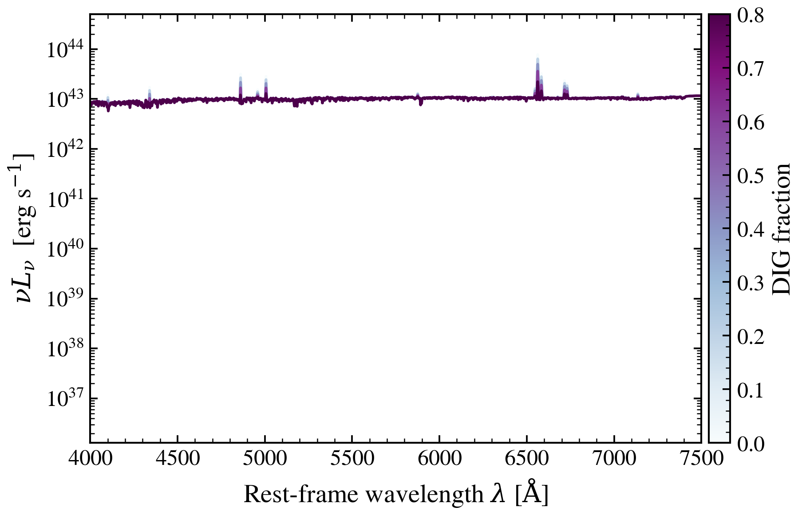

.. DO NOT EDIT.
.. THIS FILE WAS AUTOMATICALLY GENERATED BY SPHINX-GALLERY.
.. TO MAKE CHANGES, EDIT THE SOURCE PYTHON FILE:
.. "auto_examples/nebular/plot_dig_frac_sweep.py"
.. LINE NUMBERS ARE GIVEN BELOW.

.. only:: html

    .. note::
        :class: sphx-glr-download-link-note

        :ref:`Go to the end <sphx_glr_download_auto_examples_nebular_plot_dig_frac_sweep.py>`
        to download the full example code.

.. rst-class:: sphx-glr-example-title

.. _sphx_glr_auto_examples_nebular_plot_dig_frac_sweep.py:

Diffuse Ionized Gas Fraction (f_DIG)
====================================

Diffuse ionized gas (DIG) has lower ionization parameter than HII regions.
When present, DIG shifts galaxies toward the LINER region on the BPT diagram
by suppressing [OIII] relative to [NII]. f_DIG = 0 is pure HII gas;
f_DIG = 1 is pure DIG.

.. sphx-glr-precomputed-img:

.. GENERATED FROM PYTHON SOURCE LINES 17-64

.. code-block:: Python

    import matplotlib.pyplot as plt

    from tengri import Fixed, Parameters, SEDModel, load_ssp
    from tengri.analysis.plotting import setup_style, sweep_parameter

    setup_style()

    ssp = load_ssp()

    # --- Build model: young star-forming galaxy ---
    spec = Parameters(
        nebular_cue=True,
        sfh_tsnorm_log_peak_sfr=Fixed(1.0),
        sfh_tsnorm_peak_lbt_gyr=Fixed(0.5),  # Peak ~500 Myr ago (young)
        sfh_tsnorm_width_gyr=Fixed(0.3),
        sfh_tsnorm_skew=Fixed(0.2),
        sfh_tsnorm_trunc=Fixed(3.0),
        met_logzsol=Fixed(-0.3),  # Solar-ish
        dust_tau_bc=Fixed(0.0),  # No dust
        dust_tau_diff=Fixed(0.0),
        dust_slope=Fixed(-0.7),
        redshift=Fixed(0.1),
        neb_logU=Fixed(-3.0),  # Fixed ionization
        neb_logZ_gas=Fixed(-0.3),
        neb_dig_frac=Fixed(0.0),  # Will sweep this
        neb_dig_delta_logU=Fixed(-1.0),  # DIG is 1 dex lower in ionization
    )
    model = SEDModel(spec, ssp)

    # --- Sweep DIG fraction ---
    values = [0.0, 0.2, 0.4, 0.6, 0.8]

    fig, ax = sweep_parameter(
        model,
        "neb_dig_frac",
        values,
        cmap="BuPu",
        label_fmt=r"$f_{{\mathrm{{DIG}}}}$ = {:.1f}",
        wave_range=(4500, 7500),
    )
    ax.set_title("Diffuse Ionized Gas: Impact on Optical Diagnostic Lines", fontsize=12)
    ax.set_ylabel(r"$\lambda F_\lambda$ (normalized at 5500 Å)")
    plt.tight_layout()
    plt.savefig("plot_dig_frac_sweep.png", dpi=150, bbox_inches="tight")
    plt.show()

.. _sphx_glr_download_auto_examples_nebular_plot_dig_frac_sweep.py:

.. only:: html

  .. container:: sphx-glr-footer sphx-glr-footer-example

    .. container:: sphx-glr-download sphx-glr-download-jupyter

      :download:`Download Jupyter notebook: plot_dig_frac_sweep.ipynb <plot_dig_frac_sweep.ipynb>`

    .. container:: sphx-glr-download sphx-glr-download-python

      :download:`Download Python source code: plot_dig_frac_sweep.py <plot_dig_frac_sweep.py>`

    .. container:: sphx-glr-download sphx-glr-download-zip

      :download:`Download zipped: plot_dig_frac_sweep.zip <plot_dig_frac_sweep.zip>`

.. only:: html

 .. rst-class:: sphx-glr-signature

    `Gallery generated by Sphinx-Gallery <https://sphinx-gallery.github.io>`_
