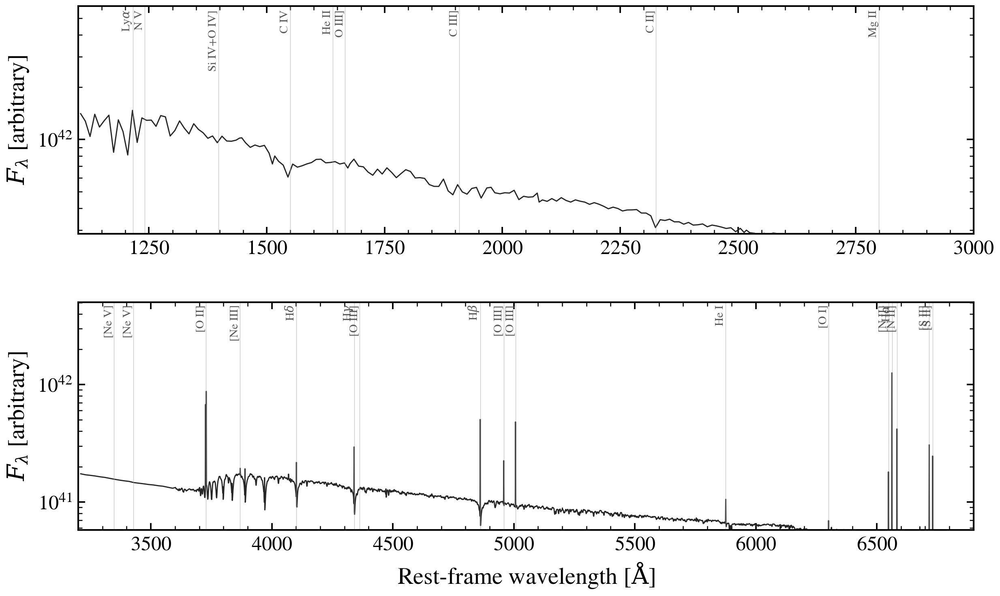

.. DO NOT EDIT.
.. THIS FILE WAS AUTOMATICALLY GENERATED BY SPHINX-GALLERY.
.. TO MAKE CHANGES, EDIT THE SOURCE PYTHON FILE:
.. "auto_examples/nebular/plot_emission_line_atlas.py"
.. LINE NUMBERS ARE GIVEN BELOW.

.. only:: html

    .. note::
        :class: sphx-glr-download-link-note

        :ref:`Go to the end <sphx_glr_download_auto_examples_nebular_plot_emission_line_atlas.py>`
        to download the full example code.

.. rst-class:: sphx-glr-example-title

.. _sphx_glr_auto_examples_nebular_plot_emission_line_atlas.py:

Optical emission-line atlas of a young star-forming galaxy
============================================================

Zoomed rest-frame spectrum of an ionised-gas-dominated SF galaxy with
the strongest optical / near-UV emission lines labelled. Wavelengths
are vacuum; line positions follow NIST/Atomic Line List.

Useful as a quick reference for which line lands where when planning
medium-band photometry or low-resolution spectroscopy at a given z.
Cue's full HII-region line catalog active on a bare-stellar SSP for
the strongest visible emission features. Issue #277 means Cue cannot
be combined with a Photometry/Spectroscopy observation, so this card
runs in rest-frame-only mode (which is all the atlas needs anyway).

.. GENERATED FROM PYTHON SOURCE LINES 16-105

.. image-sg:: /auto_examples/nebular/images/sphx_glr_plot_emission_line_atlas_001.png
   :alt: plot emission line atlas
   :srcset: /auto_examples/nebular/images/sphx_glr_plot_emission_line_atlas_001.png
   :class: sphx-glr-single-img

.. code-block:: Python

    import os

    os.environ["TF_CPP_MIN_LOG_LEVEL"] = "2"  # suppress XLA/PjRt C++ INFO+WARNING logs

    import warnings

    import jax
    import matplotlib.pyplot as plt
    import numpy as np

    import tengri
    from tengri.analysis.plotting import setup_style

    setup_style()
    warnings.filterwarnings("ignore", message=".*BakedInBackend.*")

    C_AA_PER_S = 2.998e18

    model = tengri.SEDModel.build(
        tengri.load_ssp("fsps_prsc_miles_chabrier"),
        sfh={
            "type": "dpl",
            "*": tengri.FIXED,
            "tau_gyr": 0.03,
            "log_total_mass": 10.0,
            "alpha": 4.0,
            "beta": 2.0,
        },
        dust={"type": "two_component", "*": tengri.FIXED, "tau_diff": 0.05, "tau_bc": 0.1},
        neb={"type": "cue", "*": tengri.FIXED},
        redshift=tengri.Fixed(0.0),
    )
    p = dict(model.spec.sample(jax.random.PRNGKey(0)))
    out = model.predict_rest_sed(p)
    wave = np.asarray(out.wavelength)
    f_lam = np.asarray(out.sed) * C_AA_PER_S / wave**2  # F_λ shape proxy

    LINES_UV = [
        (1215.67, "Ly$\\alpha$"),
        (1240.81, "N V"),
        (1397.20, "Si IV+O IV]"),
        (1549.48, "C IV"),
        (1640.42, "He II"),
        (1666.15, "O III]"),
        (1908.73, "C III]"),
        (2326.00, "C II]"),
        (2798.75, "Mg II"),
    ]
    LINES_OPT = [
        (3346.82, "[Ne V]"),
        (3426.85, "[Ne V]"),
        (3727.09, "[O II]"),
        (3868.76, "[Ne III]"),
        (4101.74, "H$\\delta$"),
        (4340.47, "H$\\gamma$"),
        (4363.21, "[O III]"),
        (4861.33, "H$\\beta$"),
        (4958.91, "[O III]"),
        (5006.84, "[O III]"),
        (5875.62, "He I"),
        (6300.30, "[O I]"),
        (6548.05, "[N II]"),
        (6562.80, "H$\\alpha$"),
        (6583.45, "[N II]"),
        (6716.44, "[S II]"),
        (6730.82, "[S II]"),
    ]

    fig, (ax_uv, ax_opt) = plt.subplots(2, 1, figsize=(9.5, 5.6), gridspec_kw={"hspace": 0.3})

    for ax, lines, lo, hi in [(ax_uv, LINES_UV, 1100, 3000), (ax_opt, LINES_OPT, 3200, 6900)]:
        vis = (wave > lo) & (wave < hi)
        ax.semilogy(wave[vis], f_lam[vis], color="0.15", lw=0.7)
        ymin = float(np.percentile(f_lam[vis][f_lam[vis] > 0], 20))
        ymax = float(np.max(f_lam[vis])) * 4.0
        ax.set_ylim(ymin, ymax)
        for lam, name in lines:
            if lo < lam < hi:
                ax.axvline(lam, color="0.65", lw=0.35, alpha=0.6)
                ax.text(
                    lam, ymax * 0.95, name, fontsize=7, color="0.35", rotation=90, ha="right", va="top"
                )
        ax.set_xlim(lo, hi)

    ax_uv.set_ylabel(r"$F_\lambda$ [arbitrary]")
    ax_opt.set(xlabel=r"Rest-frame wavelength [$\mathrm{\AA}$]", ylabel=r"$F_\lambda$ [arbitrary]")

    plt.savefig("plot_emission_line_atlas.png", dpi=150, bbox_inches="tight")

.. _sphx_glr_download_auto_examples_nebular_plot_emission_line_atlas.py:

.. only:: html

  .. container:: sphx-glr-footer sphx-glr-footer-example

    .. container:: sphx-glr-download sphx-glr-download-jupyter

      :download:`Download Jupyter notebook: plot_emission_line_atlas.ipynb <plot_emission_line_atlas.ipynb>`

    .. container:: sphx-glr-download sphx-glr-download-python

      :download:`Download Python source code: plot_emission_line_atlas.py <plot_emission_line_atlas.py>`

    .. container:: sphx-glr-download sphx-glr-download-zip

      :download:`Download zipped: plot_emission_line_atlas.zip <plot_emission_line_atlas.zip>`

.. only:: html

 .. rst-class:: sphx-glr-signature

    `Gallery generated by Sphinx-Gallery <https://sphinx-gallery.github.io>`_
