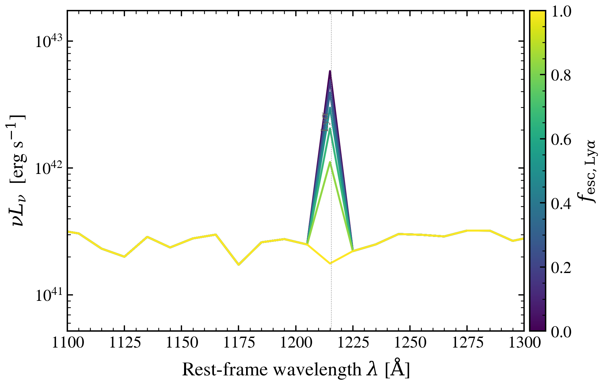

.. DO NOT EDIT.
.. THIS FILE WAS AUTOMATICALLY GENERATED BY SPHINX-GALLERY.
.. TO MAKE CHANGES, EDIT THE SOURCE PYTHON FILE:
.. "auto_examples/nebular/plot_fesc_lya_sweep.py"
.. LINE NUMBERS ARE GIVEN BELOW.

.. only:: html

    .. note::
        :class: sphx-glr-download-link-note

        :ref:`Go to the end <sphx_glr_download_auto_examples_nebular_plot_fesc_lya_sweep.py>`
        to download the full example code.

.. rst-class:: sphx-glr-example-title

.. _sphx_glr_auto_examples_nebular_plot_fesc_lya_sweep.py:

Lyα escape fraction controls Lyman-alpha strength
=================================================

The Lyα-specific escape fraction ``f_esc_lya`` sets what fraction of Lyα
photons can escape the ISM without scattering. Higher ``f_esc_lya`` suppresses
the Lyα emission line while leaving other nebular lines unchanged.

.. GENERATED FROM PYTHON SOURCE LINES 9-92

.. code-block:: Python

    import os

    os.environ["TF_CPP_MIN_LOG_LEVEL"] = "2"  # suppress XLA/PjRt C++ INFO+WARNING logs

    import warnings

    import jax
    import jax.numpy as jnp
    import matplotlib as mpl
    import matplotlib.pyplot as plt
    import numpy as np

    import tengri
    from tengri.analysis.plotting import setup_style

    setup_style()
    warnings.filterwarnings("ignore", message=".*BakedInBackend.*")
    warnings.filterwarnings("ignore", message=".*deprecated.*")

    ssp = tengri.load_ssp("fsps_prsc_miles_chabrier")
    SFH = {
        "type": "dpl",
        "*": tengri.FIXED,
        "alpha": 3.0,
        "beta": 2.0,
        "tau_gyr": 0.3,
        "log_total_mass": 10.0,
    }
    DUST = {"type": "two_component", "*": tengri.FIXED, "tau_diff": 0.05, "tau_bc": 0.1}

    model = tengri.SEDModel.build(
        ssp,
        sfh=SFH,
        dust=DUST,
        neb={"type": "cue", "*": tengri.FIXED, "neb_fesc_lya": tengri.Uniform(0.0, 1.0)},
        redshift=tengri.Fixed(0.05),
    )
    baseline = dict(model.spec.sample(jax.random.PRNGKey(0)))

    fesc_lya_values = np.linspace(0.0, 1.0, 7)
    norm = mpl.colors.Normalize(vmin=fesc_lya_values.min(), vmax=fesc_lya_values.max())
    cmap = plt.get_cmap("viridis")

    fig, ax = plt.subplots(figsize=(6.5, 4.2))
    ymax = 0.0
    ymin = np.inf
    for fesc_lya in fesc_lya_values:
        params = {**baseline, "neb_fesc_lya": jnp.float64(fesc_lya)}
        out = model.predict_rest_sed(params)
        wave = np.asarray(out.wavelength)
        nu = 2.998e18 / wave
        nu_l_nu = nu * np.asarray(out.sed)
        vis = (wave > 1100) & (wave < 1300)
        ymax = max(ymax, float(np.max(nu_l_nu[vis])))
        pos = nu_l_nu[vis][nu_l_nu[vis] > 0]
        if pos.size:
            ymin = min(ymin, float(np.min(pos)))
        ax.semilogy(wave, nu_l_nu, color=cmap(norm(fesc_lya)), lw=1.4)

    ax.set(
        xlim=(1100, 1300),
        ylim=(0.3 * ymin, 3.0 * ymax),
        xlabel=r"Rest-frame wavelength $\lambda$ [$\mathrm{\AA}$]",
        ylabel=r"$\nu L_\nu$  [erg s$^{-1}$]",
    )
    ax.axvline(1215.67, color="0.55", lw=0.5, ls=":")
    ax.text(
        1215.67,
        ymax * 0.4,
        r"Ly$\alpha$",
        color="0.4",
        fontsize=8,
        rotation=90,
        va="center",
        ha="right",
    )

    cbar = fig.colorbar(plt.cm.ScalarMappable(norm=norm, cmap=cmap), ax=ax, pad=0.01)
    cbar.set_label(r"$f_{\mathrm{esc,Ly}\alpha}$")

    fig.tight_layout()
    plt.savefig("plot_fesc_lya_sweep.png", dpi=150, bbox_inches="tight")

.. _sphx_glr_download_auto_examples_nebular_plot_fesc_lya_sweep.py:

.. only:: html

  .. container:: sphx-glr-footer sphx-glr-footer-example

    .. container:: sphx-glr-download sphx-glr-download-jupyter

      :download:`Download Jupyter notebook: plot_fesc_lya_sweep.ipynb <plot_fesc_lya_sweep.ipynb>`

    .. container:: sphx-glr-download sphx-glr-download-python

      :download:`Download Python source code: plot_fesc_lya_sweep.py <plot_fesc_lya_sweep.py>`

    .. container:: sphx-glr-download sphx-glr-download-zip

      :download:`Download zipped: plot_fesc_lya_sweep.zip <plot_fesc_lya_sweep.zip>`

.. only:: html

 .. rst-class:: sphx-glr-signature

    `Gallery generated by Sphinx-Gallery <https://sphinx-gallery.github.io>`_
