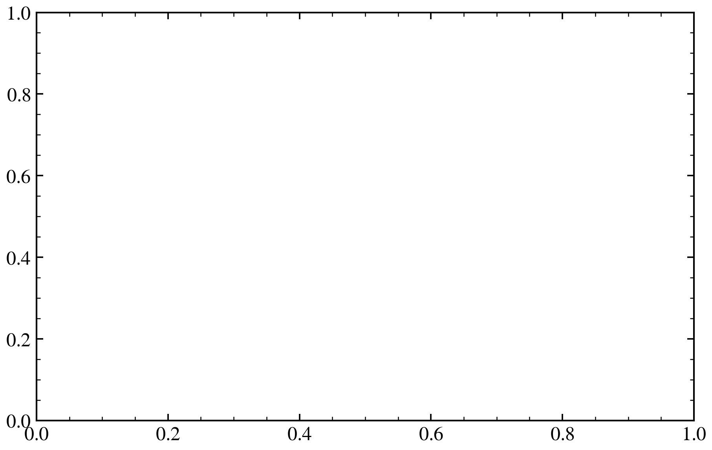

.. DO NOT EDIT.
.. THIS FILE WAS AUTOMATICALLY GENERATED BY SPHINX-GALLERY.
.. TO MAKE CHANGES, EDIT THE SOURCE PYTHON FILE:
.. "auto_examples/nebular/plot_halpha_sfr_calibration_age.py"
.. LINE NUMBERS ARE GIVEN BELOW.

.. only:: html

    .. note::
        :class: sphx-glr-download-link-note

        :ref:`Go to the end <sphx_glr_download_auto_examples_nebular_plot_halpha_sfr_calibration_age.py>`
        to download the full example code.

.. rst-class:: sphx-glr-example-title

.. _sphx_glr_auto_examples_nebular_plot_halpha_sfr_calibration_age.py:

Hα SFR calibration breaks at young ages
========================================

Murphy+2011 SFR-Hα relation requires ionizing photons from stars younger
than ~10 Myr. Constant-SFR models at ages 1–300 Myr show the calibration
breaks at young (<10 Myr; insufficient ionizing photons) and old (>100 Myr;
all stars too old to ionize) populations.

.. GENERATED FROM PYTHON SOURCE LINES 10-68

.. code-block:: Python

    import os

    os.environ["TF_CPP_MIN_LOG_LEVEL"] = "2"  # suppress XLA/PjRt C++ INFO+WARNING logs

    import warnings

    import jax
    import matplotlib.pyplot as plt
    import numpy as np

    import tengri
    from tengri.analysis.plotting import setup_style

    setup_style()
    warnings.filterwarnings("ignore", message=".*BakedInBackend.*")
    warnings.filterwarnings("ignore", message=".*deprecated.*")

    ssp = tengri.load_ssp("fsps_prsc_miles_chabrier")
    log_sfr_true, sfr_true = 1.0, 10.0
    murphy_const = 5.37e-42
    ages_myr = np.array([1.0, 3.0, 5.0, 10.0, 30.0, 100.0, 300.0])

    fig, ax = plt.subplots(figsize=(7.2, 4.5))
    sfr_inferred, ages_valid = [], []

    for age_myr in ages_myr:
        model = tengri.SEDModel.build(
            ssp,
            sfh={
                "type": "const",
                "*": tengri.FIXED,
                "log_sfr": log_sfr_true,
                "start_gyr": age_myr / 1e3,
                "end_gyr": 0.0,
            },
            dust={"type": "two_component", "*": tengri.FIXED, "tau_diff": 0.0, "tau_bc": 0.0},
            neb={"type": "cue", "*": tengri.FIXED},
            redshift=tengri.Fixed(0.0),
        )
        params = dict(model.spec.sample(jax.random.PRNGKey(0)))
        l_halpha = float(model.predict_emission_lines(params).halpha)
        sfr_inferred.append(murphy_const * l_halpha)
        ages_valid.append(age_myr)

    ratio = np.array(sfr_inferred) / sfr_true
    ax.loglog(ages_valid, ratio, "o-", markersize=7, linewidth=1.5, color="C0")
    ax.axhline(1.0, color="0.5", linestyle="--", linewidth=1.0, alpha=0.7, label="Calibration valid")
    ax.fill_between(ages_valid, 0.8, 1.2, color="green", alpha=0.1)
    ax.set(
        xlabel="Constant SFH age [Myr]",
        ylabel=r"$\mathrm{SFR}_{\mathrm{inferred}} / \mathrm{SFR}_{\mathrm{true}}$",
        xlim=(0.5, 500),
        ylim=(0.1, 10),
    )
    ax.legend(loc="upper left", fontsize=9)
    ax.grid(True, which="both", alpha=0.3, linestyle=":", linewidth=0.5)
    plt.savefig("plot_halpha_sfr_calibration_age.png", dpi=150, bbox_inches="tight")

.. _sphx_glr_download_auto_examples_nebular_plot_halpha_sfr_calibration_age.py:

.. only:: html

  .. container:: sphx-glr-footer sphx-glr-footer-example

    .. container:: sphx-glr-download sphx-glr-download-jupyter

      :download:`Download Jupyter notebook: plot_halpha_sfr_calibration_age.ipynb <plot_halpha_sfr_calibration_age.ipynb>`

    .. container:: sphx-glr-download sphx-glr-download-python

      :download:`Download Python source code: plot_halpha_sfr_calibration_age.py <plot_halpha_sfr_calibration_age.py>`

    .. container:: sphx-glr-download sphx-glr-download-zip

      :download:`Download zipped: plot_halpha_sfr_calibration_age.zip <plot_halpha_sfr_calibration_age.zip>`

.. only:: html

 .. rst-class:: sphx-glr-signature

    `Gallery generated by Sphinx-Gallery <https://sphinx-gallery.github.io>`_
