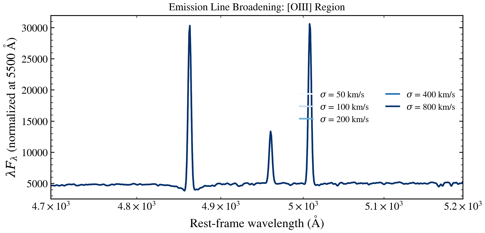

.. DO NOT EDIT.
.. THIS FILE WAS AUTOMATICALLY GENERATED BY SPHINX-GALLERY.
.. TO MAKE CHANGES, EDIT THE SOURCE PYTHON FILE:
.. "auto_examples/nebular/plot_line_sigma_sweep.py"
.. LINE NUMBERS ARE GIVEN BELOW.

.. only:: html

    .. note::
        :class: sphx-glr-download-link-note

        :ref:`Go to the end <sphx_glr_download_auto_examples_nebular_plot_line_sigma_sweep.py>`
        to download the full example code.

.. rst-class:: sphx-glr-example-title

.. _sphx_glr_auto_examples_nebular_plot_line_sigma_sweep.py:

Emission line broadening traces gas kinematics
================================================

A galaxy's velocity dispersion ``sigma_v_kms`` broadens *every* spectral
feature — including the nebular emission lines — from a few tens of km/s
(dynamically cold disks) to several hundred km/s (dispersion-dominated
spheroids and AGN narrow-line regions). The broadening is a forward-model
convolution applied to the predicted spectrum, so it is only visible when the
instrument line-spread function is finer than the velocity width: we therefore
predict a spectrum on a high-resolution grid (R ~ 10000) around the
[O III] λλ4959,5007 + Hβ region and sweep ``sigma_v_kms``.

(Note: ``sigma_v_kms`` is the galaxy velocity dispersion that convolves the
forward spectrum. The separate ``eline_sigma_kms`` parameter — registered when
a ``Spectroscopy`` observation sets ``eline_mode='fitted'/'marginalized'`` —
is the emission-line template width used when *fitting* line amplitudes, not a
forward-broadening knob.)

.. GENERATED FROM PYTHON SOURCE LINES 20-91

.. code-block:: Python

    import os

    os.environ["TF_CPP_MIN_LOG_LEVEL"] = "2"  # suppress XLA/PjRt C++ INFO+WARNING logs

    import warnings

    import jax
    import jax.numpy as jnp
    import matplotlib as mpl
    import matplotlib.pyplot as plt
    import numpy as np

    import tengri
    from tengri.analysis.plotting import setup_style

    setup_style()
    warnings.filterwarnings("ignore", message=".*BakedInBackend.*")
    warnings.filterwarnings("ignore", message=".*deprecated.*")

    Z = 0.05
    # Rest-frame window covering Hβ (4861) and [O III] λλ4959,5007, sampled finely.
    wave_rest = np.linspace(4840, 5040, 1200)
    obs = tengri.Observation(
        spectroscopy=tengri.Spectroscopy(
            wave_obs=wave_rest * (1 + Z),
            resolution=10000.0,  # fine LSF so velocity broadening is resolved
        )
    )

    ssp = tengri.load_ssp("fsps_prsc_miles_chabrier")
    model = tengri.SEDModel.build(
        ssp,
        observation=obs,
        sfh={
            "type": "dpl",
            "*": tengri.FIXED,
            "alpha": 1.0,
            "beta": 2.5,
            "tau_gyr": 0.3,
            "log_total_mass": 10.0,
        },
        dust={"type": "two_component", "*": tengri.FIXED, "tau_diff": 0.0, "tau_bc": 0.0},
        neb={"type": "cue", "*": tengri.FIXED},
        redshift=tengri.Fixed(Z),
    )
    baseline = dict(model.spec.sample(jax.random.PRNGKey(0)))

    sigma_values = np.array([30, 75, 150, 300, 500])
    norm = mpl.colors.LogNorm(vmin=sigma_values.min(), vmax=sigma_values.max())
    cmap = plt.get_cmap("viridis")

    fig, ax = plt.subplots(figsize=(6.6, 4.3))
    for sigma in sigma_values:
        flux = np.asarray(model.predict_spectrum({**baseline, "sigma_v_kms": jnp.float64(sigma)}))
        ax.plot(wave_rest, flux, color=cmap(norm(sigma)), lw=1.4)

    for lam in (4861, 4959, 5007):  # Hβ, [O III] λ4959, [O III] λ5007
        ax.axvline(lam, color="0.7", ls=":", lw=0.8)

    ax.set_xlim(wave_rest.min(), wave_rest.max())
    ax.set_xlabel(r"Rest-frame wavelength $\lambda$ [$\mathrm{\AA}$]")
    ax.set_ylabel(r"$f_\lambda$  [arb. units]")
    ax.set_title("Velocity dispersion broadens the emission lines")

    cbar = fig.colorbar(plt.cm.ScalarMappable(norm=norm, cmap=cmap), ax=ax, pad=0.01)
    cbar.set_label(r"$\sigma_v$ [km/s]")

    fig.tight_layout()
    plt.savefig("plot_line_sigma_sweep.png", dpi=150, bbox_inches="tight")
    plt.close(fig)

.. _sphx_glr_download_auto_examples_nebular_plot_line_sigma_sweep.py:

.. only:: html

  .. container:: sphx-glr-footer sphx-glr-footer-example

    .. container:: sphx-glr-download sphx-glr-download-jupyter

      :download:`Download Jupyter notebook: plot_line_sigma_sweep.ipynb <plot_line_sigma_sweep.ipynb>`

    .. container:: sphx-glr-download sphx-glr-download-python

      :download:`Download Python source code: plot_line_sigma_sweep.py <plot_line_sigma_sweep.py>`

    .. container:: sphx-glr-download sphx-glr-download-zip

      :download:`Download zipped: plot_line_sigma_sweep.zip <plot_line_sigma_sweep.zip>`

.. only:: html

 .. rst-class:: sphx-glr-signature

    `Gallery generated by Sphinx-Gallery <https://sphinx-gallery.github.io>`_
