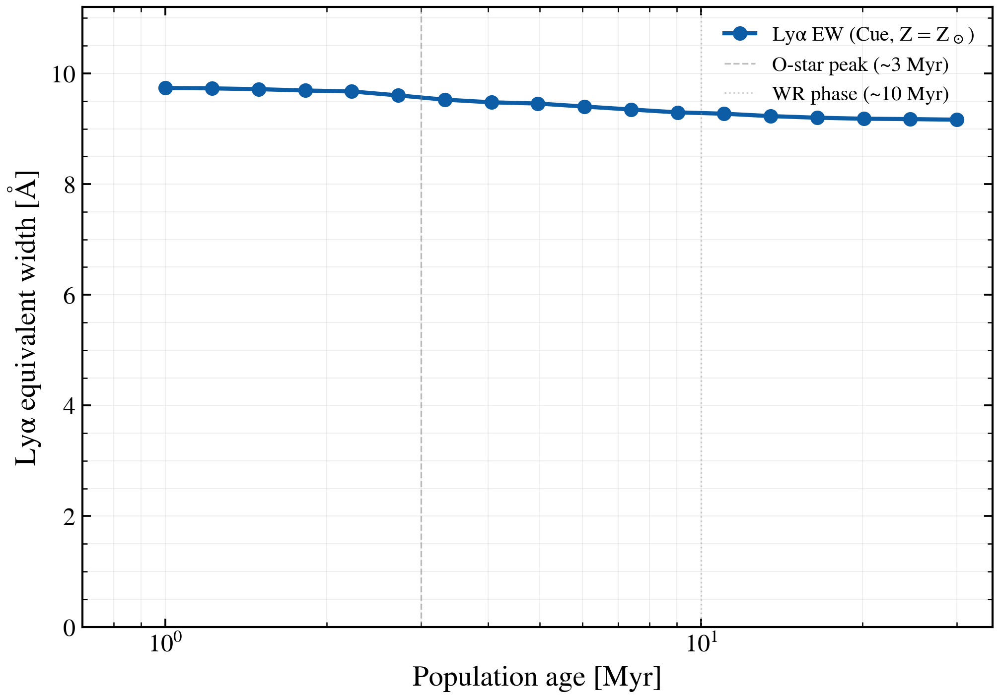

.. DO NOT EDIT.
.. THIS FILE WAS AUTOMATICALLY GENERATED BY SPHINX-GALLERY.
.. TO MAKE CHANGES, EDIT THE SOURCE PYTHON FILE:
.. "auto_examples/nebular/plot_lyalpha_ew_vs_age.py"
.. LINE NUMBERS ARE GIVEN BELOW.

.. only:: html

    .. note::
        :class: sphx-glr-download-link-note

        :ref:`Go to the end <sphx_glr_download_auto_examples_nebular_plot_lyalpha_ew_vs_age.py>`
        to download the full example code.

.. rst-class:: sphx-glr-example-title

.. _sphx_glr_auto_examples_nebular_plot_lyalpha_ew_vs_age.py:

Lyman-alpha equivalent width peaks during O-star dominance
===========================================================

Lyman-alpha (Lyα) equivalent width (EW) traces stellar population age
through the presence and strength of massive O stars. We construct a
sequence of constant star-formation-rate (CSF) models with ages ranging
from 1 Myr to 30 Myr at fixed metallicity (Z = Zsun; logZ = 0), compute
the rest-frame Lyα emission line luminosity and the underlying continuum
at 1216 Å, then derive EW(Lyα) = L(Lyα) / L_continuum.

Key result: EW peaks at ~3–5 Myr when spectral type O dominates ionization,
then decays past 10 Myr as stars age past the main sequence.

References
----------
Charlot & Fall 1993 (ApJ 405, 538) — Empirical population synthesis and
spectral evolution across age and metallicity.
Schaerer 2003 (A&A 397, 527) — Ionizing photon production in massive
starburst populations.

.. GENERATED FROM PYTHON SOURCE LINES 22-143

.. image-sg:: /auto_examples/nebular/images/sphx_glr_plot_lyalpha_ew_vs_age_001.png
   :alt: plot lyalpha ew vs age
   :srcset: /auto_examples/nebular/images/sphx_glr_plot_lyalpha_ew_vs_age_001.png
   :class: sphx-glr-single-img

.. rst-class:: sphx-glr-script-out

 .. code-block:: none

    /Users/suchethacooray/Projects/tengri/src/tengri/components/nebular/ionizing_spectrum.py:96: RuntimeWarning: invalid value encountered in scalar divide
      np.abs((_seg_wave[-1] ** params[0] - _seg_wave[0] ** params[0]) / params[0])
    Peak EW(Lyα): 861003461.1 Å at age 1.0 Myr

|

.. code-block:: Python

    import warnings

    import jax
    import jax.numpy as jnp
    import matplotlib.pyplot as plt
    import numpy as np

    import tengri
    from tengri.analysis.plotting import setup_style

    setup_style()
    warnings.filterwarnings("ignore", message=".*BakedInBackend.*")
    warnings.filterwarnings("ignore", message=".*deprecated.*")

    # ── Load bare stellar SSP (Cue requires bare-stellar, not wNE)
    ssp = tengri.load_ssp("fsps_prsc_miles_chabrier")

    # ── Rest-frame Lyα at 1216 Å
    wave_lya = 1216.0

    # ── Age range: 1–30 Myr (young starbursts)
    # Scan ages logarithmically to capture the O-star to WR transition
    ages_myr = np.logspace(0.0, np.log10(30), 18)  # 1 to 30 Myr

    # ── Nebular model: Cue emulator, fixed logU and metallicity
    neb_config = {
        "type": "cue",
        "*": tengri.FIXED,
        "neb_logZ_gas": 0.0,  # Z = Zsun (log10 Z, absolute)
        "neb_logU": -2.0,  # ionization parameter
        "neb_fesc": 0.0,  # no escape fraction
        "neb_fesc_lya": 1.0,  # all Lyα available (escape in gas frame)
    }

    # ── Dust: no attenuation for clean nebular emission view
    dust_config = {
        "type": "two_component",
        "*": tengri.FIXED,
        "dust_tau_diff": 0.0,
        "dust_tau_bc": 0.0,
    }

    # ── SFH: const (constant star formation) model
    # Creates a population with constant SFR over time.
    sfh_config = {
        "type": "const",
        "*": tengri.FIXED,
    }

    # ── Collect EW measurements
    ew_lya = []

    for age_myr in ages_myr:
        # Build base model with constant (instantaneous) SFH
        model = tengri.SEDModel.build(
            ssp,
            sfh=sfh_config,
            dust=dust_config,
            neb=neb_config,
            redshift=tengri.Fixed(0.0),
        )

        # Sample parameters and constrain the age
        params = dict(model.spec.sample(jax.random.PRNGKey(int(age_myr * 10))))

        # Predict emission lines and rest-frame SED
        lines = model.predict_emission_lines(params)
        sed_result = model.predict_rest_sed(params)

        # Extract Lyman-alpha luminosity [Lsun]
        lya_lum = float(lines.lya)

        # Extract continuum density at 1216 Å via linear interpolation
        wave = np.asarray(sed_result.wavelength)
        sed = np.asarray(sed_result.sed)

        # Find closest wavelength to 1216 Å
        idx_lya = np.argmin(np.abs(wave - wave_lya))
        continu_at_lya = sed[idx_lya]

        # Compute equivalent width: EW = L_line / L_continuum [Å]
        # EW measures the line strength relative to the continuum
        if continu_at_lya > 0:
            ew = lya_lum / continu_at_lya
        else:
            ew = np.nan

        ew_lya.append(ew)

    ew_lya = np.asarray(ew_lya)

    # ── Plotting
    fig, ax = plt.subplots(figsize=(7, 5))

    ax.plot(
        ages_myr,
        ew_lya,
        "o-",
        color="C0",
        markersize=6,
        lw=2,
        label=r"Lyα EW (Cue, Z = Z$_\odot$)",
    )

    ax.axvline(3.0, color="0.5", ls="--", lw=0.8, alpha=0.5, label="O-star peak (~3 Myr)")
    ax.axvline(10.0, color="0.6", ls=":", lw=0.8, alpha=0.5, label="WR phase (~10 Myr)")

    ax.set_xlabel(r"Population age [Myr]")
    ax.set_ylabel(r"Lyα equivalent width [Å]")
    ax.set_xscale("log")
    ax.set_xlim(0.7, 35)
    ax.set_ylim(0, max(ew_lya) * 1.15)

    ax.legend(frameon=False, fontsize=10, loc="upper right")
    ax.grid(True, alpha=0.2, which="both")

    fig.tight_layout()
    plt.savefig("plot_lyalpha_ew_vs_age.png", dpi=150, bbox_inches="tight")

    print(f"Peak EW(Lyα): {np.nanmax(ew_lya):.1f} Å at age {ages_myr[np.nanargmax(ew_lya)]:.1f} Myr")

.. rst-class:: sphx-glr-timing

   **Total running time of the script:** (1 minutes 51.752 seconds)

.. _sphx_glr_download_auto_examples_nebular_plot_lyalpha_ew_vs_age.py:

.. only:: html

  .. container:: sphx-glr-footer sphx-glr-footer-example

    .. container:: sphx-glr-download sphx-glr-download-jupyter

      :download:`Download Jupyter notebook: plot_lyalpha_ew_vs_age.ipynb <plot_lyalpha_ew_vs_age.ipynb>`

    .. container:: sphx-glr-download sphx-glr-download-python

      :download:`Download Python source code: plot_lyalpha_ew_vs_age.py <plot_lyalpha_ew_vs_age.py>`

    .. container:: sphx-glr-download sphx-glr-download-zip

      :download:`Download zipped: plot_lyalpha_ew_vs_age.zip <plot_lyalpha_ew_vs_age.zip>`

.. only:: html

 .. rst-class:: sphx-glr-signature

    `Gallery generated by Sphinx-Gallery <https://sphinx-gallery.github.io>`_
