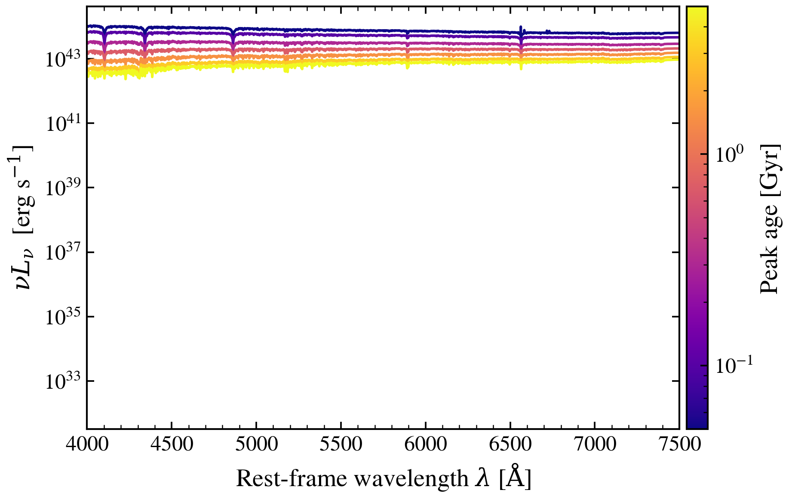

.. DO NOT EDIT.
.. THIS FILE WAS AUTOMATICALLY GENERATED BY SPHINX-GALLERY.
.. TO MAKE CHANGES, EDIT THE SOURCE PYTHON FILE:
.. "auto_examples/nebular/plot_neb_age_dependence.py"
.. LINE NUMBERS ARE GIVEN BELOW.

.. only:: html

    .. note::
        :class: sphx-glr-download-link-note

        :ref:`Go to the end <sphx_glr_download_auto_examples_nebular_plot_neb_age_dependence.py>`
        to download the full example code.

.. rst-class:: sphx-glr-example-title

.. _sphx_glr_auto_examples_nebular_plot_neb_age_dependence.py:

Nebular Emission: Dependence on Stellar Population Age
=======================================================

Ionizing photon production declines rapidly with stellar population age (~t^-1).
Compare young vs old populations to see how nebular line strength evolves.

.. sphx-glr-precomputed-img:

.. GENERATED FROM PYTHON SOURCE LINES 15-81

.. code-block:: Python

    from pathlib import Path

    import jax
    import matplotlib.pyplot as plt

    jax.config.update("jax_enable_x64", True)

    from tengri import Fixed, Parameters, SEDModel, load_ssp_data
    from tengri.analysis.plotting import setup_style, sweep_parameter

    setup_style()

    def _find_ssp():
        """Find SSP data file in standard locations."""
        name = "ssp_prsc_miles_chabrier_wNE_logGasU-3.0_logGasZ0.0.h5"
        for p in [
            Path("data") / name,
            Path("../data") / name,
            Path("../../data") / name,
            Path("../../../data") / name,
        ]:
            if p.exists():
                return str(p)
        return None

    SSP_PATH = _find_ssp()
    if SSP_PATH is None:
        raise FileNotFoundError("SSP data not found — skipping example")

    ssp = load_ssp_data(SSP_PATH)

    # --- Build model: parametric SFH with variable peak age ---
    spec = Parameters(
        sfh_tsnorm_log_peak_sfr=Fixed(1.0),
        sfh_tsnorm_peak_lbt_gyr=Fixed(0.5),  # Will sweep this
        sfh_tsnorm_width_gyr=Fixed(0.3),
        sfh_tsnorm_skew=Fixed(0.2),
        sfh_tsnorm_trunc=Fixed(3.0),
        met_logzsol=Fixed(-0.3),
        dust_tau_bc=Fixed(0.1),
        dust_tau_diff=Fixed(0.1),
        dust_slope=Fixed(-0.7),
        redshift=Fixed(0.1),
    )
    model = SEDModel(spec, ssp)

    # --- Sweep stellar population age (lookback time) ---
    values = [0.05, 0.1, 0.3, 0.7, 1.5, 3.0, 5.0]
    fig, ax = sweep_parameter(
        model,
        "sfh_tsnorm_peak_lbt_gyr",
        values,
        cmap="plasma",
        label_fmt=r"Peak age = {:.2f} Gyr",
        wave_range=(4000, 8000),
    )
    ax.set_title("Nebular Emission: Age Dependence of Ionizing Photon Production", fontsize=12)
    ax.set_ylabel(r"$\lambda F_\lambda$ (normalized at 5500 Å)")
    ax.set_ylim(0, 30_000)
    plt.tight_layout()
    plt.savefig("plot_neb_age_dependence.png", dpi=150, bbox_inches="tight")
    plt.show()

.. _sphx_glr_download_auto_examples_nebular_plot_neb_age_dependence.py:

.. only:: html

  .. container:: sphx-glr-footer sphx-glr-footer-example

    .. container:: sphx-glr-download sphx-glr-download-jupyter

      :download:`Download Jupyter notebook: plot_neb_age_dependence.ipynb <plot_neb_age_dependence.ipynb>`

    .. container:: sphx-glr-download sphx-glr-download-python

      :download:`Download Python source code: plot_neb_age_dependence.py <plot_neb_age_dependence.py>`

    .. container:: sphx-glr-download sphx-glr-download-zip

      :download:`Download zipped: plot_neb_age_dependence.zip <plot_neb_age_dependence.zip>`

.. only:: html

 .. rst-class:: sphx-glr-signature

    `Gallery generated by Sphinx-Gallery <https://sphinx-gallery.github.io>`_
