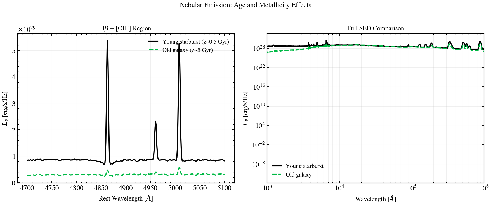

.. DO NOT EDIT.
.. THIS FILE WAS AUTOMATICALLY GENERATED BY SPHINX-GALLERY.
.. TO MAKE CHANGES, EDIT THE SOURCE PYTHON FILE:
.. "auto_examples/nebular/plot_neb_backend_compare.py"
.. LINE NUMBERS ARE GIVEN BELOW.

.. only:: html

    .. note::
        :class: sphx-glr-download-link-note

        :ref:`Go to the end <sphx_glr_download_auto_examples_nebular_plot_neb_backend_compare.py>`
        to download the full example code.

.. rst-class:: sphx-glr-example-title

.. _sphx_glr_auto_examples_nebular_plot_neb_backend_compare.py:

Nebular backends side-by-side: BakedIn vs Cue
==============================================

Two nebular backends, same SFH, same dust, same metallicity. BakedIn pulls
line ratios from the SSP grid (Conroy + Byler wNE templates); Cue (Li, Leja
& Speagle 2023) is a neural emulator over the CLOUDY parameter space, run
here at log U = -3.0.

Because BakedIn requires a wNE SSP and Cue requires a bare-stellar SSP, the
two SEDs sit at different absolute normalisations. We plot each one as
λF_λ peak-normalised so the line *shape* is what your eye reads.

Reference:
- Byler et al. 2017 ApJ 840 44 (BakedIn line treatment in FSPS/DSPS)
- Li, Leja & Speagle 2023 ApJ 956 23 (Cue emulator)

.. GENERATED FROM PYTHON SOURCE LINES 18-96

.. code-block:: Python

    import warnings

    import jax
    import matplotlib.pyplot as plt
    import numpy as np

    import tengri
    from tengri.analysis.plotting import setup_style

    setup_style()
    warnings.filterwarnings("ignore", message=".*BakedInBackend.*")

    # Active star formation so both backends emit nebular lines.
    common = dict(
        sfh={"type": "const", "*": tengri.FIXED, "log_sfr": 1.0},
        dust={"type": "two_component", "*": tengri.FIXED, "tau_diff": 0.0, "tau_bc": 0.0},
        redshift=tengri.Fixed(0.0),
    )

    ssp_wne = tengri.load_ssp()  # wNE: nebular baked in
    ssp_bare = tengri.load_ssp("fsps_prsc_miles_chabrier")  # Cue needs bare stellar

    model_baked = tengri.SEDModel.build(ssp_wne, neb={"type": "ssp", "*": tengri.FIXED}, **common)
    model_cue = tengri.SEDModel.build(
        ssp_bare,
        neb={
            "type": "cue",
            "*": tengri.FIXED,
            "logU": tengri.Fixed(-2.5),
            "logZ_gas": tengri.Fixed(0.0),
        },
        **common,
    )

    key = jax.random.PRNGKey(0)
    out_baked = model_baked.predict_rest_sed(dict(model_baked.spec.sample(key)))
    out_cue = model_cue.predict_rest_sed(dict(model_cue.spec.sample(key)))

    # Zoom on the Hβ / [O III] region.
    WMIN, WMAX = 4700.0, 5100.0

    def _norm_window(out):
        wave = np.asarray(out.wavelength)
        sed = np.asarray(out.sed)
        lfl = wave * sed
        mask = (wave > WMIN) & (wave < WMAX)
        peak = np.nanmax(lfl[mask])
        return wave[mask], lfl[mask] / peak

    fig, ax = plt.subplots(figsize=(6.5, 4.2))
    wave_b, lfl_b = _norm_window(out_baked)
    wave_c, lfl_c = _norm_window(out_cue)
    ax.plot(wave_b, lfl_b, color="C0", lw=1.5, label="BakedIn (wNE)")
    ax.plot(wave_c, lfl_c, color="C2", lw=1.5, label="Cue (logU = -2.5)")

    for lam, name in [(4861.33, r"H$\beta$"), (4958.91, "[O III] 4959"), (5006.84, "[O III] 5007")]:
        ax.axvline(lam, ls=":", color="0.6", lw=0.7)
        ax.text(
            lam,
            1.02,
            name,
            fontsize=8,
            color="0.4",
            ha="center",
            va="bottom",
            transform=ax.get_xaxis_transform(),
        )

    ax.set_xlabel(r"Rest-frame wavelength $\lambda$ [$\mathrm{\AA}$]")
    ax.set_ylabel(r"$\lambda F_\lambda$ (peak-normalised in window)")
    ax.set_xlim(WMIN, WMAX)
    ax.legend(frameon=False, fontsize=10, loc="lower left")

    fig.tight_layout()
    fig.savefig("plot_neb_backend_compare.png", dpi=150, bbox_inches="tight")

.. _sphx_glr_download_auto_examples_nebular_plot_neb_backend_compare.py:

.. only:: html

  .. container:: sphx-glr-footer sphx-glr-footer-example

    .. container:: sphx-glr-download sphx-glr-download-jupyter

      :download:`Download Jupyter notebook: plot_neb_backend_compare.ipynb <plot_neb_backend_compare.ipynb>`

    .. container:: sphx-glr-download sphx-glr-download-python

      :download:`Download Python source code: plot_neb_backend_compare.py <plot_neb_backend_compare.py>`

    .. container:: sphx-glr-download sphx-glr-download-zip

      :download:`Download zipped: plot_neb_backend_compare.zip <plot_neb_backend_compare.zip>`

.. only:: html

 .. rst-class:: sphx-glr-signature

    `Gallery generated by Sphinx-Gallery <https://sphinx-gallery.github.io>`_
