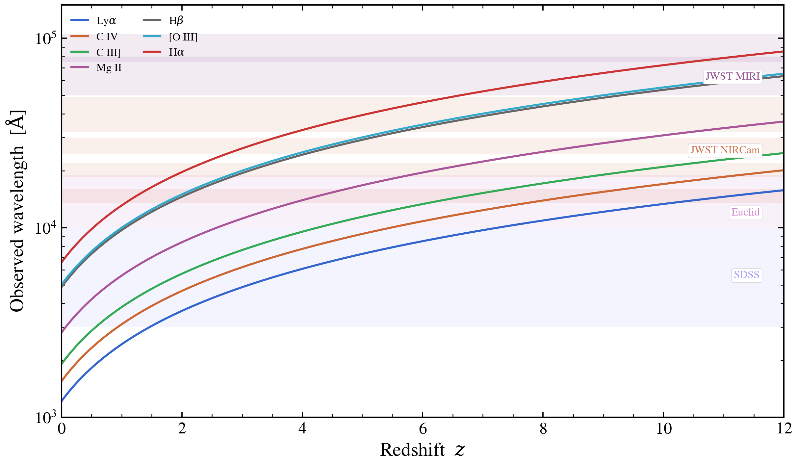

.. DO NOT EDIT.
.. THIS FILE WAS AUTOMATICALLY GENERATED BY SPHINX-GALLERY.
.. TO MAKE CHANGES, EDIT THE SOURCE PYTHON FILE:
.. "auto_examples/photometry/plot_emission_line_redshift_evolution.py"
.. LINE NUMBERS ARE GIVEN BELOW.

.. only:: html

    .. note::
        :class: sphx-glr-download-link-note

        :ref:`Go to the end <sphx_glr_download_auto_examples_photometry_plot_emission_line_redshift_evolution.py>`
        to download the full example code.

.. rst-class:: sphx-glr-example-title

.. _sphx_glr_auto_examples_photometry_plot_emission_line_redshift_evolution.py:

Strong emission lines vs redshift, with observed-frame filter bands
======================================================================

Where the brightest optical-UV emission lines land in the observer
frame as z grows from 0 to 12. Six lines are tracked simultaneously;
the SDSS *ugriz*, Euclid *Y/J/H*, JWST NIRCam wide bands, and JWST
MIRI bands are shaded so the reader can read off "Hα is in F277W at
z = 3.5" or "[O III] enters MIRI by z ≈ 8".

.. GENERATED FROM PYTHON SOURCE LINES 11-64

.. code-block:: Python

    import warnings

    import matplotlib.pyplot as plt
    import numpy as np

    from tengri.analysis.plotting import setup_style

    setup_style()
    warnings.filterwarnings("ignore", message=".*BakedInBackend.*")

    LINES = [
        (1215.67, "Ly$\\alpha$",   "#3366cc"),
        (1549.48, "C IV",          "#cc6633"),
        (1908.73, "C III]",        "#33aa55"),
        (2798.75, "Mg II",          "#aa5599"),
        (4861.33, "H$\\beta$",     "#666666"),
        (5006.84, "[O III]",        "#33aacc"),
        (6562.80, "H$\\alpha$",    "#cc3333"),
    ]
    BAND_GROUPS = [
        ("SDSS",    [(3000, 4000), (4000, 5500), (5500, 7000),
                     (7000, 8500), (8500, 10000)],         "#9999ff"),
        ("Euclid",  [(10000, 14000), (14000, 19000)],     "#cc77cc"),
        ("JWST NIRCam", [(13500, 16000), (18500, 22000), (24500, 30000),
                         (32000, 39000), (39000, 49000)], "#cc6644"),
        ("JWST MIRI", [(50000, 80000), (75000, 105000)],  "#884488"),
    ]

    z_grid = np.linspace(0.0, 12.0, 200)
    fig, ax = plt.subplots(figsize=(8.4, 5.0))

    for group, bands, color in BAND_GROUPS:
        for lo, hi in bands:
            ax.axhspan(lo, hi, color=color, alpha=0.10, lw=0)
        # one label per group
        mid = np.mean([b[0] for b in bands])
        ax.text(11.6, mid, group, fontsize=8, color=color, ha="right",
                va="center", alpha=0.9,
                bbox=dict(boxstyle="round,pad=0.2", fc="white", ec="0.85", lw=0.4))

    for lam_rest, name, color in LINES:
        ax.plot(z_grid, lam_rest * (1.0 + z_grid),
                color=color, lw=1.5, label=name)

    ax.set(yscale="log", xlim=(0, 12), ylim=(1000, 1.5e5),
           xlabel="Redshift  $z$",
           ylabel=r"Observed wavelength  [$\mathrm{\AA}$]")
    ax.legend(frameon=False, fontsize=8, loc="upper left", ncol=2)

    fig.tight_layout()
    plt.savefig("plot_emission_line_redshift_evolution.png", dpi=150,
                bbox_inches="tight")

.. _sphx_glr_download_auto_examples_photometry_plot_emission_line_redshift_evolution.py:

.. only:: html

  .. container:: sphx-glr-footer sphx-glr-footer-example

    .. container:: sphx-glr-download sphx-glr-download-jupyter

      :download:`Download Jupyter notebook: plot_emission_line_redshift_evolution.ipynb <plot_emission_line_redshift_evolution.ipynb>`

    .. container:: sphx-glr-download sphx-glr-download-python

      :download:`Download Python source code: plot_emission_line_redshift_evolution.py <plot_emission_line_redshift_evolution.py>`

    .. container:: sphx-glr-download sphx-glr-download-zip

      :download:`Download zipped: plot_emission_line_redshift_evolution.zip <plot_emission_line_redshift_evolution.zip>`

.. only:: html

 .. rst-class:: sphx-glr-signature

    `Gallery generated by Sphinx-Gallery <https://sphinx-gallery.github.io>`_
