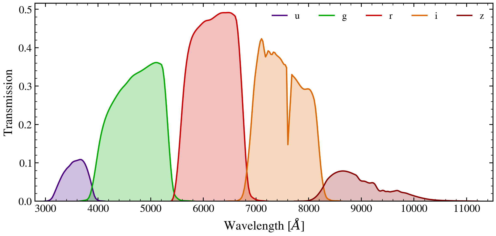

.. DO NOT EDIT.
.. THIS FILE WAS AUTOMATICALLY GENERATED BY SPHINX-GALLERY.
.. TO MAKE CHANGES, EDIT THE SOURCE PYTHON FILE:
.. "auto_examples/photometry/plot_filter_curves.py"
.. LINE NUMBERS ARE GIVEN BELOW.

.. only:: html

    .. note::
        :class: sphx-glr-download-link-note

        :ref:`Go to the end <sphx_glr_download_auto_examples_photometry_plot_filter_curves.py>`
        to download the full example code.

.. rst-class:: sphx-glr-example-title

.. _sphx_glr_auto_examples_photometry_plot_filter_curves.py:

SDSS Filter Transmission Curves
================================

Plot the ugriz filter transmission curves from the SDSS photometric system.
Filters are loaded from the SVO Filter Profile Service via tengri's filter
registry.

.. sphx-glr-precomputed-img:

.. GENERATED FROM PYTHON SOURCE LINES 16-66

.. code-block:: Python

    from pathlib import Path

    import matplotlib.pyplot as plt
    import numpy as np

    from tengri import load_filter_set
    from tengri.analysis.plotting import setup_style

    setup_style()

    # Locate filter cache — works from project root or sphinx-gallery cwd
    _FILTER_DIRS = [
        Path("data/filters"),
        Path("../data/filters"),
        Path("../../data/filters"),
        Path("../../../data/filters"),
    ]
    cache_dir = next((d for d in _FILTER_DIRS if d.exists()), "data/filters")

    # Load SDSS ugriz filters
    filter_names = ["sdss_u", "sdss_g", "sdss_r", "sdss_i", "sdss_z"]
    _waves, _trans, curves = load_filter_set(filter_names, cache_dir=str(cache_dir))

    # Band colors matching standard SDSS convention
    band_colors = {
        "sdss_u": "#4B0082",
        "sdss_g": "#00AA00",
        "sdss_r": "#CC0000",
        "sdss_i": "#DD6600",
        "sdss_z": "#880000",
    }

    fig, ax = plt.subplots(figsize=(8, 4))

    for fc, name in zip(curves, filter_names):
        wave_ang = np.array(fc.wave)
        trans = np.array(fc.trans)
        color = band_colors[name]
        ax.fill_between(wave_ang, 0, trans, alpha=0.25, color=color)
        ax.plot(wave_ang, trans, lw=1.5, color=color, label=name.replace("sdss_", ""))

    ax.set_xlabel(r"Wavelength [$\AA$]")
    ax.set_ylabel("Transmission")
    ax.set_xlim(2800, 11500)
    ax.set_ylim(0, None)
    ax.legend(frameon=False, ncol=5, loc="upper right")
    fig.tight_layout()

    plt.savefig("plot_filter_curves.png", dpi=150, bbox_inches="tight")

.. _sphx_glr_download_auto_examples_photometry_plot_filter_curves.py:

.. only:: html

  .. container:: sphx-glr-footer sphx-glr-footer-example

    .. container:: sphx-glr-download sphx-glr-download-jupyter

      :download:`Download Jupyter notebook: plot_filter_curves.ipynb <plot_filter_curves.ipynb>`

    .. container:: sphx-glr-download sphx-glr-download-python

      :download:`Download Python source code: plot_filter_curves.py <plot_filter_curves.py>`

    .. container:: sphx-glr-download sphx-glr-download-zip

      :download:`Download zipped: plot_filter_curves.zip <plot_filter_curves.zip>`

.. only:: html

 .. rst-class:: sphx-glr-signature

    `Gallery generated by Sphinx-Gallery <https://sphinx-gallery.github.io>`_
