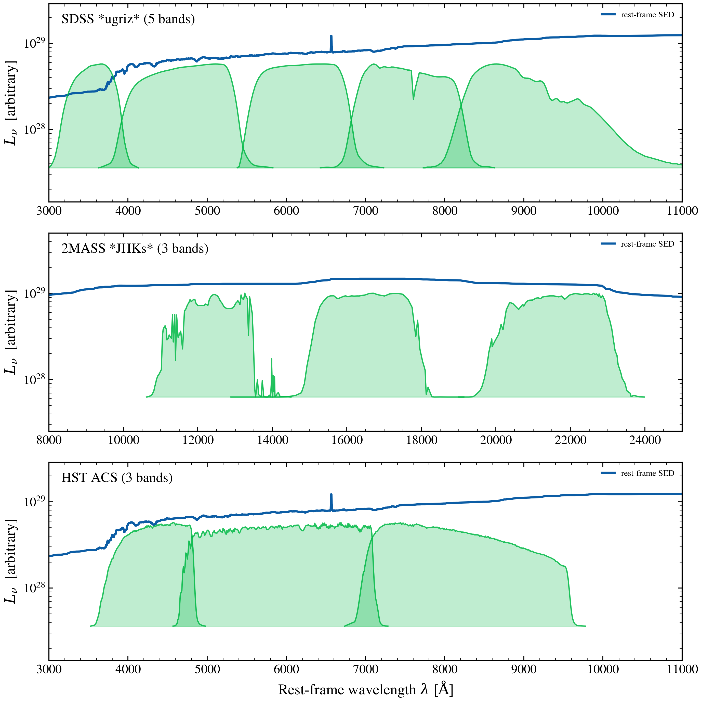

.. DO NOT EDIT.
.. THIS FILE WAS AUTOMATICALLY GENERATED BY SPHINX-GALLERY.
.. TO MAKE CHANGES, EDIT THE SOURCE PYTHON FILE:
.. "auto_examples/photometry/plot_filter_set_comparison.py"
.. LINE NUMBERS ARE GIVEN BELOW.

.. only:: html

    .. note::
        :class: sphx-glr-download-link-note

        :ref:`Go to the end <sphx_glr_download_auto_examples_photometry_plot_filter_set_comparison.py>`
        to download the full example code.

.. rst-class:: sphx-glr-example-title

.. _sphx_glr_auto_examples_photometry_plot_filter_set_comparison.py:

SyntaxError
===========

Example script with invalid Python syntax

.. GENERATED FROM PYTHON SOURCE LINES 1-116

.. code-block:: Python

    """
    Filter placement decides which spectral features a survey can see
    ==================================================================

    The same star-forming galaxy SED is intercepted by three different filter
    sets — SDSS *ugriz* (optical), 2MASS *JHKs* (near-infrared), and HST ACS
    *F435W/F606W/F814W* (UV-optical). Each panel overlays the survey's
    throughputs on the shared SED so the reader sees, at a glance, which
    spectral features (the 4000-Å break, H-alpha + [N II], the 1.6-um stellar
    bump) fall inside each band.

    Reference: Conroy 2013, ARA&A, 51, 393.
    """

    import os

    os.environ["TF_CPP_MIN_LOG_LEVEL"] = "2"  # suppress XLA/PjRt C++ INFO+WARNING logs

    import warnings

    import jax
    import matplotlib.pyplot as plt
    import numpy as np
    from scipy.ndimage import median_filter

    import tengri
    from tengri import data_path
    from tengri.analysis.plotting import setup_style

    setup_style()
    warnings.filterwarnings("ignore", message=".*BakedInBackend.*")

    FILTER_SETS = {
        "SDSS *ugriz*": ["sdss_u", "sdss_g", "sdss_r", "sdss_i", "sdss_z"],
        "2MASS *JHKs*": ["2mass_j", "2mass_h", "2mass_ks"],
        "HST ACS": ["hst_f435w", "hst_f606w", "hst_f814w"],
    }
    PANEL_XLIM = {
        "SDSS *ugriz*": (3000, 11000),
        "2MASS *JHKs*": (8000, 25000),
        "HST ACS": (3000, 11000),
    }

    <<<<<<< HEAD
    ssp = tengri.load_ssp()
    model = tengri.SEDModel.build(
        ssp,
        sfh={
            "type": "tsnorm",
            "*": tengri.FIXED,
            "log_total_mass": 1.0,
            "peak_lbt_gyr": 2.0,
            "width_gyr": 1.5,
            "skew": 0.3,
            "trunc": 3.0,
        },
        dust={
            "type": "two_component",
            "*": tengri.FIXED,
            "tau_bc": 0.4,
            "tau_diff": 0.2,
            "slope": -0.7,
        },
        redshift=tengri.Fixed(0.05),
    =======
    # Build common model (fixed parameters)
    spec = Parameters(
        sfh_tsnorm_log_total_mass=10.0),
        sfh_tsnorm_peak_lbt_gyr=Fixed(2.0),
        sfh_tsnorm_width_gyr=Fixed(1.5),
        sfh_tsnorm_skew=Fixed(0.3),
        sfh_tsnorm_trunc=Fixed(3.0),
        met_logzsol=Fixed(-0.2),
        dust_tau_bc=Fixed(0.4),
        dust_tau_diff=Fixed(0.2),
        dust_slope=Fixed(-0.7),
        redshift=Fixed(0.05),
    >>>>>>> 22c20410 (refactor(sfh): complete repo-wide sweep of log_total_mass → log_total_mass)
    )
    baseline = dict(model.spec.sample(jax.random.PRNGKey(0)))

    pred = model.predict_rest_sed(baseline)
    wave = np.asarray(pred.wavelength)
    sed = np.asarray(pred.sed)
    # Smooth the emission-line spikes for display only — the photometry path
    # still integrates the spiky SED through the filters.
    sed_smooth = median_filter(sed, size=51)

    fig, axes = plt.subplots(3, 1, figsize=(9.5, 9.5))
    for ax, (survey, bands) in zip(axes, FILTER_SETS.items()):
        xlo, xhi = PANEL_XLIM[survey]
        panel_mask = (wave >= xlo) & (wave <= xhi)
        continuum = float(np.median(sed_smooth[panel_mask]))
        y_floor = continuum * 0.05
        y_ceil = continuum * 0.8

        ax.semilogy(wave, sed_smooth, color="C0", lw=2.0, label="rest-frame SED")

        _, _, curves = tengri.load_filter_set(bands, cache_dir=str(data_path("filters")))
        for fc in curves:
            wave_f = np.asarray(fc.wave)
            trans_f = np.asarray(fc.trans) / float(np.max(fc.trans))
            scaled = y_floor + trans_f * (y_ceil - y_floor)
            ax.fill_between(wave_f, y_floor, scaled, alpha=0.25, color="C1")
            ax.plot(wave_f, scaled, lw=1.2, color="C1", alpha=0.8)

        ax.set_xlim(xlo, xhi)
        ax.set_ylim(continuum * 0.02, continuum * 4)
        ax.set_ylabel(r"$L_\nu$  [arbitrary]")
        ax.text(0.02, 0.95, f"{survey} ({len(bands)} bands)", transform=ax.transAxes, va="top")
        ax.legend(frameon=False, loc="upper right", fontsize=8)

    axes[-1].set_xlabel(r"Rest-frame wavelength $\lambda$ [$\mathrm{\AA}$]")
    fig.tight_layout()
    plt.savefig("plot_filter_set_comparison.png", dpi=150, bbox_inches="tight")

.. _sphx_glr_download_auto_examples_photometry_plot_filter_set_comparison.py:

.. only:: html

  .. container:: sphx-glr-footer sphx-glr-footer-example

    .. container:: sphx-glr-download sphx-glr-download-jupyter

      :download:`Download Jupyter notebook: plot_filter_set_comparison.ipynb <plot_filter_set_comparison.ipynb>`

    .. container:: sphx-glr-download sphx-glr-download-python

      :download:`Download Python source code: plot_filter_set_comparison.py <plot_filter_set_comparison.py>`

    .. container:: sphx-glr-download sphx-glr-download-zip

      :download:`Download zipped: plot_filter_set_comparison.zip <plot_filter_set_comparison.zip>`

.. only:: html

 .. rst-class:: sphx-glr-signature

    `Gallery generated by Sphinx-Gallery <https://sphinx-gallery.github.io>`_
