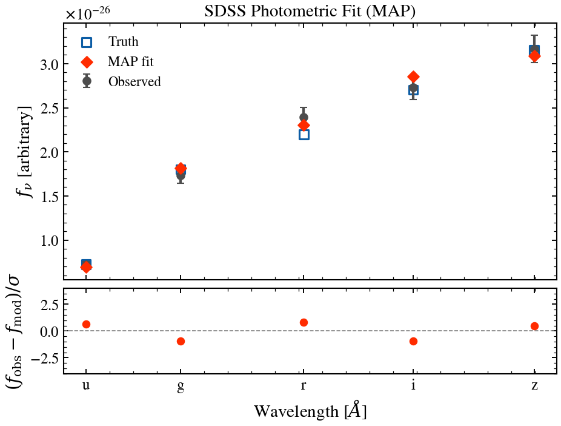

.. DO NOT EDIT.
.. THIS FILE WAS AUTOMATICALLY GENERATED BY SPHINX-GALLERY.
.. TO MAKE CHANGES, EDIT THE SOURCE PYTHON FILE:
.. "auto_examples/photometry/plot_photometric_fit.py"
.. LINE NUMBERS ARE GIVEN BELOW.

.. only:: html

    .. note::
        :class: sphx-glr-download-link-note

        :ref:`Go to the end <sphx_glr_download_auto_examples_photometry_plot_photometric_fit.py>`
        to download the full example code.

.. rst-class:: sphx-glr-example-title

.. _sphx_glr_auto_examples_photometry_plot_photometric_fit.py:

Photometric SED Fit
====================

Generate a mock galaxy with SDSS ugriz photometry and fit it using
tengri's variational inference. Shows observed vs model photometry
with error bars and residuals.

.. sphx-glr-precomputed-img:

.. GENERATED FROM PYTHON SOURCE LINES 16-122

.. code-block:: Python

    import jax
    import matplotlib.pyplot as plt
    import numpy as np

    from tengri import (
        Fitter,
        Fixed,
        Observation,
        Parameters,
        Photometry,
        SEDModel,
        Uniform,
        data_path,
        load_ssp,
    )
    from tengri.analysis.plotting import setup_style

    setup_style()

    # --- Check for SSP data ---

    ssp = load_ssp()

    # --- Setup ---
    bands = ["sdss_u", "sdss_g", "sdss_r", "sdss_i", "sdss_z"]
    obs = Observation(
        photometry=Photometry.from_names(bands, cache_dir=str(data_path("filters"))),
    )

    spec = Parameters(
        sfh_tsnorm_log_peak_sfr=Uniform(-1.0, 2.5),
        sfh_tsnorm_peak_lbt_gyr=Uniform(0.5, 12.0),
        sfh_tsnorm_width_gyr=Uniform(0.3, 5.0),
        sfh_tsnorm_skew=Uniform(-3.0, 3.0),
        sfh_tsnorm_trunc=Uniform(1.0, 10.0),
        met_logzsol=Uniform(-2.0, 0.2),
        dust_tau_bc=Fixed(0.3),
        dust_tau_diff=Fixed(0.2),
        dust_slope=Fixed(-0.7),
        redshift=Fixed(0.05),
    )
    model = SEDModel(spec, ssp, observation=obs)

    # --- Generate mock data (star-forming galaxy) ---
    true_params = spec.sample(jax.random.PRNGKey(42))
    true_params["sfh_tsnorm_peak_lbt_gyr"] = 3.0
    true_params["sfh_tsnorm_width_gyr"] = 2.0
    true_params["sfh_tsnorm_log_peak_sfr"] = 1.0
    true_params["sfh_tsnorm_skew"] = 0.3  # Positive skew = recent star formation
    mock = model.mock(true_params, snr=20.0, key=jax.random.PRNGKey(0))

    # --- Fit with MAP ---
    fitter = Fitter(model, mock.flux_obs, mock.noise)
    posterior = fitter.run("map", optimizer="adam", n_steps=300, verbose=False)
    best_fit = model.predict_photometry(posterior.params)

    # --- Plot ---
    wave_eff = np.array([3551, 4686, 6166, 7480, 8932])  # SDSS effective wavelengths
    band_names = ["u", "g", "r", "i", "z"]

    fig, (ax, ax_res) = plt.subplots(
        2, 1, figsize=(7, 5), height_ratios=[3, 1], sharex=True, gridspec_kw={"hspace": 0.05}
    )

    ax.errorbar(
        wave_eff,
        np.array(mock.flux_obs),
        yerr=np.array(mock.noise),
        fmt="o",
        color="0.3",
        ms=6,
        capsize=3,
        label="Observed",
        zorder=5,
    )
    ax.scatter(
        wave_eff,
        np.array(mock.flux_true),
        marker="s",
        s=50,
        facecolors="none",
        edgecolors="C0",
        lw=1.5,
        label="Truth",
        zorder=4,
    )
    ax.scatter(wave_eff, np.array(best_fit), marker="D", s=40, color="C3", label="MAP fit", zorder=6)
    ax.set_ylabel(r"$f_\nu$ [arbitrary]")
    ax.legend(frameon=False)
    ax.set_title("SDSS Photometric Fit (MAP)")

    residuals = (np.array(mock.flux_obs) - np.array(best_fit)) / np.array(mock.noise)
    ax_res.axhline(0, color="0.5", ls="--", lw=0.8)
    ax_res.scatter(wave_eff, residuals, c="C3", s=30, zorder=5)
    ax_res.set_xlabel(r"Wavelength [$\AA$]")
    ax_res.set_ylabel(r"$(f_\mathrm{obs} - f_\mathrm{mod}) / \sigma$")
    ax_res.set_ylim(-4, 4)
    ax_res.set_xticks(wave_eff)
    ax_res.set_xticklabels(band_names)

    fig.tight_layout()
    plt.savefig("plot_photometric_fit.png", dpi=150, bbox_inches="tight")

.. _sphx_glr_download_auto_examples_photometry_plot_photometric_fit.py:

.. only:: html

  .. container:: sphx-glr-footer sphx-glr-footer-example

    .. container:: sphx-glr-download sphx-glr-download-jupyter

      :download:`Download Jupyter notebook: plot_photometric_fit.ipynb <plot_photometric_fit.ipynb>`

    .. container:: sphx-glr-download sphx-glr-download-python

      :download:`Download Python source code: plot_photometric_fit.py <plot_photometric_fit.py>`

    .. container:: sphx-glr-download sphx-glr-download-zip

      :download:`Download zipped: plot_photometric_fit.zip <plot_photometric_fit.zip>`

.. only:: html

 .. rst-class:: sphx-glr-signature

    `Gallery generated by Sphinx-Gallery <https://sphinx-gallery.github.io>`_
