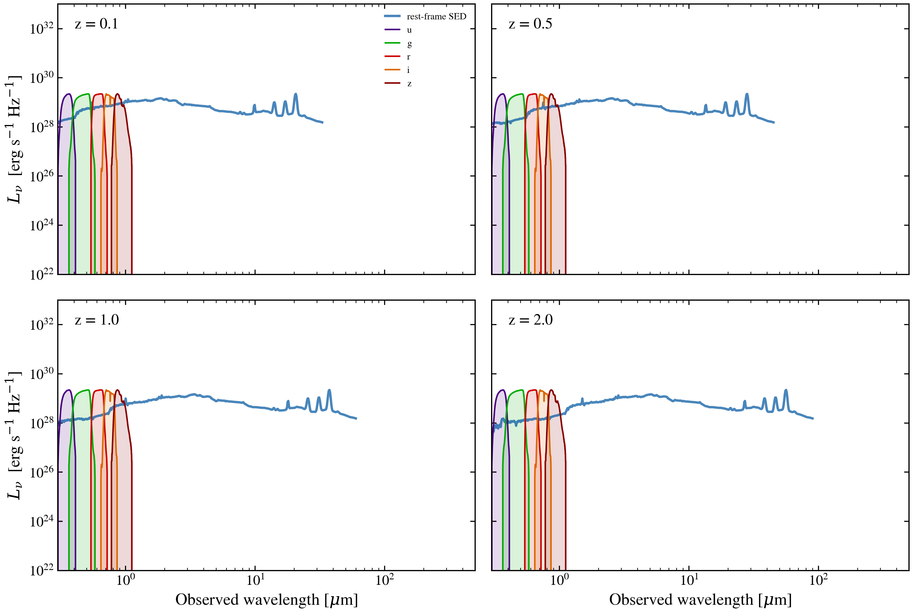

.. DO NOT EDIT.
.. THIS FILE WAS AUTOMATICALLY GENERATED BY SPHINX-GALLERY.
.. TO MAKE CHANGES, EDIT THE SOURCE PYTHON FILE:
.. "auto_examples/photometry/plot_redshift_filter_grid.py"
.. LINE NUMBERS ARE GIVEN BELOW.

.. only:: html

    .. note::
        :class: sphx-glr-download-link-note

        :ref:`Go to the end <sphx_glr_download_auto_examples_photometry_plot_redshift_filter_grid.py>`
        to download the full example code.

.. rst-class:: sphx-glr-example-title

.. _sphx_glr_auto_examples_photometry_plot_redshift_filter_grid.py:

SDSS *ugriz* sweep through a galaxy SED as z grows from 0.1 to 2
==================================================================

Same rest-frame star-forming SED at four observed redshifts, with the
SDSS *ugriz* throughputs plotted in their *observed* position so the
reader sees which rest-frame features each band samples. The Balmer
break enters the *u* band by z=1; by z=2 the bands fall longward of
the 4000-A break entirely. This is the geometric source of the
k-correction's sign.

Reference: Hogg et al. 2002, astro-ph/0210394 (k-correction primer).

.. GENERATED FROM PYTHON SOURCE LINES 14-96

.. image-sg:: /auto_examples/photometry/images/sphx_glr_plot_redshift_filter_grid_001.png
   :alt: plot redshift filter grid
   :srcset: /auto_examples/photometry/images/sphx_glr_plot_redshift_filter_grid_001.png
   :class: sphx-glr-single-img

.. code-block:: Python

    import os

    os.environ["TF_CPP_MIN_LOG_LEVEL"] = "2"  # suppress XLA/PjRt C++ INFO+WARNING logs

    import warnings

    import jax
    import jax.numpy as jnp
    import matplotlib.pyplot as plt
    import numpy as np

    import tengri
    from tengri.analysis.plotting import setup_style

    setup_style()
    warnings.filterwarnings("ignore", message=".*BakedInBackend.*")

    BANDS = ["sdss_u", "sdss_g", "sdss_r", "sdss_i", "sdss_z"]
    BAND_COLORS = {
        "sdss_u": "#4B0082",
        "sdss_g": "#00AA00",
        "sdss_r": "#CC0000",
        "sdss_i": "#DD6600",
        "sdss_z": "#880000",
    }
    REDSHIFTS = (0.1, 0.5, 1.0, 2.0)

    model = tengri.SEDModel.build(
        tengri.load_ssp(),
        sfh={
            "type": "tsnorm",
            "*": tengri.FIXED,
            "log_total_mass": 10.0,
            "peak_lbt_gyr": 2.0,
            "width_gyr": 1.5,
            "skew": 0.0,
            "trunc": 2.0,
        },
        dust={
            "type": "two_component",
            "*": tengri.FIXED,
            "tau_bc": 0.3,
            "tau_diff": 0.2,
            "slope": -0.7,
        },
        redshift=tengri.Fixed(0.0),
    )
    baseline = dict(model.spec.sample(jax.random.PRNGKey(0)))
    wave_grid = jnp.logspace(jnp.log10(1000.0), jnp.log10(3.0e5), 500)
    pred = model.predict_rest_sed(baseline, wave=wave_grid)
    wave_rest_um = np.asarray(pred.wavelength) / 1.0e4
    sed_rest = np.asarray(pred.sed)

    _, _, filter_curves = tengri.load_filter_set(BANDS)

    fig, axes = plt.subplots(2, 2, figsize=(11.0, 7.5), sharex=True, sharey=True)
    axes = axes.flatten()

    for ax, z in zip(axes, REDSHIFTS):
        wave_obs_um = wave_rest_um * (1.0 + z)
        ax.loglog(wave_obs_um, sed_rest, color="C0", lw=2.0, alpha=0.75, label="rest-frame SED")
        for fc, name in zip(filter_curves, BANDS):
            wave_f_um = np.asarray(fc.wave) / 1.0e4
            trans = np.asarray(fc.trans)
            scaled = trans * np.max(sed_rest) / np.max(trans)
            color = BAND_COLORS[name]
            ax.fill_between(wave_f_um, 1.0e20, scaled, alpha=0.15, color=color)
            legend_label = name.replace("sdss_", "") if z == REDSHIFTS[0] else None
            ax.plot(wave_f_um, scaled, color=color, lw=1.3, label=legend_label)
        ax.set_xlim(0.3, 5.0e2)
        ax.set_ylim(1.0e22, 1.0e33)
        ax.text(0.04, 0.95, f"z = {z}", transform=ax.transAxes, va="top")

    axes[0].legend(frameon=False, fontsize=8, loc="upper right")
    for ax in axes[2:]:
        ax.set_xlabel(r"Observed wavelength [$\mu$m]")
    for ax in (axes[0], axes[2]):
        ax.set_ylabel(r"$L_\nu$  [erg s$^{-1}$ Hz$^{-1}$]")

    fig.tight_layout()
    plt.savefig("plot_redshift_filter_grid.png", dpi=150, bbox_inches="tight")

.. _sphx_glr_download_auto_examples_photometry_plot_redshift_filter_grid.py:

.. only:: html

  .. container:: sphx-glr-footer sphx-glr-footer-example

    .. container:: sphx-glr-download sphx-glr-download-jupyter

      :download:`Download Jupyter notebook: plot_redshift_filter_grid.ipynb <plot_redshift_filter_grid.ipynb>`

    .. container:: sphx-glr-download sphx-glr-download-python

      :download:`Download Python source code: plot_redshift_filter_grid.py <plot_redshift_filter_grid.py>`

    .. container:: sphx-glr-download sphx-glr-download-zip

      :download:`Download zipped: plot_redshift_filter_grid.zip <plot_redshift_filter_grid.zip>`

.. only:: html

 .. rst-class:: sphx-glr-signature

    `Gallery generated by Sphinx-Gallery <https://sphinx-gallery.github.io>`_
