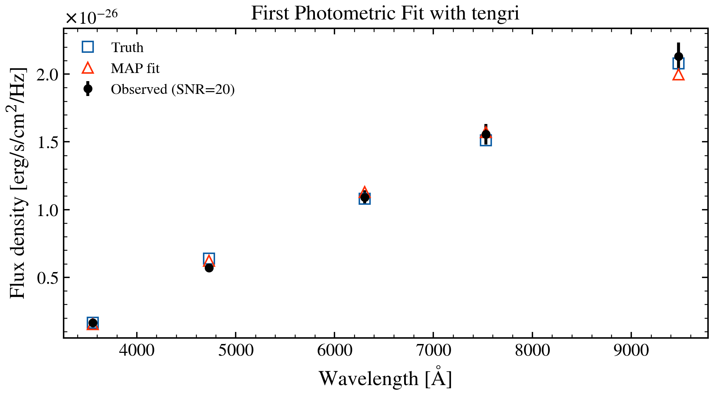

.. DO NOT EDIT.
.. THIS FILE WAS AUTOMATICALLY GENERATED BY SPHINX-GALLERY.
.. TO MAKE CHANGES, EDIT THE SOURCE PYTHON FILE:
.. "auto_examples/quickstart/plot_first_fit.py"
.. LINE NUMBERS ARE GIVEN BELOW.

.. only:: html

    .. note::
        :class: sphx-glr-download-link-note

        :ref:`Go to the end <sphx_glr_download_auto_examples_quickstart_plot_first_fit.py>`
        to download the full example code.

.. rst-class:: sphx-glr-example-title

.. _sphx_glr_auto_examples_quickstart_plot_first_fit.py:

First Photometric Fit
=====================

The shortest tengri workflow: define a parametric SFH + Calzetti dust
model, mock SDSS photometry, fit with MAP optimization, overplot. Start
here.

.. sphx-glr-precomputed-img:

.. GENERATED FROM PYTHON SOURCE LINES 16-98

.. image-sg:: /auto_examples/quickstart/images/sphx_glr_plot_first_fit_001.png
   :alt: First Photometric Fit with tengri
   :srcset: /auto_examples/quickstart/images/sphx_glr_plot_first_fit_001.png
   :class: sphx-glr-single-img

.. rst-class:: sphx-glr-script-out

 .. code-block:: none

    /Users/suchethacooray/Projects/tengri/.claude/worktrees/gallery-batch-2/src/tengri/forward/sed_model.py:643: BakedInNebularWarning: BakedInBackend: nebular emission is baked into the SSP file at a FIXED logU and FIXED escape fraction determined when the SSP grid was generated (commonly logU = −3, but depends on the SSP file). The ionization parameter and escape fraction are NOT free parameters — varying neb_logU or neb_fesc in your Parameters will have no effect. Check your SSP file's nebular assumptions. Switch to CloudyGridBackend or CueBackend to vary nebular properties. To suppress: pass ionizing_source_warning='suppress'.
      self._nebular_backend = BakedInBackend()

|

.. code-block:: Python

    import jax
    import jax.numpy as jnp
    import matplotlib.pyplot as plt
    import numpy as np

    from tengri import (
        FIXED,
        FREE,
        Fitter,
        Fixed,
        Observation,
        Photometry,
        SEDModel,
        Uniform,
        data_path,
        load_ssp,
    )
    from tengri.analysis.plotting import setup_style

    setup_style()

    # --- Build the model with the recommended nested-dict grammar ---
    bands = ["sdss_u", "sdss_g", "sdss_r", "sdss_i", "sdss_z"]
    obs = Observation(
        photometry=Photometry.from_names(bands, cache_dir=str(data_path("filters"))),
    )
    model = SEDModel.from_groups(
        ssp_data=load_ssp(),
        observation=obs,
        sfh={"type": "tsnorm", "*": FREE},
        dust={
            "type": "two_component",
            "law_bc": "calzetti",
            "*": FIXED,
            "tau_diff": Uniform(0.0, 1.5),  # free; everything else fixed
            "slope": -0.7,
        },
        redshift=Fixed(0.05),
    )

    # --- Mock a star-forming galaxy at z=0.05 (SNR=20) ---
    key = jax.random.PRNGKey(42)
    truth = model.spec.sample(key)
    truth.update(  # nudge the random draw toward a clear SF galaxy
        sfh_tsnorm_peak_lbt_gyr=3.0,
        sfh_tsnorm_width_gyr=2.0,
        sfh_tsnorm_log_peak_sfr=1.0,
        sfh_tsnorm_skew=0.3,
    )
    mock = model.mock(truth, snr=20.0, key=key)

    # --- Fit with MAP (Adam) ---
    fitter = Fitter(model, data=mock.flux_obs, noise=mock.noise)
    posterior = fitter.run("map", optimizer="adam", n_steps=300, verbose=False)

    # --- Plot: data, truth, MAP fit ---
    wave_eff = np.array([float(jnp.mean(w)) for w in obs.photometry.filter_waves])
    fig, ax = plt.subplots(figsize=(7, 4))
    ax.errorbar(
        wave_eff, mock.flux_obs, yerr=mock.noise, fmt="o", color="k", ms=5, label="Observed (SNR=20)"
    )
    ax.plot(wave_eff, mock.flux_true, "s", color="C0", ms=7, mfc="none", label="Truth")
    ax.plot(
        wave_eff,
        model.predict_photometry(posterior.params),
        "^",
        color="C3",
        ms=7,
        mfc="none",
        label="MAP fit",
    )

    ax.set(
        xlabel="Wavelength [Å]",
        ylabel=r"Flux density [erg/s/cm$^2$/Hz]",
        title="First Photometric Fit with tengri",
    )
    ax.legend(fontsize=10, frameon=False)
    fig.tight_layout()
    plt.savefig("plot_first_fit.png", dpi=150, bbox_inches="tight")
    plt.show()

.. rst-class:: sphx-glr-timing

   **Total running time of the script:** (0 minutes 10.390 seconds)

.. _sphx_glr_download_auto_examples_quickstart_plot_first_fit.py:

.. only:: html

  .. container:: sphx-glr-footer sphx-glr-footer-example

    .. container:: sphx-glr-download sphx-glr-download-jupyter

      :download:`Download Jupyter notebook: plot_first_fit.ipynb <plot_first_fit.ipynb>`

    .. container:: sphx-glr-download sphx-glr-download-python

      :download:`Download Python source code: plot_first_fit.py <plot_first_fit.py>`

    .. container:: sphx-glr-download sphx-glr-download-zip

      :download:`Download zipped: plot_first_fit.zip <plot_first_fit.zip>`

.. only:: html

 .. rst-class:: sphx-glr-signature

    `Gallery generated by Sphinx-Gallery <https://sphinx-gallery.github.io>`_
