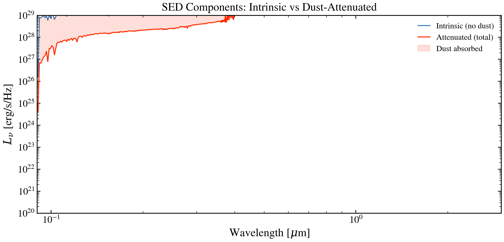

.. DO NOT EDIT.
.. THIS FILE WAS AUTOMATICALLY GENERATED BY SPHINX-GALLERY.
.. TO MAKE CHANGES, EDIT THE SOURCE PYTHON FILE:
.. "auto_examples/quickstart/plot_sed_components.py"
.. LINE NUMBERS ARE GIVEN BELOW.

.. only:: html

    .. note::
        :class: sphx-glr-download-link-note

        :ref:`Go to the end <sphx_glr_download_auto_examples_quickstart_plot_sed_components.py>`
        to download the full example code.

.. rst-class:: sphx-glr-example-title

.. _sphx_glr_auto_examples_quickstart_plot_sed_components.py:

SED Components
==============

Predict a galaxy SED at fixed parameters, then re-predict with dust
optical depths set to zero. Overplot to see how much UV-optical light
the dust absorbed.

.. sphx-glr-precomputed-img:

.. GENERATED FROM PYTHON SOURCE LINES 16-102

.. image-sg:: /auto_examples/quickstart/images/sphx_glr_plot_sed_components_001.png
   :alt: SED Components: Intrinsic vs Dust-Attenuated
   :srcset: /auto_examples/quickstart/images/sphx_glr_plot_sed_components_001.png
   :class: sphx-glr-single-img

.. rst-class:: sphx-glr-script-out

 .. code-block:: none

    /Users/suchethacooray/Projects/tengri/.claude/worktrees/gallery-batch-2/src/tengri/forward/sed_model.py:643: BakedInNebularWarning: BakedInBackend: nebular emission is baked into the SSP file at a FIXED logU and FIXED escape fraction determined when the SSP grid was generated (commonly logU = −3, but depends on the SSP file). The ionization parameter and escape fraction are NOT free parameters — varying neb_logU or neb_fesc in your Parameters will have no effect. Check your SSP file's nebular assumptions. Switch to CloudyGridBackend or CueBackend to vary nebular properties. To suppress: pass ionizing_source_warning='suppress'.
      self._nebular_backend = BakedInBackend()

|

.. code-block:: Python

    import jax
    import jax.numpy as jnp
    import matplotlib.pyplot as plt
    import numpy as np

    from tengri import (
        FIXED,
        Fixed,
        Observation,
        Photometry,
        SEDModel,
        data_path,
        load_ssp,
    )
    from tengri.analysis.plotting import setup_style

    setup_style()

    # --- Build a fully-fixed dusty galaxy at z = 0 ---
    obs = Observation(
        photometry=Photometry.from_names(["sdss_r"], cache_dir=str(data_path("filters"))),
    )
    model = SEDModel.from_groups(
        ssp_data=load_ssp(),
        observation=obs,
        sfh={
            "type": "tsnorm",
            "*": FIXED,
            "log_peak_sfr": 1.2,
            "peak_lbt_gyr": 5.0,
            "width_gyr": 2.0,
            "skew": 0.5,
            "trunc": 3.0,
        },
        dust={
            "type": "two_component",
            "law_bc": "calzetti",
            "*": FIXED,
            "tau_bc": 1.0,
            "tau_diff": 0.5,
            "slope": -0.7,
        },
        redshift=Fixed(0.0),
    )

    # --- Predict twice: with dust, and with tau_bc=tau_diff=0 ---
    params = model.spec.sample(jax.random.PRNGKey(0))
    sed_total = np.array(model.predict_rest_sed(params).sed)
    sed_intrinsic = np.array(
        model.predict_rest_sed(
            {**params, "dust_tau_bc": jnp.array(0.0), "dust_tau_diff": jnp.array(0.0)}
        ).sed
    )

    # --- Plot ---
    wave_um = np.array(model.ssp_data.ssp_wave) / 1e4
    mask = (wave_um > 0.09) & (wave_um < 3.0)

    fig, ax = plt.subplots(figsize=(9, 4.5))
    ax.plot(
        wave_um[mask], sed_intrinsic[mask], color="C0", lw=1.2, alpha=0.8, label="Intrinsic (no dust)"
    )
    ax.plot(wave_um[mask], sed_total[mask], color="C3", lw=1.2, label="Attenuated (total)")
    ax.fill_between(
        wave_um[mask],
        sed_total[mask],
        sed_intrinsic[mask],
        alpha=0.15,
        color="C3",
        label="Dust absorbed",
    )

    ax.set(
        xlabel=r"Wavelength [$\mu$m]",
        ylabel=r"$L_\nu$ [erg/s/Hz]",
        title="SED Components: Intrinsic vs Dust-Attenuated",
        xscale="log",
        yscale="log",
        xlim=(0.09, 3.0),
        ylim=(1e20, 1e29),
    )
    ax.legend(fontsize=10, frameon=False, loc="upper right")
    fig.tight_layout()
    plt.savefig("plot_sed_components.png", dpi=150, bbox_inches="tight")
    plt.show()

.. rst-class:: sphx-glr-timing

   **Total running time of the script:** (0 minutes 4.580 seconds)

.. _sphx_glr_download_auto_examples_quickstart_plot_sed_components.py:

.. only:: html

  .. container:: sphx-glr-footer sphx-glr-footer-example

    .. container:: sphx-glr-download sphx-glr-download-jupyter

      :download:`Download Jupyter notebook: plot_sed_components.ipynb <plot_sed_components.ipynb>`

    .. container:: sphx-glr-download sphx-glr-download-python

      :download:`Download Python source code: plot_sed_components.py <plot_sed_components.py>`

    .. container:: sphx-glr-download sphx-glr-download-zip

      :download:`Download zipped: plot_sed_components.zip <plot_sed_components.zip>`

.. only:: html

 .. rst-class:: sphx-glr-signature

    `Gallery generated by Sphinx-Gallery <https://sphinx-gallery.github.io>`_
