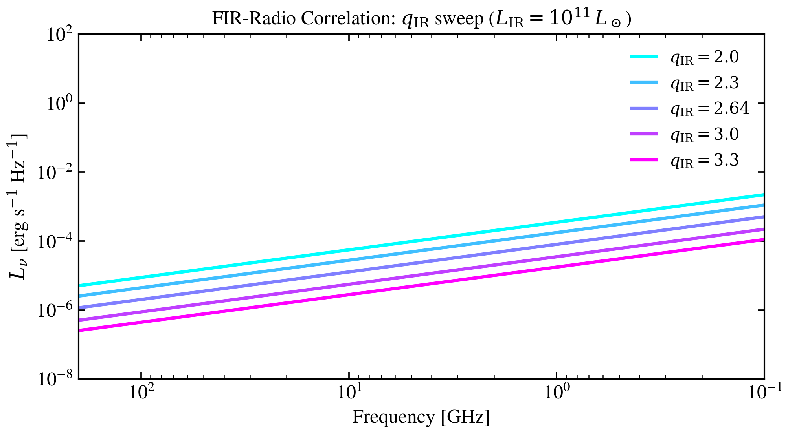

.. DO NOT EDIT.
.. THIS FILE WAS AUTOMATICALLY GENERATED BY SPHINX-GALLERY.
.. TO MAKE CHANGES, EDIT THE SOURCE PYTHON FILE:
.. "auto_examples/radio/plot_q_ir_sweep.py"
.. LINE NUMBERS ARE GIVEN BELOW.

.. only:: html

    .. note::
        :class: sphx-glr-download-link-note

        :ref:`Go to the end <sphx_glr_download_auto_examples_radio_plot_q_ir_sweep.py>`
        to download the full example code.

.. rst-class:: sphx-glr-example-title

.. _sphx_glr_auto_examples_radio_plot_q_ir_sweep.py:

FIR-Radio Correlation (q_IR)
=============================

The FIR-radio correlation links a galaxy's infrared luminosity to its
1.4 GHz synchrotron emission via the dimensionless parameter
:math:`q_{\rm IR} = \log_{10}(L_{\rm IR} / 3.75\times10^{12} \, L_{\rm 1.4GHz})`.
Higher :math:`q_{\rm IR}` means relatively less radio per unit star formation.
The canonical value for star-forming galaxies is 2.64 (Bell 2003).

.. sphx-glr-precomputed-img:

.. GENERATED FROM PYTHON SOURCE LINES 18-62

.. code-block:: Python

    import jax
    import jax.numpy as jnp
    import matplotlib.pyplot as plt
    import numpy as np

    jax.config.update("jax_enable_x64", True)

    from tengri.analysis.plotting import SWEEP_CMAPS, setup_style
    from tengri.radio import radio_star_forming

    setup_style()

    # --- Wavelength grid: radio regime (1 mm to 10 m) ---
    wave = jnp.logspace(7, 11, 600)  # Angstrom: 1 mm = 1e7 Å, 10 m = 1e11 Å

    L_ir = 1e11  # L_sun — ULIRG-like

    q_ir_values = [2.0, 2.3, 2.64, 3.0, 3.3]
    cmap = plt.get_cmap(SWEEP_CMAPS["radio"])
    colors = [cmap(i / max(len(q_ir_values) - 1, 1)) for i in range(len(q_ir_values))]

    fig, ax = plt.subplots(figsize=(7, 4))

    for q_ir, color in zip(q_ir_values, colors):
        # radio_star_forming takes q_ir as a parameter
        L_nu = radio_star_forming(wave, L_ir=L_ir, q_ir=q_ir, alpha_sf=0.8)
        nu_ghz = (3e18 / np.array(wave)) / 1e9  # convert Å → Hz → GHz
        ax.loglog(nu_ghz, np.array(L_nu), color=color, lw=2.0, label=rf"$q_{{\rm IR}}={q_ir}$")

    ax.set_xlabel("Frequency [GHz]", fontsize=12)
    ax.set_ylabel(r"$L_\nu$ [erg s$^{-1}$ Hz$^{-1}$]", fontsize=12)
    ax.invert_xaxis()
    ax.set_xlim(200, 0.1)
    ax.set_ylim(1e-8, 1e2)
    ax.legend(fontsize=10, frameon=False)
    ax.set_title(
        r"FIR-Radio Correlation: $q_{\rm IR}$ sweep ($L_{\rm IR}=10^{11}\,L_\odot$)",
        fontsize=12,
    )
    plt.tight_layout()
    plt.savefig("plot_q_ir_sweep.png", dpi=150, bbox_inches="tight")
    plt.show()

.. _sphx_glr_download_auto_examples_radio_plot_q_ir_sweep.py:

.. only:: html

  .. container:: sphx-glr-footer sphx-glr-footer-example

    .. container:: sphx-glr-download sphx-glr-download-jupyter

      :download:`Download Jupyter notebook: plot_q_ir_sweep.ipynb <plot_q_ir_sweep.ipynb>`

    .. container:: sphx-glr-download sphx-glr-download-python

      :download:`Download Python source code: plot_q_ir_sweep.py <plot_q_ir_sweep.py>`

    .. container:: sphx-glr-download sphx-glr-download-zip

      :download:`Download zipped: plot_q_ir_sweep.zip <plot_q_ir_sweep.zip>`

.. only:: html

 .. rst-class:: sphx-glr-signature

    `Gallery generated by Sphinx-Gallery <https://sphinx-gallery.github.io>`_
