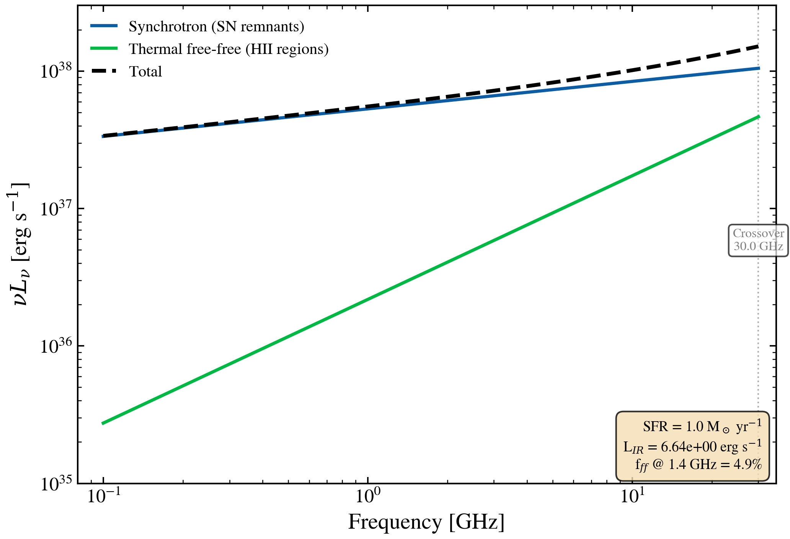

.. DO NOT EDIT.
.. THIS FILE WAS AUTOMATICALLY GENERATED BY SPHINX-GALLERY.
.. TO MAKE CHANGES, EDIT THE SOURCE PYTHON FILE:
.. "auto_examples/radio/plot_synchrotron_thermal_decomposition.py"
.. LINE NUMBERS ARE GIVEN BELOW.

.. only:: html

    .. note::
        :class: sphx-glr-download-link-note

        :ref:`Go to the end <sphx_glr_download_auto_examples_radio_plot_synchrotron_thermal_decomposition.py>`
        to download the full example code.

.. rst-class:: sphx-glr-example-title

.. _sphx_glr_auto_examples_radio_plot_synchrotron_thermal_decomposition.py:

Radio SED decomposition: synchrotron vs thermal free-free
=========================================================

Decompose a star-forming galaxy's radio SED into its physical components:
synchrotron (steep, slope ~ -0.8) from supernova remnants and thermal
free-free (flat, slope ~ -0.1) from HII regions. At radio frequencies,
synchrotron dominates below ~30 GHz, while free-free becomes progressively
important above. This example uses the Condon (1992) framework with
Murphy+2011 thermal calibration.

References
----------
Condon, J. J. 1992, ARA&A, 30, 575
  (Radio SED models and FIR-radio correlation)
Murphy, E. J., et al. 2011, ApJ, 737, 67
  (Radio SFR calibrations and free-free emission)
Helou, G. & Bicay, D. A. 1993, ApJ, 415, 93
  (FIR-radio correlation and physical origins)

.. GENERATED FROM PYTHON SOURCE LINES 21-135

.. image-sg:: /auto_examples/radio/images/sphx_glr_plot_synchrotron_thermal_decomposition_001.png
   :alt: plot synchrotron thermal decomposition
   :srcset: /auto_examples/radio/images/sphx_glr_plot_synchrotron_thermal_decomposition_001.png
   :class: sphx-glr-single-img

.. code-block:: Python

    import warnings

    import matplotlib.pyplot as plt
    import numpy as np

    from tengri.analysis.plotting import setup_style
    from tengri.components.radio.radio import compute_radio_components

    setup_style()
    warnings.filterwarnings("ignore", message=".*BakedInBackend.*")

    # Physical constants
    C_AA_PER_S = 2.998e18  # c in Angstrom/s (for nu * L_nu conversions)

    # Reference star-forming galaxy: SFR = 1 M_sun/yr => L_IR ~ 5.3e10 L_sun
    sfr_msun_yr = 1.0
    L_IR = sfr_msun_yr * 1.73e10 * 3.839e33  # IR luminosity in erg/s

    # Radio frequency grid: 0.1 to 30 GHz
    nu_ghz = np.logspace(-1, np.log10(30), 256)  # GHz
    nu_hz = nu_ghz * 1.0e9  # Hz
    wavelength = (C_AA_PER_S / nu_hz).astype(np.float64)  # Angstrom (rest-frame)

    # Compute total radio SED and decomposition
    # Using Bell (2003) FIRRC (q_IR=2.64) with Condon synchrotron slope (alpha=0.8)
    components = compute_radio_components(
        wavelength=wavelength,
        L_ir=L_IR,
        L_agn_bol=0.0,  # Star-forming only; no AGN
        q_ir=2.64,  # Bell (2003) FIR-radio correlation
        alpha_sf=0.8,  # Condon (1992) synchrotron index
        sfr_mode="bell2003",
        include_freefree=True,
        T_e=1e4,  # HII region electron temperature [K]
        alpha_ff=-0.1,  # Free-free spectral index (nearly flat)
    )

    sed_total = np.asarray(components["total"])
    sed_synch = np.asarray(components["synchrotron"])
    sed_thermal = np.asarray(components["freefree"])

    # Convert to nu * L_nu (erg/s)
    nu_l_nu_total = C_AA_PER_S / wavelength * sed_total
    nu_l_nu_synch = C_AA_PER_S / wavelength * sed_synch
    nu_l_nu_thermal = C_AA_PER_S / wavelength * sed_thermal

    # Thermal fraction at selected frequencies (diagnostic)
    thermal_frac_at_1p4ghz = (
        np.interp(1.4, nu_ghz, np.asarray(sed_thermal) / (np.asarray(sed_total) + 1e-40))
        * 100.0
    )

    # Plot
    fig, ax = plt.subplots(figsize=(7.2, 5.0))

    # Synchrotron: steep power-law (slope ~ -0.8 below 10 GHz)
    ax.loglog(nu_ghz, nu_l_nu_synch, "C0-", lw=2.0, label="Synchrotron (SN remnants)", zorder=2)

    # Free-free: shallow power-law (slope ~ -0.1, nearly flat)
    ax.loglog(
        nu_ghz,
        nu_l_nu_thermal,
        "C1-",
        lw=2.0,
        label="Thermal free-free (HII regions)",
        zorder=2,
    )

    # Total (sum)
    ax.loglog(nu_ghz, nu_l_nu_total, "k--", lw=2.4, label="Total", zorder=3)

    # Crossover annotation: thermal flux grows faster than synchrotron at high nu
    # Typical crossover for SFR~1 M_sun/yr is ~30 GHz
    crossover_nu = nu_ghz[np.argmin(np.abs(sed_synch - sed_thermal))]
    crossover_idx = np.argmin(np.abs(nu_ghz - crossover_nu))
    ax.axvline(crossover_nu, color="gray", lw=1.0, ls=":", alpha=0.6, zorder=1)
    ax.text(
        crossover_nu,
        5e36,
        f"Crossover\n{crossover_nu:.1f} GHz",
        fontsize=8,
        color="0.5",
        ha="center",
        bbox=dict(boxstyle="round,pad=0.3", facecolor="white", alpha=0.7),
    )

    ax.set(
        xlim=(0.08, 35),
        ylim=(1e35, 3e38),
        xlabel="Frequency [GHz]",
        ylabel=r"$\nu L_\nu$ [erg s$^{-1}$]",
    )
    ax.legend(loc="upper left", fontsize=10, framealpha=0.95)

    # Inset text: diagnostic summary
    textstr = (
        f"SFR = {sfr_msun_yr:.1f} M$_\\odot$ yr$^{{-1}}$\n"
        f"L$_{{IR}}$ = {L_IR/1e43:.2e} erg s$^{{-1}}$\n"
        f"f$_{{ff}}$ @ 1.4 GHz = {thermal_frac_at_1p4ghz:.1f}%"
    )
    ax.text(
        0.98,
        0.02,
        textstr,
        fontsize=9,
        ha="right",
        va="bottom",
        transform=ax.transAxes,
        bbox=dict(boxstyle="round,pad=0.5", facecolor="wheat", alpha=0.8),
    )

    fig.tight_layout()
    plt.savefig("plot_synchrotron_thermal_decomposition.png", dpi=150, bbox_inches="tight")

.. _sphx_glr_download_auto_examples_radio_plot_synchrotron_thermal_decomposition.py:

.. only:: html

  .. container:: sphx-glr-footer sphx-glr-footer-example

    .. container:: sphx-glr-download sphx-glr-download-jupyter

      :download:`Download Jupyter notebook: plot_synchrotron_thermal_decomposition.ipynb <plot_synchrotron_thermal_decomposition.ipynb>`

    .. container:: sphx-glr-download sphx-glr-download-python

      :download:`Download Python source code: plot_synchrotron_thermal_decomposition.py <plot_synchrotron_thermal_decomposition.py>`

    .. container:: sphx-glr-download sphx-glr-download-zip

      :download:`Download zipped: plot_synchrotron_thermal_decomposition.zip <plot_synchrotron_thermal_decomposition.zip>`

.. only:: html

 .. rst-class:: sphx-glr-signature

    `Gallery generated by Sphinx-Gallery <https://sphinx-gallery.github.io>`_
