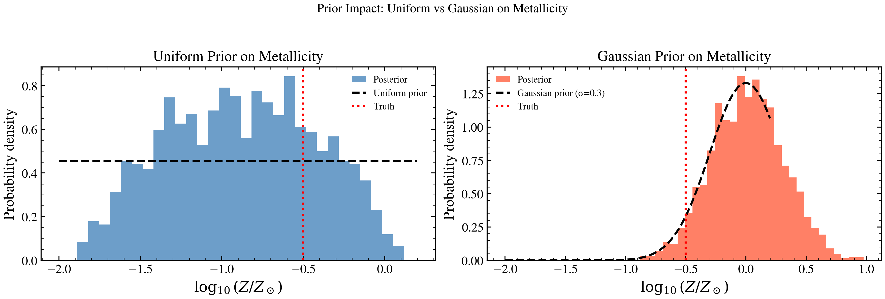

.. DO NOT EDIT.
.. THIS FILE WAS AUTOMATICALLY GENERATED BY SPHINX-GALLERY.
.. TO MAKE CHANGES, EDIT THE SOURCE PYTHON FILE:
.. "auto_examples/recipes/plot_recipe_compare_priors.py"
.. LINE NUMBERS ARE GIVEN BELOW.

.. only:: html

    .. note::
        :class: sphx-glr-download-link-note

        :ref:`Go to the end <sphx_glr_download_auto_examples_recipes_plot_recipe_compare_priors.py>`
        to download the full example code.

.. rst-class:: sphx-glr-example-title

.. _sphx_glr_auto_examples_recipes_plot_recipe_compare_priors.py:

Prior Sensitivity: Gaussian vs Uniform
=======================================

How does prior choice affect the posterior? This recipe compares fitting
with a Uniform prior vs Gaussian prior on metallicity, showing how prior
assumptions constrain the posterior.

.. sphx-glr-precomputed-img:

.. GENERATED FROM PYTHON SOURCE LINES 16-192

.. code-block:: Python

    from pathlib import Path

    import jax
    import matplotlib.pyplot as plt
    import numpy as np

    from tengri import (
        Fitter,
        Fixed,
        Gaussian,
        Observation,
        Parameters,
        Photometry,
        SEDModel,
        Uniform,
        load_ssp_data,
    )
    from tengri.analysis.plotting import setup_style

    setup_style()

    def _find_ssp():
        """Locate SSP data from project root or docs/ (sphinx-gallery) cwd."""
        name = "ssp_prsc_miles_chabrier_wNE_logGasU-3.0_logGasZ0.0.h5"
        for p in [
            Path("data") / name,
            Path("../data") / name,
            Path("../../data") / name,
            Path("../../../data") / name,
        ]:
            if p.exists():
                return str(p)
        return None

    SSP_PATH = _find_ssp()
    if SSP_PATH is None:
        raise FileNotFoundError("SSP data not found — skipping example")

    ssp = load_ssp_data(SSP_PATH)

    # --- Setup observation and mock data ---
    bands = ["sdss_u", "sdss_g", "sdss_r", "sdss_i", "sdss_z"]
    obs = Observation(photometry=Photometry.from_names(bands))

    # Generate mock data with moderate metallicity
    true_spec = Parameters(
        sfh_tsnorm_log_peak_sfr=Fixed(0.8),
        sfh_tsnorm_peak_lbt_gyr=Fixed(2.0),
        sfh_tsnorm_width_gyr=Fixed(1.5),
        sfh_tsnorm_skew=Fixed(0.1),
        sfh_tsnorm_trunc=Fixed(5.0),
        met_logzsol=Fixed(-0.5),  # Subsolar: true value
        dust_tau_bc=Fixed(0.1),
        dust_tau_diff=Fixed(0.2),
        dust_slope=Fixed(-0.7),
        redshift=Fixed(0.1),
        mean_sfh_type="tsnorm",
    )
    model_true = SEDModel(true_spec, ssp, observation=obs)

    key = jax.random.PRNGKey(42)
    true_params_dict = {
        "sfh_tsnorm_log_peak_sfr": 0.8,
        "sfh_tsnorm_peak_lbt_gyr": 2.0,
        "sfh_tsnorm_width_gyr": 1.5,
        "sfh_tsnorm_skew": 0.1,
        "sfh_tsnorm_trunc": 5.0,
        "met_logzsol": -0.5,
        "dust_tau_bc": 0.1,
        "dust_tau_diff": 0.2,
        "dust_slope": -0.7,
        "redshift": 0.1,
    }
    mock = model_true.mock(true_params_dict, snr=20.0, key=key)

    # --- Fit 1: Uniform prior on metallicity ---
    spec_uniform = Parameters(
        sfh_tsnorm_log_peak_sfr=Uniform(-1.0, 2.5),
        sfh_tsnorm_peak_lbt_gyr=Uniform(0.5, 12.0),
        sfh_tsnorm_width_gyr=Uniform(0.3, 5.0),
        sfh_tsnorm_skew=Uniform(-3.0, 3.0),
        sfh_tsnorm_trunc=Uniform(1.0, 10.0),
        met_logzsol=Uniform(-2.0, 0.2),  # ← Uniform prior
        dust_tau_diff=Uniform(0.0, 1.5),
        dust_slope=Fixed(-0.7),
        redshift=Fixed(0.1),
        mean_sfh_type="tsnorm",
    )
    model_uniform = SEDModel(spec_uniform, ssp, observation=obs)
    fitter_uniform = Fitter(model_uniform, data=mock.flux_obs, noise=mock.noise)
    fitter_uniform.run("map", optimizer="adam", n_steps=200, verbose=False)
    posterior_uniform = fitter_uniform.run(
        "vi",
        n_iterations=10,
        n_samples=3,
        n_posterior_samples=2000,
        verbose=False,
    )

    # --- Fit 2: Gaussian prior on metallicity (informative) ---
    spec_gaussian = Parameters(
        sfh_tsnorm_log_peak_sfr=Uniform(-1.0, 2.5),
        sfh_tsnorm_peak_lbt_gyr=Uniform(0.5, 12.0),
        sfh_tsnorm_width_gyr=Uniform(0.3, 5.0),
        sfh_tsnorm_skew=Uniform(-3.0, 3.0),
        sfh_tsnorm_trunc=Uniform(1.0, 10.0),
        met_logzsol=Gaussian(mu=0.0, sigma=0.3),  # ← Gaussian centered at solar, sigma=0.3
        dust_tau_diff=Uniform(0.0, 1.5),
        dust_slope=Fixed(-0.7),
        redshift=Fixed(0.1),
        mean_sfh_type="tsnorm",
    )
    model_gaussian = SEDModel(spec_gaussian, ssp, observation=obs)
    fitter_gaussian = Fitter(model_gaussian, data=mock.flux_obs, noise=mock.noise)
    fitter_gaussian.run("map", optimizer="adam", n_steps=200, verbose=False)
    posterior_gaussian = fitter_gaussian.run(
        "vi",
        n_iterations=10,
        n_samples=3,
        n_posterior_samples=2000,
        verbose=False,
    )

    # --- Comparison plot: Posterior distributions + prior overlay ---
    fig, axes = plt.subplots(1, 2, figsize=(12, 4))

    # Metallicity parameter
    met_uniform = np.array(posterior_uniform.samples["met_logzsol"])
    met_gaussian = np.array(posterior_gaussian.samples["met_logzsol"])

    # Histogram: Uniform prior fit
    axes[0].hist(met_uniform, bins=30, alpha=0.6, color="C0", density=True, label="Posterior")
    z_vals = np.linspace(-2.0, 0.2, 100)
    axes[0].plot(z_vals, np.ones_like(z_vals) / 2.2, "k--", lw=2.0, label="Uniform prior")
    axes[0].axvline(-0.5, color="red", ls=":", lw=2.0, label="Truth")
    axes[0].set_xlabel(r"$\log_{10}(Z/Z_\odot)$")
    axes[0].set_ylabel("Probability density")
    axes[0].set_title("Uniform Prior on Metallicity")
    axes[0].legend(frameon=False, fontsize=9)

    # Histogram: Gaussian prior fit
    axes[1].hist(met_gaussian, bins=30, alpha=0.6, color="C3", density=True, label="Posterior")
    axes[1].plot(
        z_vals,
        np.exp(-0.5 * (z_vals / 0.3) ** 2) / (0.3 * np.sqrt(2 * np.pi)),
        "k--",
        lw=2.0,
        label="Gaussian prior (σ=0.3)",
    )
    axes[1].axvline(-0.5, color="red", ls=":", lw=2.0, label="Truth")
    axes[1].set_xlabel(r"$\log_{10}(Z/Z_\odot)$")
    axes[1].set_ylabel("Probability density")
    axes[1].set_title("Gaussian Prior on Metallicity")
    axes[1].legend(frameon=False, fontsize=9)

    fig.suptitle("Prior Impact: Uniform vs Gaussian on Metallicity", fontsize=12, y=1.02)
    fig.tight_layout()
    plt.savefig("plot_recipe_compare_priors.png", dpi=150, bbox_inches="tight")
    plt.show()

    # Print summary
    print("\n--- Prior Sensitivity Summary ---")
    print(f"True metallicity: {-0.5:.3f}")
    print("\nUniform prior [-2.0, 0.2]:")
    print(f"  Posterior median: {np.median(met_uniform):.3f}")
    med_u = np.percentile(met_uniform, 16)
    hi_u = np.percentile(met_uniform, 84)
    print(f"  Posterior 68% CI: [{med_u:.3f}, {hi_u:.3f}]")
    print("\nGaussian prior N(0.0, 0.3):")
    print(f"  Posterior median: {np.median(met_gaussian):.3f}")
    med_g = np.percentile(met_gaussian, 16)
    hi_g = np.percentile(met_gaussian, 84)
    print(f"  Posterior 68% CI: [{med_g:.3f}, {hi_g:.3f}]")

.. _sphx_glr_download_auto_examples_recipes_plot_recipe_compare_priors.py:

.. only:: html

  .. container:: sphx-glr-footer sphx-glr-footer-example

    .. container:: sphx-glr-download sphx-glr-download-jupyter

      :download:`Download Jupyter notebook: plot_recipe_compare_priors.ipynb <plot_recipe_compare_priors.ipynb>`

    .. container:: sphx-glr-download sphx-glr-download-python

      :download:`Download Python source code: plot_recipe_compare_priors.py <plot_recipe_compare_priors.py>`

    .. container:: sphx-glr-download sphx-glr-download-zip

      :download:`Download zipped: plot_recipe_compare_priors.zip <plot_recipe_compare_priors.zip>`

.. only:: html

 .. rst-class:: sphx-glr-signature

    `Gallery generated by Sphinx-Gallery <https://sphinx-gallery.github.io>`_
