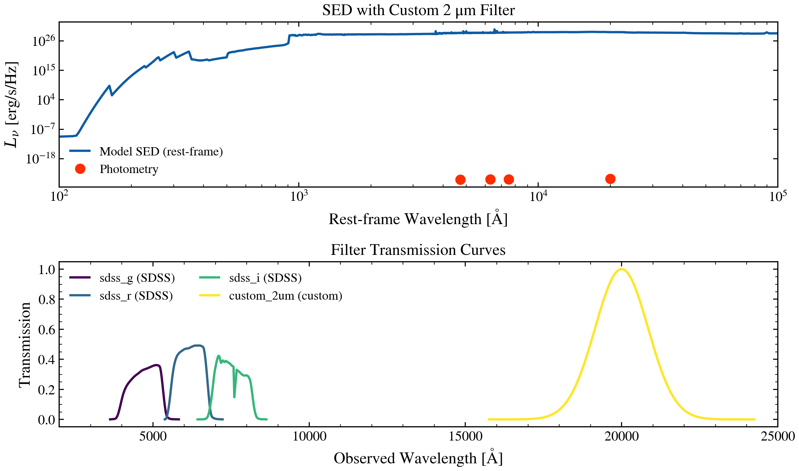

.. DO NOT EDIT.
.. THIS FILE WAS AUTOMATICALLY GENERATED BY SPHINX-GALLERY.
.. TO MAKE CHANGES, EDIT THE SOURCE PYTHON FILE:
.. "auto_examples/recipes/plot_recipe_custom_filter.py"
.. LINE NUMBERS ARE GIVEN BELOW.

.. only:: html

    .. note::
        :class: sphx-glr-download-link-note

        :ref:`Go to the end <sphx_glr_download_auto_examples_recipes_plot_recipe_custom_filter.py>`
        to download the full example code.

.. rst-class:: sphx-glr-example-title

.. _sphx_glr_auto_examples_recipes_plot_recipe_custom_filter.py:

Register and Use Custom Filters
================================

How do I register a custom photometric filter and use it in SED modeling?
This recipe generates a synthetic filter response and uses it to compute
photometry through a model SED.

.. sphx-glr-precomputed-img:

.. GENERATED FROM PYTHON SOURCE LINES 16-112

.. image-sg:: /auto_examples/recipes/images/sphx_glr_plot_recipe_custom_filter_001.png
   :alt: SED with Custom 2 μm Filter, Filter Transmission Curves
   :srcset: /auto_examples/recipes/images/sphx_glr_plot_recipe_custom_filter_001.png
   :class: sphx-glr-single-img

.. rst-class:: sphx-glr-script-out

 .. code-block:: none

    /Users/suchethacooray/Projects/tengri/.claude/worktrees/gallery-batch-2/src/tengri/forward/sed_model.py:643: BakedInNebularWarning: BakedInBackend: nebular emission is baked into the SSP file at a FIXED logU and FIXED escape fraction determined when the SSP grid was generated (commonly logU = −3, but depends on the SSP file). The ionization parameter and escape fraction are NOT free parameters — varying neb_logU or neb_fesc in your Parameters will have no effect. Check your SSP file's nebular assumptions. Switch to CloudyGridBackend or CueBackend to vary nebular properties. To suppress: pass ionizing_source_warning='suppress'.
      self._nebular_backend = BakedInBackend()

|

.. code-block:: Python

    import jax.numpy as jnp
    import matplotlib.pyplot as plt
    import numpy as np

    from tengri import Fixed, Parameters, Photometry, SEDModel, load_ssp
    from tengri.analysis.plotting import setup_style
    from tengri.observation.photometry import FilterCurve

    setup_style()

    ssp = load_ssp()

    # --- Build a synthetic Gaussian filter at 2 microns ---
    # Custom filter: 2 micron (20000 Angstrom) with 0.2 micron FWHM
    wave_center = 20000.0  # Angstrom
    fwhm = 2000.0  # Angstrom
    sigma = fwhm / (2 * np.sqrt(2 * np.log(2)))

    # Fine wavelength grid for smooth transmission
    wave_grid = np.linspace(wave_center - 5 * sigma, wave_center + 5 * sigma, 200)
    trans_curve = np.exp(-0.5 * ((wave_grid - wave_center) / sigma) ** 2)

    # Create FilterCurve object
    custom_filter = FilterCurve(
        wave=jnp.array(wave_grid), trans=jnp.array(trans_curve), name="custom_2um"
    )

    # --- Create Photometry with custom filter + standard SDSS ---
    # Start with SDSS optical
    sdss_phot = Photometry.from_names(["sdss_g", "sdss_r", "sdss_i"])

    # Manually add custom filter by reconstructing the Photometry
    all_filters = [*sdss_phot.filters, custom_filter]
    all_names = [*sdss_phot.names, "custom_2um"]
    phot = Photometry(filters=tuple(all_filters), names=tuple(all_names))

    # --- Build model and plot SED ---
    spec = Parameters(
        sfh_tsnorm_log_peak_sfr=Fixed(1.0),
        sfh_tsnorm_peak_lbt_gyr=Fixed(2.0),
        sfh_tsnorm_width_gyr=Fixed(1.5),
        sfh_tsnorm_skew=Fixed(0.2),
        sfh_tsnorm_trunc=Fixed(5.0),
        met_logzsol=Fixed(0.0),
        dust_tau_bc=Fixed(0.1),
        dust_tau_diff=Fixed(0.2),
        dust_slope=Fixed(-0.7),
        redshift=Fixed(0.05),
        mean_sfh_type="tsnorm",
    )

    from tengri import Observation

    obs = Observation(photometry=phot)
    model = SEDModel(spec, ssp, observation=obs)

    # Compute SEDs for visualization
    spec_dict = spec.get_fixed_values()
    sed_result = model.predict_rest_sed(spec_dict)
    wave_rest = sed_result.wavelength
    sed_rest = sed_result.sed

    # --- Plot: SED + filter responses ---
    fig, (ax_sed, ax_filters) = plt.subplots(2, 1, figsize=(10, 6), sharex=False)

    # Top: SED with photometric points
    phot_wave = np.array([float(jnp.mean(w)) for w in phot.filter_waves])  # Effective wavelengths
    phot_flux = np.array(model.predict_photometry(spec_dict))

    ax_sed.loglog(wave_rest, sed_rest, color="C0", lw=2.0, label="Model SED (rest-frame)")
    ax_sed.plot(phot_wave, phot_flux, "o", color="C3", ms=8, label="Photometry", zorder=10)
    ax_sed.set_xlabel(r"Rest-frame Wavelength [Å]")
    ax_sed.set_ylabel(r"$L_\nu$ [erg/s/Hz]")
    ax_sed.set_title("SED with Custom 2 μm Filter")
    ax_sed.legend(frameon=False)
    ax_sed.set_xlim(100, 100000)

    # Bottom: Filter responses
    colors = plt.cm.viridis(np.linspace(0, 1, len(phot.names)))
    for i, (fname, wave_filt, trans_filt) in enumerate(
        zip(phot.names, phot.filter_waves, phot.filter_trans)
    ):
        label = f"{fname} ({'custom' if fname == 'custom_2um' else 'SDSS'})"
        ax_filters.plot(wave_filt, trans_filt, color=colors[i], lw=2.0, label=label)

    ax_filters.set_xlabel(r"Observed Wavelength [Å]")
    ax_filters.set_ylabel("Transmission")
    ax_filters.set_title("Filter Transmission Curves")
    ax_filters.legend(frameon=False, ncol=2)
    ax_filters.set_xlim(2000, 25000)

    fig.tight_layout()
    plt.savefig("plot_recipe_custom_filter.png", dpi=150, bbox_inches="tight")
    plt.show()

.. rst-class:: sphx-glr-timing

   **Total running time of the script:** (0 minutes 6.053 seconds)

.. _sphx_glr_download_auto_examples_recipes_plot_recipe_custom_filter.py:

.. only:: html

  .. container:: sphx-glr-footer sphx-glr-footer-example

    .. container:: sphx-glr-download sphx-glr-download-jupyter

      :download:`Download Jupyter notebook: plot_recipe_custom_filter.ipynb <plot_recipe_custom_filter.ipynb>`

    .. container:: sphx-glr-download sphx-glr-download-python

      :download:`Download Python source code: plot_recipe_custom_filter.py <plot_recipe_custom_filter.py>`

    .. container:: sphx-glr-download sphx-glr-download-zip

      :download:`Download zipped: plot_recipe_custom_filter.zip <plot_recipe_custom_filter.zip>`

.. only:: html

 .. rst-class:: sphx-glr-signature

    `Gallery generated by Sphinx-Gallery <https://sphinx-gallery.github.io>`_
