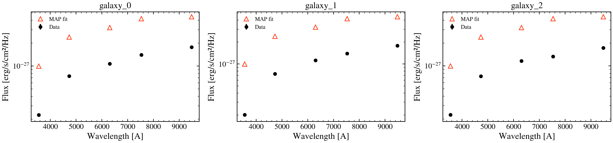

.. DO NOT EDIT.
.. THIS FILE WAS AUTOMATICALLY GENERATED BY SPHINX-GALLERY.
.. TO MAKE CHANGES, EDIT THE SOURCE PYTHON FILE:
.. "auto_examples/recipes/plot_recipe_load_real_csv.py"
.. LINE NUMBERS ARE GIVEN BELOW.

.. only:: html

    .. note::
        :class: sphx-glr-download-link-note

        :ref:`Go to the end <sphx_glr_download_auto_examples_recipes_plot_recipe_load_real_csv.py>`
        to download the full example code.

.. rst-class:: sphx-glr-example-title

.. _sphx_glr_auto_examples_recipes_plot_recipe_load_real_csv.py:

Load and Fit Real CSV Photometry
================================

How do I load photometric data from a CSV file and fit it? This recipe
demonstrates loading a table of measured fluxes and uncertainties,
building observations per galaxy, and running a MAP fit on each.

.. sphx-glr-precomputed-img:

.. GENERATED FROM PYTHON SOURCE LINES 16-138

.. image-sg:: /auto_examples/recipes/images/sphx_glr_plot_recipe_load_real_csv_001.png
   :alt: galaxy_0, galaxy_1, galaxy_2
   :srcset: /auto_examples/recipes/images/sphx_glr_plot_recipe_load_real_csv_001.png
   :class: sphx-glr-single-img

.. rst-class:: sphx-glr-script-out

 .. code-block:: none

    /Users/suchethacooray/Projects/tengri/src/tengri/forward/sed_model.py:636: BakedInNebularWarning: BakedInBackend: nebular emission is baked into the SSP file at a FIXED logU and FIXED escape fraction determined when the SSP grid was generated (commonly logU = −3, but depends on the SSP file). The ionization parameter and escape fraction are NOT free parameters — varying neb_logU or neb_fesc in your Parameters will have no effect. Check your SSP file's nebular assumptions. Switch to CloudyGridBackend or CueBackend to vary nebular properties. To suppress: pass ionizing_source_warning='suppress'.
      self._nebular_backend = BakedInBackend()

|

.. code-block:: Python

    from pathlib import Path

    import jax
    import jax.numpy as jnp
    import matplotlib.pyplot as plt
    import numpy as np

    from tengri import (
        Fitter,
        Fixed,
        Observation,
        Parameters,
        Photometry,
        SEDModel,
        Uniform,
        load_ssp_data,
    )
    from tengri.analysis.plotting import setup_style

    setup_style()

    def _find_ssp():
        """Locate SSP data from project root or docs/ (sphinx-gallery) cwd."""
        name = "ssp_prsc_miles_chabrier_wNE_logGasU-3.0_logGasZ0.0.h5"
        for p in [
            Path("data") / name,
            Path("../data") / name,
            Path("../../data") / name,
            Path("../../../data") / name,
        ]:
            if p.exists():
                return str(p)
        return None

    SSP_PATH = _find_ssp()
    if SSP_PATH is None:
        raise FileNotFoundError("SSP data not found — skipping example")

    ssp = load_ssp_data(SSP_PATH)

    # --- Generate mock CSV with 5 SDSS bands x 3 galaxies ---
    # In practice, load your own CSV via np.genfromtxt() or pd.read_csv()
    bands = ["sdss_u", "sdss_g", "sdss_r", "sdss_i", "sdss_z"]
    obs_config = Observation(photometry=Photometry.from_names(bands))
    spec_template = Parameters(
        sfh_tsnorm_log_peak_sfr=Fixed(0.5),
        sfh_tsnorm_peak_lbt_gyr=Fixed(3.0),
        sfh_tsnorm_width_gyr=Fixed(2.0),
        sfh_tsnorm_skew=Fixed(0.0),
        sfh_tsnorm_trunc=Fixed(5.0),
        met_logzsol=Fixed(-0.3),
        dust_tau_diff=Fixed(0.3),
        dust_slope=Fixed(-0.7),
        redshift=Fixed(0.1),
        mean_sfh_type="tsnorm",
    )
    model_template = SEDModel(spec_template, ssp, observation=obs_config)

    # Mock 3 galaxies with different parameters
    key = jax.random.PRNGKey(42)
    galaxy_data = []
    for gal_id in range(3):
        params = spec_template.sample(jax.random.fold_in(key, gal_id))
        mock = model_template.mock(params, snr=20.0, key=jax.random.fold_in(key, 100 + gal_id))
        galaxy_data.append(
            {
                "name": f"galaxy_{gal_id}",
                "redshift": 0.1,
                "flux": np.array(mock.flux_obs),
                "error": np.array(mock.noise),
            }
        )

    # --- Fit each galaxy ---
    fig, axes = plt.subplots(1, 3, figsize=(14, 3.5))

    for gal_idx, gal in enumerate(galaxy_data):
        # Build free model: redshift fixed to measured, others free
        spec = Parameters(
            sfh_tsnorm_log_peak_sfr=Uniform(-1.0, 2.5),
            sfh_tsnorm_peak_lbt_gyr=Uniform(0.5, 12.0),
            sfh_tsnorm_width_gyr=Uniform(0.3, 5.0),
            sfh_tsnorm_skew=Uniform(-3.0, 3.0),
            sfh_tsnorm_trunc=Uniform(1.0, 10.0),
            met_logzsol=Uniform(-2.0, 0.2),
            dust_tau_diff=Uniform(0.0, 1.5),
            dust_slope=Fixed(-0.7),
            redshift=Fixed(gal["redshift"]),
            mean_sfh_type="tsnorm",
        )
        model = SEDModel(spec, ssp, observation=obs_config)

        # MAP fit
        fitter = Fitter(model, data=gal["flux"], noise=gal["error"])
        posterior = fitter.run("map", optimizer="adam", n_steps=200, verbose=False)

        # Plot
        wave_eff = np.array([float(jnp.mean(w)) for w in obs_config.photometry.filter_waves])
        pred = np.array(model.predict_photometry(posterior.params))

        axes[gal_idx].errorbar(
            wave_eff,
            gal["flux"],
            yerr=gal["error"],
            fmt="o",
            color="k",
            ms=5,
            label="Data",
        )
        axes[gal_idx].plot(wave_eff, pred, "^", color="C3", ms=7, mfc="none", label="MAP fit", lw=2.0)
        axes[gal_idx].set_xlabel("Wavelength [A]")
        axes[gal_idx].set_ylabel("Flux [erg/s/cm²/Hz]")
        axes[gal_idx].set_title(gal["name"])
        axes[gal_idx].legend(frameon=False, fontsize=9)
        axes[gal_idx].set_yscale("log")

    fig.tight_layout()
    plt.savefig("plot_recipe_load_real_csv.png", dpi=150, bbox_inches="tight")
    plt.show()

.. rst-class:: sphx-glr-timing

   **Total running time of the script:** (0 minutes 10.412 seconds)

.. _sphx_glr_download_auto_examples_recipes_plot_recipe_load_real_csv.py:

.. only:: html

  .. container:: sphx-glr-footer sphx-glr-footer-example

    .. container:: sphx-glr-download sphx-glr-download-jupyter

      :download:`Download Jupyter notebook: plot_recipe_load_real_csv.ipynb <plot_recipe_load_real_csv.ipynb>`

    .. container:: sphx-glr-download sphx-glr-download-python

      :download:`Download Python source code: plot_recipe_load_real_csv.py <plot_recipe_load_real_csv.py>`

    .. container:: sphx-glr-download sphx-glr-download-zip

      :download:`Download zipped: plot_recipe_load_real_csv.zip <plot_recipe_load_real_csv.zip>`

.. only:: html

 .. rst-class:: sphx-glr-signature

    `Gallery generated by Sphinx-Gallery <https://sphinx-gallery.github.io>`_
