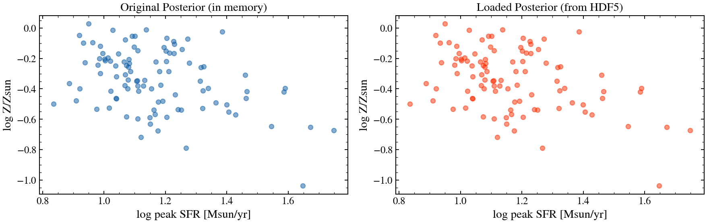

.. DO NOT EDIT.
.. THIS FILE WAS AUTOMATICALLY GENERATED BY SPHINX-GALLERY.
.. TO MAKE CHANGES, EDIT THE SOURCE PYTHON FILE:
.. "auto_examples/recipes/plot_recipe_save_load_posterior.py"
.. LINE NUMBERS ARE GIVEN BELOW.

.. only:: html

    .. note::
        :class: sphx-glr-download-link-note

        :ref:`Go to the end <sphx_glr_download_auto_examples_recipes_plot_recipe_save_load_posterior.py>`
        to download the full example code.

.. rst-class:: sphx-glr-example-title

.. _sphx_glr_auto_examples_recipes_plot_recipe_save_load_posterior.py:

Save and Load a Posterior
==========================

How do I save a posterior to disk and load it later? This recipe demonstrates
running a NUTS fit, saving the Posterior to an HDF5 file, reloading it,
and analyzing the saved results.

.. sphx-glr-precomputed-img:

.. GENERATED FROM PYTHON SOURCE LINES 16-143

.. image-sg:: /auto_examples/recipes/images/sphx_glr_plot_recipe_save_load_posterior_001.png
   :alt: Original Posterior (in memory), Loaded Posterior (from HDF5)
   :srcset: /auto_examples/recipes/images/sphx_glr_plot_recipe_save_load_posterior_001.png
   :class: sphx-glr-single-img

.. rst-class:: sphx-glr-script-out

 .. code-block:: none

    /Users/suchethacooray/Projects/tengri/src/tengri/forward/sed_model.py:636: BakedInNebularWarning: BakedInBackend: nebular emission is baked into the SSP file at a FIXED logU and FIXED escape fraction determined when the SSP grid was generated (commonly logU = −3, but depends on the SSP file). The ionization parameter and escape fraction are NOT free parameters — varying neb_logU or neb_fesc in your Parameters will have no effect. Check your SSP file's nebular assumptions. Switch to CloudyGridBackend or CueBackend to vary nebular properties. To suppress: pass ionizing_source_warning='suppress'.
      self._nebular_backend = BakedInBackend()
    Saving posterior to: /var/folders/km/_d_w3tds0hs4c5pbvflcdt480000gn/T/tmpcgsehydi/posterior.h5
    Loading posterior from: /var/folders/km/_d_w3tds0hs4c5pbvflcdt480000gn/T/tmpcgsehydi/posterior.h5

    Loaded posterior method: NUTS (BlackJAX)
    Number of samples: 100
    Diagnostics: {'n_burnin': np.float64(100.0), 'n_divergent': np.float64(1.0), 'n_samples': np.float64(100.0), 'n_warmup': np.float64(50.0), 'step_size': np.float64(0.015124748845950981), 'warmup': 'window'}

    Save/load test complete!

|

.. code-block:: Python

    import tempfile
    from pathlib import Path

    import jax
    import matplotlib.pyplot as plt

    from tengri import (
        Fitter,
        Fixed,
        Observation,
        Parameters,
        Photometry,
        SEDModel,
        Uniform,
        load_ssp_data,
    )
    from tengri.analysis.plotting import setup_style
    from tengri.inference.posterior import Posterior

    setup_style()

    def _find_ssp():
        """Locate SSP data from project root or docs/ (sphinx-gallery) cwd."""
        name = "ssp_prsc_miles_chabrier_wNE_logGasU-3.0_logGasZ0.0.h5"
        for p in [
            Path("data") / name,
            Path("../data") / name,
            Path("../../data") / name,
            Path("../../../data") / name,
        ]:
            if p.exists():
                return str(p)
        return None

    SSP_PATH = _find_ssp()
    if SSP_PATH is None:
        raise FileNotFoundError("SSP data not found — skipping example")

    ssp = load_ssp_data(SSP_PATH)

    # --- Setup and fit ---
    bands = ["sdss_g", "sdss_r", "sdss_i", "sdss_z"]
    obs = Observation(photometry=Photometry.from_names(bands))

    spec = Parameters(
        sfh_tsnorm_log_peak_sfr=Uniform(-1.0, 2.5),
        sfh_tsnorm_peak_lbt_gyr=Uniform(0.5, 12.0),
        sfh_tsnorm_width_gyr=Uniform(0.3, 5.0),
        sfh_tsnorm_skew=Uniform(-3.0, 3.0),
        sfh_tsnorm_trunc=Uniform(1.0, 10.0),
        met_logzsol=Uniform(-2.0, 0.2),
        dust_tau_diff=Uniform(0.0, 1.5),
        dust_slope=Fixed(-0.7),
        redshift=Fixed(0.08),
        mean_sfh_type="tsnorm",
    )
    model = SEDModel(spec, ssp, observation=obs)

    # Generate mock data
    key = jax.random.PRNGKey(42)
    true_params = spec.sample(key)
    true_params["sfh_tsnorm_peak_lbt_gyr"] = 2.5
    true_params["sfh_tsnorm_log_peak_sfr"] = 1.0
    mock = model.mock(true_params, snr=25.0, key=key)

    # Fit with NUTS (small sample for speed)
    fitter = Fitter(model, data=mock.flux_obs, noise=mock.noise)
    fitter.run("map", optimizer="adam", n_steps=150, verbose=False)
    posterior = fitter.run(
        "mcmc_nuts",
        n_warmup=50,
        n_samples=100,
        verbose=False,
    )

    # --- Save to temporary file ---
    with tempfile.TemporaryDirectory() as tmpdir:
        save_path = str(Path(tmpdir) / "posterior.h5")
        print(f"Saving posterior to: {save_path}")
        posterior.save(save_path)

        # --- Load from file ---
        print(f"Loading posterior from: {save_path}")
        posterior_loaded = Posterior.load(save_path, model=model)

        # --- Verify loaded posterior ---
        print(f"\nLoaded posterior method: {posterior_loaded.method}")
        print(f"Number of samples: {len(posterior_loaded.samples['met_logzsol'])}")
        print(f"Diagnostics: {posterior_loaded.diagnostics}")

        # --- Plot both originals and loaded ---
        fig, axes = plt.subplots(1, 2, figsize=(12, 4))

        # Original posterior scatter
        if posterior.samples:
            axes[0].scatter(
                posterior.samples["sfh_tsnorm_log_peak_sfr"],
                posterior.samples["met_logzsol"],
                alpha=0.5,
                s=30,
                color="C0",
            )
            axes[0].set_xlabel("log peak SFR [Msun/yr]")
            axes[0].set_ylabel("log Z/Zsun")
            axes[0].set_title("Original Posterior (in memory)")

        # Loaded posterior scatter
        if posterior_loaded.samples:
            axes[1].scatter(
                posterior_loaded.samples["sfh_tsnorm_log_peak_sfr"],
                posterior_loaded.samples["met_logzsol"],
                alpha=0.5,
                s=30,
                color="C3",
            )
            axes[1].set_xlabel("log peak SFR [Msun/yr]")
            axes[1].set_ylabel("log Z/Zsun")
            axes[1].set_title("Loaded Posterior (from HDF5)")

        fig.tight_layout()
        plt.savefig("plot_recipe_save_load_posterior.png", dpi=150, bbox_inches="tight")
        plt.show()

    print("\nSave/load test complete!")

.. rst-class:: sphx-glr-timing

   **Total running time of the script:** (0 minutes 9.491 seconds)

.. _sphx_glr_download_auto_examples_recipes_plot_recipe_save_load_posterior.py:

.. only:: html

  .. container:: sphx-glr-footer sphx-glr-footer-example

    .. container:: sphx-glr-download sphx-glr-download-jupyter

      :download:`Download Jupyter notebook: plot_recipe_save_load_posterior.ipynb <plot_recipe_save_load_posterior.ipynb>`

    .. container:: sphx-glr-download sphx-glr-download-python

      :download:`Download Python source code: plot_recipe_save_load_posterior.py <plot_recipe_save_load_posterior.py>`

    .. container:: sphx-glr-download sphx-glr-download-zip

      :download:`Download zipped: plot_recipe_save_load_posterior.zip <plot_recipe_save_load_posterior.zip>`

.. only:: html

 .. rst-class:: sphx-glr-signature

    `Gallery generated by Sphinx-Gallery <https://sphinx-gallery.github.io>`_
