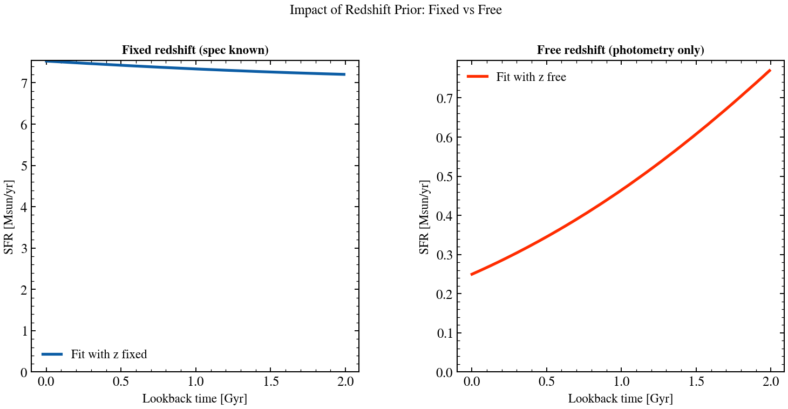

.. DO NOT EDIT.
.. THIS FILE WAS AUTOMATICALLY GENERATED BY SPHINX-GALLERY.
.. TO MAKE CHANGES, EDIT THE SOURCE PYTHON FILE:
.. "auto_examples/recipes/plot_recipe_specific_redshift.py"
.. LINE NUMBERS ARE GIVEN BELOW.

.. only:: html

    .. note::
        :class: sphx-glr-download-link-note

        :ref:`Go to the end <sphx_glr_download_auto_examples_recipes_plot_recipe_specific_redshift.py>`
        to download the full example code.

.. rst-class:: sphx-glr-example-title

.. _sphx_glr_auto_examples_recipes_plot_recipe_specific_redshift.py:

Fix Redshift to a Known Value
==============================

How do I fit a spectrum when redshift is known from spectroscopy? This recipe
shows how fixing redshift with Fixed() constrains other parameters more tightly
compared to letting it vary.

.. sphx-glr-precomputed-img:

.. GENERATED FROM PYTHON SOURCE LINES 16-168

.. code-block:: Python

    from pathlib import Path

    import jax
    import matplotlib.pyplot as plt
    import numpy as np

    from tengri import (
        Fitter,
        Fixed,
        Observation,
        Parameters,
        Photometry,
        SEDModel,
        Uniform,
        load_ssp_data,
    )
    from tengri.analysis.plotting import setup_style

    setup_style()

    def _find_ssp():
        """Locate SSP data from project root or docs/ (sphinx-gallery) cwd."""
        name = "ssp_prsc_miles_chabrier_wNE_logGasU-3.0_logGasZ0.0.h5"
        for p in [
            Path("data") / name,
            Path("../data") / name,
            Path("../../data") / name,
            Path("../../../data") / name,
        ]:
            if p.exists():
                return str(p)
        return None

    SSP_PATH = _find_ssp()
    if SSP_PATH is None:
        raise FileNotFoundError("SSP data not found — skipping example")

    ssp = load_ssp_data(SSP_PATH)

    # Known spectroscopic redshift
    TRUE_REDSHIFT = 0.15

    # --- Generate mock data at known redshift ---
    bands = ["sdss_u", "sdss_g", "sdss_r", "sdss_i", "sdss_z"]
    obs = Observation(photometry=Photometry.from_names(bands))

    true_spec = Parameters(
        sfh_tsnorm_log_peak_sfr=Fixed(1.2),
        sfh_tsnorm_peak_lbt_gyr=Fixed(2.5),
        sfh_tsnorm_width_gyr=Fixed(1.8),
        sfh_tsnorm_skew=Fixed(0.1),
        sfh_tsnorm_trunc=Fixed(5.0),
        met_logzsol=Fixed(-0.2),
        dust_tau_bc=Fixed(0.1),
        dust_tau_diff=Fixed(0.25),
        dust_slope=Fixed(-0.7),
        redshift=Fixed(TRUE_REDSHIFT),
        mean_sfh_type="tsnorm",
    )
    model_true = SEDModel(true_spec, ssp, observation=obs)

    key = jax.random.PRNGKey(42)
    true_params_dict = {
        "sfh_tsnorm_log_peak_sfr": 1.2,
        "sfh_tsnorm_peak_lbt_gyr": 2.5,
        "sfh_tsnorm_width_gyr": 1.8,
        "sfh_tsnorm_skew": 0.1,
        "sfh_tsnorm_trunc": 5.0,
        "met_logzsol": -0.2,
        "dust_tau_bc": 0.1,
        "dust_tau_diff": 0.25,
        "dust_slope": -0.7,
        "redshift": TRUE_REDSHIFT,
    }
    mock = model_true.mock(true_params_dict, snr=25.0, key=key)

    # --- Fit 1: Redshift FIXED (spectroscopy known) ---
    spec_fixed_z = Parameters(
        sfh_tsnorm_log_peak_sfr=Uniform(-1.0, 2.5),
        sfh_tsnorm_peak_lbt_gyr=Uniform(0.5, 12.0),
        sfh_tsnorm_width_gyr=Uniform(0.3, 5.0),
        sfh_tsnorm_skew=Uniform(-3.0, 3.0),
        sfh_tsnorm_trunc=Uniform(1.0, 10.0),
        met_logzsol=Uniform(-2.0, 0.2),
        dust_tau_diff=Uniform(0.0, 1.5),
        dust_slope=Fixed(-0.7),
        redshift=Fixed(TRUE_REDSHIFT),  # ← Fixed from spectroscopy
        mean_sfh_type="tsnorm",
    )
    model_fixed = SEDModel(spec_fixed_z, ssp, observation=obs)
    fitter_fixed = Fitter(model_fixed, data=mock.flux_obs, noise=mock.noise)
    posterior_fixed = fitter_fixed.run("map", optimizer="adam", n_steps=200, verbose=False)

    # --- Fit 2: Redshift FREE (photometry only) ---
    spec_free_z = Parameters(
        sfh_tsnorm_log_peak_sfr=Uniform(-1.0, 2.5),
        sfh_tsnorm_peak_lbt_gyr=Uniform(0.5, 12.0),
        sfh_tsnorm_width_gyr=Uniform(0.3, 5.0),
        sfh_tsnorm_skew=Uniform(-3.0, 3.0),
        sfh_tsnorm_trunc=Uniform(1.0, 10.0),
        met_logzsol=Uniform(-2.0, 0.2),
        dust_tau_diff=Uniform(0.0, 1.5),
        dust_slope=Fixed(-0.7),
        redshift=Uniform(0.0, 0.5),  # ← Free to vary
        mean_sfh_type="tsnorm",
    )
    model_free = SEDModel(spec_free_z, ssp, observation=obs)
    fitter_free = Fitter(model_free, data=mock.flux_obs, noise=mock.noise)
    posterior_free = fitter_free.run("map", optimizer="adam", n_steps=200, verbose=False)

    # --- Plot: SFH comparison with fixed vs free redshift ---
    sfh_fixed = model_fixed.predict_sfh(posterior_fixed.params)
    sfh_free = model_free.predict_sfh(posterior_free.params)

    fig = plt.figure(figsize=(12, 5))
    gs = fig.add_gridspec(1, 2, wspace=0.3)
    ax_fixed = fig.add_subplot(gs[0])
    ax_free = fig.add_subplot(gs[1])

    t_gyr = np.array(sfh_fixed["t_gyr"])
    mask = t_gyr < 2.0

    # Fixed redshift plot
    ax_fixed.plot(
        t_gyr[mask], np.array(sfh_fixed["sfr_mean"])[mask], "C0-", lw=2.5,
        label="Fit with z fixed"
    )
    ax_fixed.set_xlabel("Lookback time [Gyr]", fontsize=11)
    ax_fixed.set_ylabel("SFR [Msun/yr]", fontsize=11)
    ax_fixed.set_title("Fixed redshift (spec known)", fontsize=11, fontweight="bold")
    ax_fixed.set_ylim(bottom=0)
    ax_fixed.legend(frameon=False)

    # Free redshift plot
    t_gyr_free = np.array(sfh_free["t_gyr"])
    mask_free = t_gyr_free < 2.0
    ax_free.plot(
        t_gyr_free[mask_free], np.array(sfh_free["sfr_mean"])[mask_free], "C3-", lw=2.5,
        label="Fit with z free"
    )
    ax_free.set_xlabel("Lookback time [Gyr]", fontsize=11)
    ax_free.set_ylabel("SFR [Msun/yr]", fontsize=11)
    ax_free.set_title("Free redshift (photometry only)", fontsize=11, fontweight="bold")
    ax_free.set_ylim(bottom=0)
    ax_free.legend(frameon=False)

    fig.suptitle("Impact of Redshift Prior: Fixed vs Free", fontsize=12, y=1.02)
    plt.savefig("plot_recipe_specific_redshift.png", dpi=150, bbox_inches="tight")
    plt.show()

.. _sphx_glr_download_auto_examples_recipes_plot_recipe_specific_redshift.py:

.. only:: html

  .. container:: sphx-glr-footer sphx-glr-footer-example

    .. container:: sphx-glr-download sphx-glr-download-jupyter

      :download:`Download Jupyter notebook: plot_recipe_specific_redshift.ipynb <plot_recipe_specific_redshift.ipynb>`

    .. container:: sphx-glr-download sphx-glr-download-python

      :download:`Download Python source code: plot_recipe_specific_redshift.py <plot_recipe_specific_redshift.py>`

    .. container:: sphx-glr-download sphx-glr-download-zip

      :download:`Download zipped: plot_recipe_specific_redshift.zip <plot_recipe_specific_redshift.zip>`

.. only:: html

 .. rst-class:: sphx-glr-signature

    `Gallery generated by Sphinx-Gallery <https://sphinx-gallery.github.io>`_
