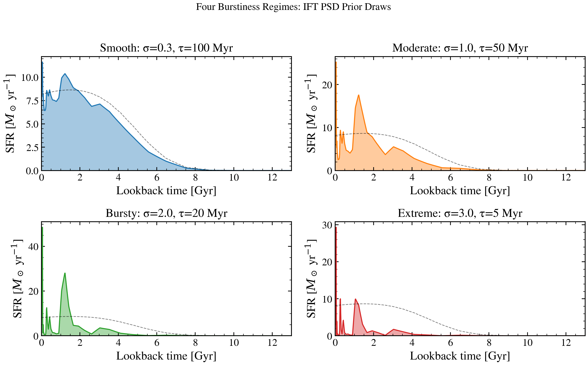

.. DO NOT EDIT.
.. THIS FILE WAS AUTOMATICALLY GENERATED BY SPHINX-GALLERY.
.. TO MAKE CHANGES, EDIT THE SOURCE PYTHON FILE:
.. "auto_examples/sfh/plot_bursty_recovery.py"
.. LINE NUMBERS ARE GIVEN BELOW.

.. only:: html

    .. note::
        :class: sphx-glr-download-link-note

        :ref:`Go to the end <sphx_glr_download_auto_examples_sfh_plot_bursty_recovery.py>`
        to download the full example code.

.. rst-class:: sphx-glr-example-title

.. _sphx_glr_auto_examples_sfh_plot_bursty_recovery.py:

Four regimes of stochastic-SFH burstiness from smooth to extreme
================================================================

Four representative (σ, τ) pairs define burstiness regimes: Smooth (σ=0.3, τ=100 Myr),
Moderate (σ=1.0, τ=50 Myr), Bursty (σ=2.0, τ=20 Myr), and Extreme (σ=3.0, τ=5 Myr).
Each panel shows one forward-model draw with the smooth mean SFH overlaid,
illustrating the range of morphologies that each regime produces before inference.

.. GENERATED FROM PYTHON SOURCE LINES 10-77

.. code-block:: Python

    import warnings

    import jax
    import jax.numpy as jnp
    import matplotlib.pyplot as plt
    import numpy as np

    import tengri
    from tengri.analysis.plotting import setup_style

    setup_style()
    warnings.filterwarnings("ignore", message=".*BakedInBackend.*")

    ssp = tengri.load_ssp()

    # Quick minimal observation (just for SFH predictions)
    model = tengri.SEDModel.build(
        ssp,
        sfh={
            "type": "field_psd",
            "*": tengri.FIXED,
            "mean": "tsnorm",
            "tsnorm_log_peak_sfr": 1.2,
            "tsnorm_peak_lbt_gyr": 3.0,
            "tsnorm_width_gyr": 3.0,
            "tsnorm_skew": 0.3,
            "tsnorm_trunc": 2.0,
            "psd_sigma": tengri.Uniform(0.1, 4.0),
            "psd_tau_myr": tengri.Uniform(1.0, 300.0),
        },
        dust={"type": "two_component", "*": tengri.FIXED, "tau_diff": 0.2, "tau_bc": 0.3},
        redshift=tengri.Fixed(0.0),
    )

    REGIMES = [
        {"label": "Smooth", "sigma": 0.3, "tau": 100.0, "color": "#1f77b4"},
        {"label": "Moderate", "sigma": 1.0, "tau": 50.0, "color": "#ff7f0e"},
        {"label": "Bursty", "sigma": 2.0, "tau": 20.0, "color": "#2ca02c"},
        {"label": "Extreme", "sigma": 3.0, "tau": 5.0, "color": "#d62728"},
    ]

    fig, axes = plt.subplots(2, 2, figsize=(10, 6), sharey=False)
    axes_flat = axes.flatten()

    for ax, reg in zip(axes_flat, REGIMES):
        key = jax.random.PRNGKey(42)
        baseline = dict(model.spec.sample(key))
        params = {
            **baseline,
            "sfh_field_psd_sigma": jnp.array(reg["sigma"]),
            "sfh_field_psd_tau_myr": jnp.array(reg["tau"]),
        }
        sfh = model.predict_sfh(params)
        t_gyr = np.array(sfh["t_gyr"])
        sfr_full = np.array(sfh["sfr_full"])
        sfr_mean = np.array(sfh["sfr_mean"])
        ax.fill_between(t_gyr, 0, sfr_full, alpha=0.4, color=reg["color"])
        ax.plot(t_gyr, sfr_full, color=reg["color"], lw=1.2)
        ax.plot(t_gyr, sfr_mean, color="k", lw=0.8, ls="--", alpha=0.5, label="Mean SFH")
        ax.set_xlabel("Lookback time [Gyr]")
        ax.set_ylabel(r"SFR [$M_\odot$ yr$^{-1}$]")
        ax.set_xlim(0, 13)
        ax.set_ylim(bottom=0)

    fig.tight_layout()
    fig.savefig("plot_bursty_recovery.png", dpi=150, bbox_inches="tight")

.. _sphx_glr_download_auto_examples_sfh_plot_bursty_recovery.py:

.. only:: html

  .. container:: sphx-glr-footer sphx-glr-footer-example

    .. container:: sphx-glr-download sphx-glr-download-jupyter

      :download:`Download Jupyter notebook: plot_bursty_recovery.ipynb <plot_bursty_recovery.ipynb>`

    .. container:: sphx-glr-download sphx-glr-download-python

      :download:`Download Python source code: plot_bursty_recovery.py <plot_bursty_recovery.py>`

    .. container:: sphx-glr-download sphx-glr-download-zip

      :download:`Download zipped: plot_bursty_recovery.zip <plot_bursty_recovery.zip>`

.. only:: html

 .. rst-class:: sphx-glr-signature

    `Gallery generated by Sphinx-Gallery <https://sphinx-gallery.github.io>`_
