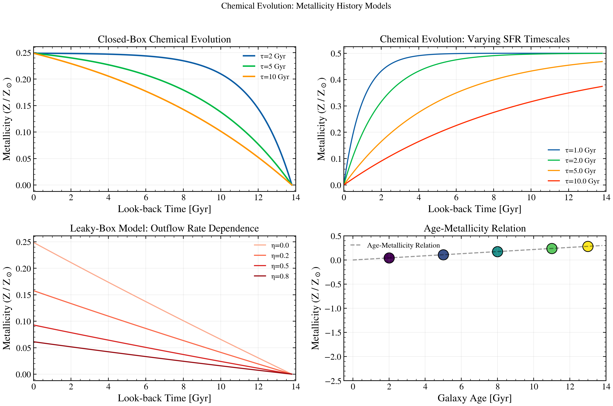

.. DO NOT EDIT.
.. THIS FILE WAS AUTOMATICALLY GENERATED BY SPHINX-GALLERY.
.. TO MAKE CHANGES, EDIT THE SOURCE PYTHON FILE:
.. "auto_examples/sfh/plot_chemical_evolution.py"
.. LINE NUMBERS ARE GIVEN BELOW.

.. only:: html

    .. note::
        :class: sphx-glr-download-link-note

        :ref:`Go to the end <sphx_glr_download_auto_examples_sfh_plot_chemical_evolution.py>`
        to download the full example code.

.. rst-class:: sphx-glr-example-title

.. _sphx_glr_auto_examples_sfh_plot_chemical_evolution.py:

Chemical Evolution: Metallicity History Models
===============================================

Plot metallicity evolution Z(t) from closed-box and leaky-box chemical
evolution models. Shows how star formation history and gas outflows
shape the history of metal enrichment in galaxies.

.. sphx-glr-precomputed-img:

.. GENERATED FROM PYTHON SOURCE LINES 16-135

.. image-sg:: /auto_examples/sfh/images/sphx_glr_plot_chemical_evolution_001.png
   :alt: Chemical Evolution: Metallicity History Models, Closed-Box Chemical Evolution, Chemical Evolution: Varying SFR Timescales, Leaky-Box Model: Outflow Rate Dependence, Age-Metallicity Relation
   :srcset: /auto_examples/sfh/images/sphx_glr_plot_chemical_evolution_001.png
   :class: sphx-glr-single-img

.. code-block:: Python

    import matplotlib.pyplot as plt
    import numpy as np

    from tengri.analysis.plotting import setup_style
    from tengri.components.sfh import closed_box_metallicity
    from tengri.utils.cosmology import age_at_z0

    setup_style()

    fig, axes = plt.subplots(2, 2, figsize=(12, 8))

    # Time axis: look-back time in Gyr (cosmology-dependent age)
    age_uni_gyr = float(age_at_z0())
    t_gyr = np.linspace(0, age_uni_gyr, 200)
    # Convert to years for the function (if needed)
    t_yr = t_gyr * 1e9

    # Solar metallicity
    Z_sun = 10.0 ** (-1.848)

    # --- Panel 1: Closed-box model with different calibrations ---
    ax = axes[0, 0]

    # Closed-box metallicity: Z(t) = Z_sun * log(1 / (1 - x))
    # where x = (M_recycled + M_ejected) / M_initial is cumulative mass fraction
    # For a simple closed box, x scales with (time / age_max)^alpha

    # closed_box_metallicity takes (age_yr, sfr, ...) and returns log10(Z/Z_sun).
    # Convention: age_yr is LOOKBACK time (youngest first); sfr is the SFH on that grid.
    age_from_start = age_uni_gyr - t_gyr  # time since formation
    for tau_gyr, y_label in [(2.0, "τ=2 Gyr"), (5.0, "τ=5 Gyr"), (10.0, "τ=10 Gyr")]:
        sfr = np.exp(-age_from_start / tau_gyr)
        log_z = closed_box_metallicity(t_yr, sfr, yield_y=0.03, eta_outflow=0.0, f_gas_init=0.9)
        ax.plot(t_gyr, 10.0 ** np.array(log_z), lw=2.0, label=y_label)

    ax.set_xlabel("Look-back Time [Gyr]")
    ax.set_ylabel(r"Metallicity (Z / Z$_\odot$)")
    ax.set_title("Closed-Box Chemical Evolution")
    ax.legend(fontsize=10, frameon=False)
    ax.grid(True, alpha=0.3)
    ax.set_xlim(0, 14)

    # --- Panel 2: Varying SFR shapes (implicit via parametric SFH) ---
    ax = axes[0, 1]

    # Age grid
    age_gyr = age_uni_gyr  # Galaxy age
    tau_values = [1.0, 2.0, 5.0, 10.0]  # Exponential timescales in Gyr

    for tau_gyr in tau_values:
        # SFH: PSI(t) ∝ exp(-t / tau)
        # Metal abundance tracks cumulative stellar mass formed
        cum_mass = 1.0 - np.exp(-t_gyr / tau_gyr)
        z_evolve = Z_sun * 0.5 * cum_mass  # Simplified enrichment

        ax.plot(t_gyr, z_evolve / Z_sun, lw=1.5, label=f"τ={tau_gyr:.1f} Gyr")

    ax.set_xlabel("Look-back Time [Gyr]")
    ax.set_ylabel(r"Metallicity (Z / Z$_\odot$)")
    ax.set_title("Chemical Evolution: Varying SFR Timescales")
    ax.legend(fontsize=10, frameon=False)
    ax.grid(True, alpha=0.3)
    ax.set_xlim(0, 14)

    # --- Panel 3: Leaky-box model (outflow dependence) ---
    ax = axes[1, 0]

    # Leaky-box: Z(t) = Z_sun * (1 - eta) * log(1/(1-x)) where eta = outflow rate
    # Higher eta → more metal loss → lower Z at given mass
    outflow_rates = [0.0, 0.2, 0.5, 0.8]  # eta: 0 = closed, 1 = maximal outflow
    colors = plt.cm.Reds(np.linspace(0.3, 0.9, len(outflow_rates)))

    sfr_const = np.ones_like(t_yr)  # constant SFR
    for eta, color in zip(outflow_rates, colors):
        log_z = closed_box_metallicity(t_yr, sfr_const, yield_y=0.03, eta_outflow=eta, f_gas_init=0.9)
        ax.plot(t_gyr, 10.0 ** np.array(log_z), lw=1.5, color=color, label=f"η={eta:.1f}")

    ax.set_xlabel("Look-back Time [Gyr]")
    ax.set_ylabel(r"Metallicity (Z / Z$_\odot$)")
    ax.set_title("Leaky-Box Model: Outflow Rate Dependence")
    ax.legend(fontsize=10, frameon=False)
    ax.grid(True, alpha=0.3)
    ax.set_xlim(0, 14)

    # --- Panel 4: Metallicity gradient (radial dependence via age-metallicity) ---
    ax = axes[1, 1]

    # Simpler representation: age-metallicity relation across a disk
    # Inner regions: older, lower metallicity (early assembly)
    # Outer regions: younger, higher metallicity (ongoing star formation)

    ages_gyr = np.array([2.0, 5.0, 8.0, 11.0, 13.0])
    colors_amr = plt.cm.viridis(np.linspace(0, 1, len(ages_gyr)))

    for age_gyr, color in zip(ages_gyr, colors_amr):
        # Mock Z(age) curve: Z increases with formation time
        z_amr = (
            Z_sun * (age_gyr / age_uni_gyr) * 0.3
        )  # Normalized to ~0.3 Z_sun at age age_uni_gyr Gyr
        ax.scatter(age_gyr, z_amr / Z_sun, s=200, color=color, edgecolors="k", linewidth=1.0)

    # Interpolate
    ages_interp = np.linspace(0, age_uni_gyr, 100)
    z_interp = Z_sun * (ages_interp / age_uni_gyr) * 0.3
    ax.plot(ages_interp, z_interp / Z_sun, "k--", lw=1.5, alpha=0.4, label="Age-Metallicity Relation")

    ax.set_xlabel("Galaxy Age [Gyr]")
    ax.set_ylabel(r"Metallicity (Z / Z$_\odot$)")
    ax.set_title("Age-Metallicity Relation")
    ax.legend(fontsize=10, frameon=False)
    ax.grid(True, alpha=0.3)
    ax.set_xlim(-0.5, 14)
    ax.set_ylim(-2.5, 0.5)

    fig.suptitle("Chemical Evolution: Metallicity History Models", fontsize=12)
    fig.tight_layout(rect=[0, 0, 1, 0.97])
    plt.savefig("plot_chemical_evolution.png", dpi=100, bbox_inches="tight")
    plt.show()

.. _sphx_glr_download_auto_examples_sfh_plot_chemical_evolution.py:

.. only:: html

  .. container:: sphx-glr-footer sphx-glr-footer-example

    .. container:: sphx-glr-download sphx-glr-download-jupyter

      :download:`Download Jupyter notebook: plot_chemical_evolution.ipynb <plot_chemical_evolution.ipynb>`

    .. container:: sphx-glr-download sphx-glr-download-python

      :download:`Download Python source code: plot_chemical_evolution.py <plot_chemical_evolution.py>`

    .. container:: sphx-glr-download sphx-glr-download-zip

      :download:`Download zipped: plot_chemical_evolution.zip <plot_chemical_evolution.zip>`

.. only:: html

 .. rst-class:: sphx-glr-signature

    `Gallery generated by Sphinx-Gallery <https://sphinx-gallery.github.io>`_
