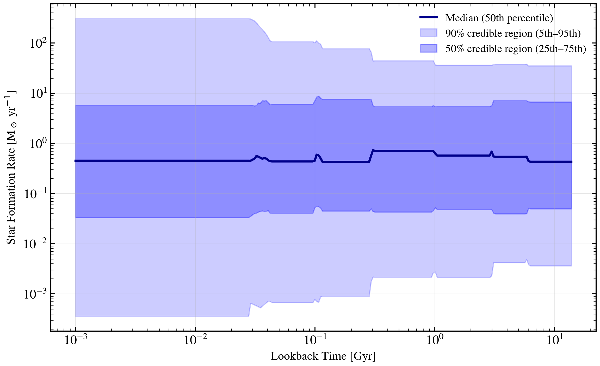

.. DO NOT EDIT.
.. THIS FILE WAS AUTOMATICALLY GENERATED BY SPHINX-GALLERY.
.. TO MAKE CHANGES, EDIT THE SOURCE PYTHON FILE:
.. "auto_examples/sfh/plot_continuity_prior_visualisation.py"
.. LINE NUMBERS ARE GIVEN BELOW.

.. only:: html

    .. note::
        :class: sphx-glr-download-link-note

        :ref:`Go to the end <sphx_glr_download_auto_examples_sfh_plot_continuity_prior_visualisation.py>`
        to download the full example code.

.. rst-class:: sphx-glr-example-title

.. _sphx_glr_auto_examples_sfh_plot_continuity_prior_visualisation.py:

Non-Parametric Continuity Prior: 200 Sample Draws
===================================================

The continuity prior (Leja+2019) penalises sharp transitions in adjacent-bin
log-SFR ratios with a Student-t distribution (mu=0, sigma=0.3, df=2). This
visualisation shows 200 independent draws from the registry default prior,
displayed as percentile bands (5th, 25th, 50th, 75th, 95th) versus lookback
time.

.. sphx-glr-precomputed-img:

.. GENERATED FROM PYTHON SOURCE LINES 18-118

.. image-sg:: /auto_examples/sfh/images/sphx_glr_plot_continuity_prior_visualisation_001.png
   :alt: plot continuity prior visualisation
   :srcset: /auto_examples/sfh/images/sphx_glr_plot_continuity_prior_visualisation_001.png
   :class: sphx-glr-single-img

.. code-block:: Python

    import os

    os.environ["TF_CPP_MIN_LOG_LEVEL"] = "2"  # suppress XLA/PjRt C++ INFO+WARNING logs

    import os

    import jax.random as jr
    import matplotlib.pyplot as plt
    import numpy as np

    from tengri import Fixed, Parameters, SEDModel, load_ssp, setup_style

    setup_style()

    ssp = load_ssp()

    # Build a model with continuity SFH (non-parametric, 7 bins). The registry
    # ships the faithful Leja+2019 prior on each log-SFR ratio:
    # StudentT(mu=0, sigma=0.3, df=2). We let the registry defaults flow through
    # so the prior draws below reflect the published prior rather than an
    # arbitrary uniform override.
    spec = Parameters(
        mean_sfh_type="continuity",
        met_logzsol=Fixed(-0.3),
        dust_tau_bc=Fixed(0.3),
        dust_tau_diff=Fixed(0.2),
        dust_slope=Fixed(-0.7),
        redshift=Fixed(0.1),
    )

    model = SEDModel(spec, ssp)

    # Generate 200 prior draws
    n_samples = 200
    key = jr.PRNGKey(42)

    # Lookback time grid for SFH evaluation (log-spaced from ~1 Myr to ~13 Gyr)
    age_lookback_yr = np.logspace(6, 10.14, 256)  # 1 Myr → ~13.8 Gyr
    age_lookback_gyr = age_lookback_yr / 1e9

    # Store SFR arrays for each sample
    sfr_samples = []

    for i in range(n_samples):
        key = jr.fold_in(key, i)
        params = dict(spec.sample(key))

        # Evaluate the continuity SFH via the public predict_sfh path (no reach into
        # internal SFH functions), then resample onto the plotting grid.
        sfh = model.predict_sfh(params)
        t_gyr = np.asarray(sfh["t_gyr"])
        sfr = np.asarray(sfh["sfr_mean"])
        sfr_samples.append(np.interp(age_lookback_gyr, t_gyr, sfr))

    sfr_samples = np.array(sfr_samples)  # (n_samples, n_age)

    # Compute percentiles
    percentiles = [5, 25, 50, 75, 95]
    sfr_percs = {p: np.percentile(sfr_samples, p, axis=0) for p in percentiles}

    # Plot
    fig, ax = plt.subplots(figsize=(8, 5))

    # Median line
    ax.plot(
        age_lookback_gyr,
        sfr_percs[50],
        color="darkblue",
        linewidth=2,
        label="Median (50th percentile)",
    )

    # Percentile bands
    ax.fill_between(
        age_lookback_gyr,
        sfr_percs[5],
        sfr_percs[95],
        alpha=0.2,
        color="blue",
        label="90% credible region (5th–95th)",
    )
    ax.fill_between(
        age_lookback_gyr,
        sfr_percs[25],
        sfr_percs[75],
        alpha=0.3,
        color="blue",
        label="50% credible region (25th–75th)",
    )

    ax.set_xlabel("Lookback Time [Gyr]", fontsize=11)
    ax.set_ylabel(r"Star Formation Rate [M$_\odot$ yr$^{-1}$]", fontsize=11)
    ax.set_xscale("log")
    ax.set_yscale("log")
    ax.legend(fontsize=10)
    ax.grid(True, alpha=0.3)

    plt.tight_layout()
    plt.savefig("plot_continuity_prior_visualisation.png", dpi=150, bbox_inches="tight")

.. _sphx_glr_download_auto_examples_sfh_plot_continuity_prior_visualisation.py:

.. only:: html

  .. container:: sphx-glr-footer sphx-glr-footer-example

    .. container:: sphx-glr-download sphx-glr-download-jupyter

      :download:`Download Jupyter notebook: plot_continuity_prior_visualisation.ipynb <plot_continuity_prior_visualisation.ipynb>`

    .. container:: sphx-glr-download sphx-glr-download-python

      :download:`Download Python source code: plot_continuity_prior_visualisation.py <plot_continuity_prior_visualisation.py>`

    .. container:: sphx-glr-download sphx-glr-download-zip

      :download:`Download zipped: plot_continuity_prior_visualisation.zip <plot_continuity_prior_visualisation.zip>`

.. only:: html

 .. rst-class:: sphx-glr-signature

    `Gallery generated by Sphinx-Gallery <https://sphinx-gallery.github.io>`_
