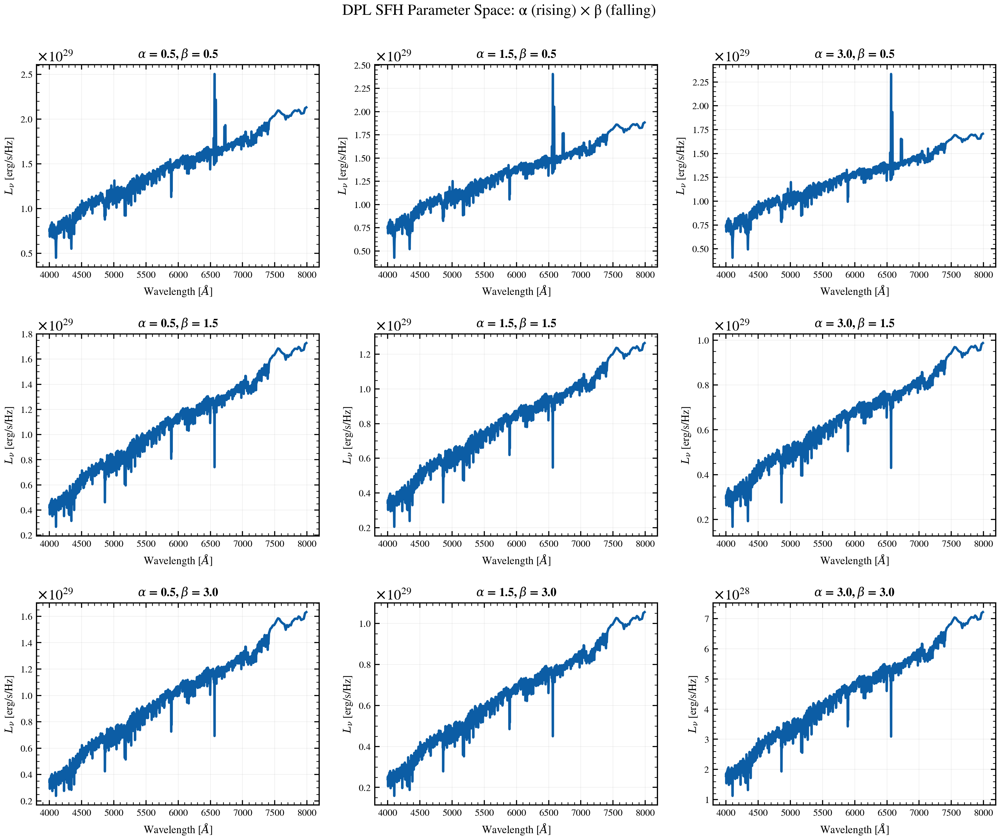

.. DO NOT EDIT.
.. THIS FILE WAS AUTOMATICALLY GENERATED BY SPHINX-GALLERY.
.. TO MAKE CHANGES, EDIT THE SOURCE PYTHON FILE:
.. "auto_examples/sfh/plot_dpl_alpha_beta_grid.py"
.. LINE NUMBERS ARE GIVEN BELOW.

.. only:: html

    .. note::
        :class: sphx-glr-download-link-note

        :ref:`Go to the end <sphx_glr_download_auto_examples_sfh_plot_dpl_alpha_beta_grid.py>`
        to download the full example code.

.. rst-class:: sphx-glr-example-title

.. _sphx_glr_auto_examples_sfh_plot_dpl_alpha_beta_grid.py:

Double Power-Law SFH: 2D Parameter Grid (α × β)
===============================================

Visualize a 3×3 grid of double power-law SFH shapes, sweeping
the rising slope α and falling slope β to show how the
parameter space controls SFH morphology.

.. sphx-glr-precomputed-img:

.. GENERATED FROM PYTHON SOURCE LINES 16-82

.. image-sg:: /auto_examples/sfh/images/sphx_glr_plot_dpl_alpha_beta_grid_001.png
   :alt: DPL SFH Parameter Space: α (rising) × β (falling), $\alpha$ = 0.5, $\beta$ = 0.5, $\alpha$ = 1.5, $\beta$ = 0.5, $\alpha$ = 3.0, $\beta$ = 0.5, $\alpha$ = 0.5, $\beta$ = 1.5, $\alpha$ = 1.5, $\beta$ = 1.5, $\alpha$ = 3.0, $\beta$ = 1.5, $\alpha$ = 0.5, $\beta$ = 3.0, $\alpha$ = 1.5, $\beta$ = 3.0, $\alpha$ = 3.0, $\beta$ = 3.0
   :srcset: /auto_examples/sfh/images/sphx_glr_plot_dpl_alpha_beta_grid_001.png
   :class: sphx-glr-single-img

.. rst-class:: sphx-glr-script-out

 .. code-block:: none

    /Users/suchethacooray/Projects/tengri/.claude/worktrees/gallery-batch-2/src/tengri/forward/sed_model.py:643: BakedInNebularWarning: BakedInBackend: nebular emission is baked into the SSP file at a FIXED logU and FIXED escape fraction determined when the SSP grid was generated (commonly logU = −3, but depends on the SSP file). The ionization parameter and escape fraction are NOT free parameters — varying neb_logU or neb_fesc in your Parameters will have no effect. Check your SSP file's nebular assumptions. Switch to CloudyGridBackend or CueBackend to vary nebular properties. To suppress: pass ionizing_source_warning='suppress'.
      self._nebular_backend = BakedInBackend()

|

.. code-block:: Python

    import matplotlib.pyplot as plt
    import numpy as np

    from tengri import Fixed, Parameters, SEDModel, load_ssp
    from tengri.analysis.plotting import setup_style

    setup_style()

    ssp = load_ssp()

    # Shared baseline
    shared = dict(
        sfh_dpl_tau_gyr=Fixed(3.0),
        sfh_dpl_log_peak_sfr=Fixed(1.0),
        met_logzsol=Fixed(-0.3),
        dust_tau_bc=Fixed(0.3),
        dust_tau_diff=Fixed(0.2),
        dust_slope=Fixed(-0.7),
        redshift=Fixed(0.1),
    )

    # Grid: alpha (rising slope) and beta (falling slope)
    alphas = [0.5, 1.5, 3.0]
    betas = [0.5, 1.5, 3.0]

    fig, axes = plt.subplots(3, 3, figsize=(12, 10))
    fig.suptitle("DPL SFH Parameter Space: α (rising) × β (falling)", fontsize=13, y=0.995)

    for i, beta in enumerate(betas):
        for j, alpha in enumerate(alphas):
            ax = axes[i, j]

            spec = Parameters(
                mean_sfh_type="dpl",
                sfh_dpl_alpha=Fixed(alpha),
                sfh_dpl_beta=Fixed(beta),
                **shared,
            )
            model = SEDModel(spec, ssp)

            params_eval = {k: float(v.value) for k, v in shared.items()}
            params_eval.update({"sfh_dpl_alpha": alpha, "sfh_dpl_beta": beta})

            sed = model.predict_rest_sed(params_eval).sed

            # Optical region
            wave_opt = np.array(ssp.ssp_wave)
            mask = (wave_opt > 4000) & (wave_opt < 8000)

            ax.plot(
                wave_opt[mask],
                np.array(sed[mask]),
                "C0-",
                lw=2.0,
            )
            ax.set_xlabel(r"Wavelength [$\AA$]", fontsize=9)
            ax.set_ylabel(r"$L_\nu$ [erg/s/Hz]", fontsize=9)
            ax.set_title(rf"$\alpha$ = {alpha}, $\beta$ = {beta}", fontsize=10, fontweight="bold")
            ax.grid(True, alpha=0.2)
            ax.tick_params(labelsize=8)

    fig.tight_layout()
    plt.savefig("plot_dpl_alpha_beta_grid.png", dpi=150, bbox_inches="tight")
    plt.show()

.. rst-class:: sphx-glr-timing

   **Total running time of the script:** (0 minutes 2.696 seconds)

.. _sphx_glr_download_auto_examples_sfh_plot_dpl_alpha_beta_grid.py:

.. only:: html

  .. container:: sphx-glr-footer sphx-glr-footer-example

    .. container:: sphx-glr-download sphx-glr-download-jupyter

      :download:`Download Jupyter notebook: plot_dpl_alpha_beta_grid.ipynb <plot_dpl_alpha_beta_grid.ipynb>`

    .. container:: sphx-glr-download sphx-glr-download-python

      :download:`Download Python source code: plot_dpl_alpha_beta_grid.py <plot_dpl_alpha_beta_grid.py>`

    .. container:: sphx-glr-download sphx-glr-download-zip

      :download:`Download zipped: plot_dpl_alpha_beta_grid.zip <plot_dpl_alpha_beta_grid.zip>`

.. only:: html

 .. rst-class:: sphx-glr-signature

    `Gallery generated by Sphinx-Gallery <https://sphinx-gallery.github.io>`_
