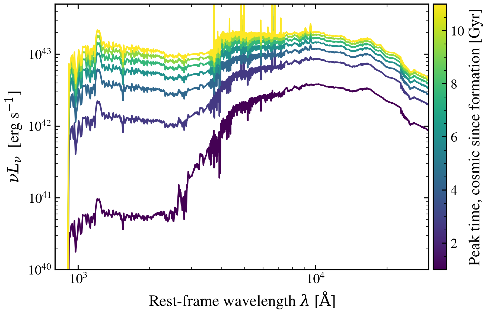

.. DO NOT EDIT.
.. THIS FILE WAS AUTOMATICALLY GENERATED BY SPHINX-GALLERY.
.. TO MAKE CHANGES, EDIT THE SOURCE PYTHON FILE:
.. "auto_examples/sfh/plot_lnorm_peak_sweep.py"
.. LINE NUMBERS ARE GIVEN BELOW.

.. only:: html

    .. note::
        :class: sphx-glr-download-link-note

        :ref:`Go to the end <sphx_glr_download_auto_examples_sfh_plot_lnorm_peak_sweep.py>`
        to download the full example code.

.. rst-class:: sphx-glr-example-title

.. _sphx_glr_auto_examples_sfh_plot_lnorm_peak_sweep.py:

Log-normal peak lookback time shifts stellar age and SED morphology
===================================================================

The peak lookback time of a log-normal SFH controls when most stars formed,
shifting the age structure and dramatically affecting UV slope, 4000 Å break
strength, and NIR luminosity. We vary the peak time across its prior range with
every other parameter fixed.

.. GENERATED FROM PYTHON SOURCE LINES 10-63

.. code-block:: Python

    import warnings

    import jax
    import jax.numpy as jnp
    import matplotlib as mpl
    import matplotlib.pyplot as plt
    import numpy as np

    import tengri
    from tengri.analysis.plotting import setup_style

    setup_style()
    warnings.filterwarnings("ignore", message=".*BakedInBackend.*")

    ssp = tengri.load_ssp()
    model = tengri.SEDModel.build(
        ssp,
        sfh={
            "type": "lnorm",
            "*": tengri.FIXED,
            "peak_lbt_gyr": tengri.Uniform(1.0, 11.0),
            "log_peak_sfr": 1.0,
            "width_gyr": 0.3,
        },
        dust={"type": "two_component", "*": tengri.FIXED, "tau_diff": 0.2, "tau_bc": 0.3},
        redshift=tengri.Fixed(0.1),
    )
    baseline = dict(model.spec.sample(jax.random.PRNGKey(0)))

    peak_values = np.linspace(1.0, 11.0, 7)
    norm = mpl.colors.Normalize(vmin=peak_values.min(), vmax=peak_values.max())
    cmap = plt.get_cmap("viridis")

    fig, ax = plt.subplots(figsize=(6.5, 4.2))
    for peak in peak_values:
        params = {**baseline, "sfh_lnorm_peak_lbt_gyr": jnp.float64(peak)}
        out = model.predict_rest_sed(params)
        wave = np.asarray(out.wavelength)
        nu = 2.998e18 / wave  # Å/s -> Hz
        nu_l_nu = nu * np.asarray(out.sed)
        ax.loglog(wave, nu_l_nu, color=cmap(norm(peak)), lw=1.4)

    ax.set_xlim(800, 3e4)
    ax.set_ylim(1e40, 5e43)
    ax.set_xlabel(r"Rest-frame wavelength $\lambda$ [$\mathrm{\AA}$]")
    ax.set_ylabel(r"$\nu L_\nu$  [erg s$^{-1}$]")

    cbar = fig.colorbar(plt.cm.ScalarMappable(norm=norm, cmap=cmap), ax=ax, pad=0.01)
    cbar.set_label(r"Peak lookback time [Gyr]")

    fig.tight_layout()
    fig.savefig("plot_lnorm_peak_sweep.png", dpi=150, bbox_inches="tight")

.. _sphx_glr_download_auto_examples_sfh_plot_lnorm_peak_sweep.py:

.. only:: html

  .. container:: sphx-glr-footer sphx-glr-footer-example

    .. container:: sphx-glr-download sphx-glr-download-jupyter

      :download:`Download Jupyter notebook: plot_lnorm_peak_sweep.ipynb <plot_lnorm_peak_sweep.ipynb>`

    .. container:: sphx-glr-download sphx-glr-download-python

      :download:`Download Python source code: plot_lnorm_peak_sweep.py <plot_lnorm_peak_sweep.py>`

    .. container:: sphx-glr-download sphx-glr-download-zip

      :download:`Download zipped: plot_lnorm_peak_sweep.zip <plot_lnorm_peak_sweep.zip>`

.. only:: html

 .. rst-class:: sphx-glr-signature

    `Gallery generated by Sphinx-Gallery <https://sphinx-gallery.github.io>`_
