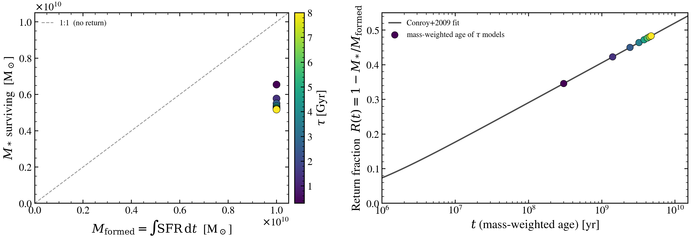

.. DO NOT EDIT.
.. THIS FILE WAS AUTOMATICALLY GENERATED BY SPHINX-GALLERY.
.. TO MAKE CHANGES, EDIT THE SOURCE PYTHON FILE:
.. "auto_examples/sfh/plot_mass_formed_vs_mass_observed.py"
.. LINE NUMBERS ARE GIVEN BELOW.

.. only:: html

    .. note::
        :class: sphx-glr-download-link-note

        :ref:`Go to the end <sphx_glr_download_auto_examples_sfh_plot_mass_formed_vs_mass_observed.py>`
        to download the full example code.

.. rst-class:: sphx-glr-example-title

.. _sphx_glr_auto_examples_sfh_plot_mass_formed_vs_mass_observed.py:

Stellar mass formed vs surviving: the Chabrier return fraction with age
=======================================================================

Mass formed in the SFH (``∫SFR dt``) is not the mass observed today
(``M_*``). Stellar winds and supernovae return a fraction ``R(t)`` of
the formed mass to the ISM. For a Chabrier IMF the Conroy+2009 fit is

.. math::

    R(t) = 0.05 \, \ln\!\left(1 + \frac{t}{3 \times 10^5 \, \mathrm{yr}}\right),

reaching ~0.30 at 1 Gyr and ~0.40 at 10 Gyr. We use the
mass-weighted age that ``tengri`` reports for a delayed-τ SFH and
plot the resulting M_formed vs M_surviving curve.

References:
- Conroy, Gunn, White 2009 ApJ 699 486 (return-fraction fit, Eq. 26).
- Chabrier 2003 PASP 115 763 (IMF).

.. GENERATED FROM PYTHON SOURCE LINES 21-113

.. image-sg:: /auto_examples/sfh/images/sphx_glr_plot_mass_formed_vs_mass_observed_001.png
   :alt: plot mass formed vs mass observed
   :srcset: /auto_examples/sfh/images/sphx_glr_plot_mass_formed_vs_mass_observed_001.png
   :class: sphx-glr-single-img

.. code-block:: Python

    import warnings

    import jax
    import jax.numpy as jnp
    import matplotlib as mpl
    import matplotlib.pyplot as plt
    import numpy as np

    import tengri
    from tengri.analysis.plotting import setup_style

    setup_style()
    warnings.filterwarnings("ignore")

    def conroy09_return_fraction(t_yr: np.ndarray) -> np.ndarray:
        """Chabrier-IMF return fraction, Conroy+2009 Eq. 26."""
        return 0.05 * np.log(1.0 + t_yr / 3.0e5)

    ssp = tengri.load_ssp("fsps_prsc_miles_chabrier")
    model = tengri.SEDModel.build(
        ssp,
        sfh={"type": "exp", "*": tengri.FIXED, "tau_gyr": 3.0, "log_total_mass": 10.0},
        dust={"type": "two_component", "*": tengri.FIXED, "tau_diff": 0.0, "tau_bc": 0.0},
        redshift=tengri.Fixed(0.0),
    )
    baseline = dict(model.spec.sample(jax.random.PRNGKey(0)))

    tau_values = np.linspace(0.3, 8.0, 8)
    m_formed, m_surv, t_mw = [], [], []
    for tau in tau_values:
        p = {**baseline, "sfh_exp_tau_gyr": jnp.float64(tau)}
        q = model.predict_sfh_quantities(p)
        age_mw_yr = float(q.mass_weighted_age_gyr) * 1e9
        R = conroy09_return_fraction(age_mw_yr)
        m_formed.append(float(q.stellar_mass))
        m_surv.append(float(q.stellar_mass) * (1.0 - R))
        t_mw.append(age_mw_yr / 1e9)
    m_formed = np.array(m_formed)
    m_surv = np.array(m_surv)
    t_mw = np.array(t_mw)

    fig, (ax_l, ax_r) = plt.subplots(1, 2, figsize=(11.5, 4.2))
    norm = mpl.colors.Normalize(vmin=tau_values.min(), vmax=tau_values.max())
    cmap = plt.get_cmap("viridis")

    ax_l.plot(
        [0, m_formed.max() * 1.05],
        [0, m_formed.max() * 1.05],
        "k--",
        lw=1.0,
        alpha=0.4,
        label="1:1  (no return)",
    )
    ax_l.scatter(m_formed, m_surv, c=tau_values, cmap=cmap, s=70, edgecolor="k", lw=0.4, zorder=3)
    ax_l.set(
        xlabel=r"$M_{\rm formed} = \int\!\mathrm{SFR}\,\mathrm{d}t$  [M$_\odot$]",
        ylabel=r"$M_*$ surviving  [M$_\odot$]",
        xlim=(0, m_formed.max() * 1.05),
        ylim=(0, m_formed.max() * 1.05),
    )
    ax_l.legend(frameon=False, fontsize=9, loc="upper left")
    cb = fig.colorbar(plt.cm.ScalarMappable(norm=norm, cmap=cmap), ax=ax_l, pad=0.02)
    cb.set_label(r"$\tau$ [Gyr]")

    t_grid = np.logspace(6, 10.2, 200)
    ax_r.semilogx(
        t_grid, conroy09_return_fraction(t_grid), color="0.3", lw=1.6, label="Conroy+2009 fit"
    )
    ax_r.scatter(
        t_mw * 1e9,
        1.0 - m_surv / m_formed,
        c=tau_values,
        cmap=cmap,
        s=60,
        edgecolor="k",
        lw=0.4,
        zorder=3,
        label=r"mass-weighted age of $\tau$ models",
    )
    ax_r.set(
        xlabel=r"$t$ (mass-weighted age) [yr]",
        ylabel=r"Return fraction  $R(t) = 1 - M_*/M_{\rm formed}$",
        xlim=(1e6, 1.5e10),
        ylim=(0, 0.55),
    )
    ax_r.legend(frameon=False, fontsize=9, loc="upper left")

    fig.tight_layout()
    plt.savefig("plot_mass_formed_vs_mass_observed.png", dpi=150, bbox_inches="tight")

.. _sphx_glr_download_auto_examples_sfh_plot_mass_formed_vs_mass_observed.py:

.. only:: html

  .. container:: sphx-glr-footer sphx-glr-footer-example

    .. container:: sphx-glr-download sphx-glr-download-jupyter

      :download:`Download Jupyter notebook: plot_mass_formed_vs_mass_observed.ipynb <plot_mass_formed_vs_mass_observed.ipynb>`

    .. container:: sphx-glr-download sphx-glr-download-python

      :download:`Download Python source code: plot_mass_formed_vs_mass_observed.py <plot_mass_formed_vs_mass_observed.py>`

    .. container:: sphx-glr-download sphx-glr-download-zip

      :download:`Download zipped: plot_mass_formed_vs_mass_observed.zip <plot_mass_formed_vs_mass_observed.zip>`

.. only:: html

 .. rst-class:: sphx-glr-signature

    `Gallery generated by Sphinx-Gallery <https://sphinx-gallery.github.io>`_
