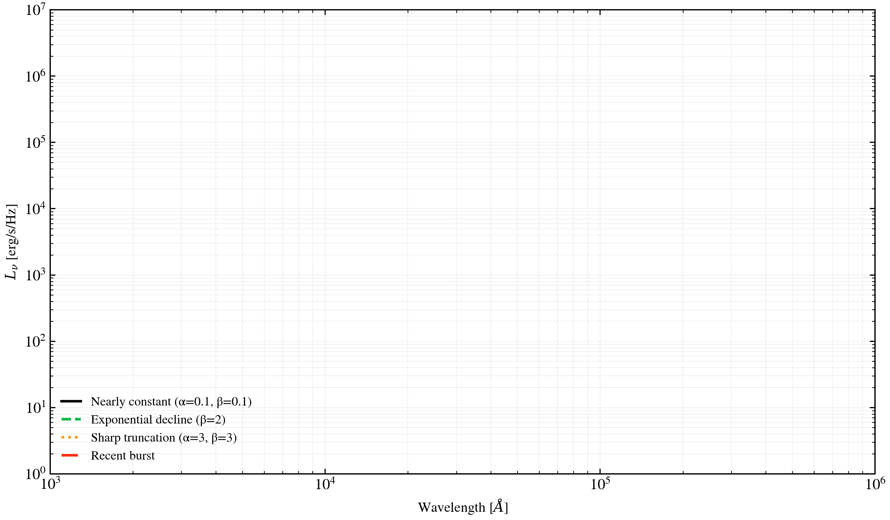

.. DO NOT EDIT.
.. THIS FILE WAS AUTOMATICALLY GENERATED BY SPHINX-GALLERY.
.. TO MAKE CHANGES, EDIT THE SOURCE PYTHON FILE:
.. "auto_examples/sfh/plot_sfh_quenching_compare.py"
.. LINE NUMBERS ARE GIVEN BELOW.

.. only:: html

    .. note::
        :class: sphx-glr-download-link-note

        :ref:`Go to the end <sphx_glr_download_auto_examples_sfh_plot_sfh_quenching_compare.py>`
        to download the full example code.

.. rst-class:: sphx-glr-example-title

.. _sphx_glr_auto_examples_sfh_plot_sfh_quenching_compare.py:

Quenching morphology sets the age mix and resulting SED colors
==============================================================

Four quenching scenarios—constant SFR, exponential decline, sharp truncation,
and recent burst—produce distinct SED shapes. Constant SFR yields a young,
blue galaxy; sharp quenching creates old red colors; a recent burst injects
young stars atop an old population. The SED reveals the full assembly history.

.. GENERATED FROM PYTHON SOURCE LINES 10-123

.. code-block:: Python

    import os

    os.environ["TF_CPP_MIN_LOG_LEVEL"] = "2"  # suppress XLA/PjRt C++ INFO+WARNING logs

    import warnings

    import jax
    import matplotlib.pyplot as plt
    import numpy as np

    import tengri
    from tengri.analysis.plotting import setup_style

    setup_style()
    warnings.filterwarnings("ignore", message=".*BakedInBackend.*")

    ssp = tengri.load_ssp()

    # Scenario 1: Nearly constant star formation
    model1 = tengri.SEDModel.build(
        ssp,
        sfh={
            "type": "dpl",
            "*": tengri.FIXED,
            "alpha": 0.1,
            "beta": 0.1,
            "tau_gyr": 3.0,
            "log_total_mass": 10.0,
        },
        dust={"type": "two_component", "*": tengri.FIXED, "tau_diff": 0.2, "tau_bc": 0.3},
        redshift=tengri.Fixed(0.1),
    )

    # Scenario 2: Exponential decline
    model2 = tengri.SEDModel.build(
        ssp,
        sfh={
            "type": "dpl",
            "*": tengri.FIXED,
            "alpha": 1.0,
            "beta": 2.0,
            "tau_gyr": 2.0,
            "log_total_mass": 10.0,
        },
        dust={"type": "two_component", "*": tengri.FIXED, "tau_diff": 0.2, "tau_bc": 0.3},
        redshift=tengri.Fixed(0.1),
    )

    # Scenario 3: Sharp truncation
    model3 = tengri.SEDModel.build(
        ssp,
        sfh={
            "type": "dpl",
            "*": tengri.FIXED,
            "alpha": 3.0,
            "beta": 3.0,
            "tau_gyr": 1.5,
            "log_total_mass": 10.0,
        },
        dust={"type": "two_component", "*": tengri.FIXED, "tau_diff": 0.2, "tau_bc": 0.3},
        redshift=tengri.Fixed(0.1),
    )

    # Scenario 4: Recent burst
    model4 = tengri.SEDModel.build(
        ssp,
        sfh={
            "type": "tsnorm",
            "*": tengri.FIXED,
            "log_total_mass": 10.0,
            "peak_lbt_gyr": 0.2,
            "width_gyr": 0.5,
            "skew": 0.3,
            "trunc": 2.0,
        },
        dust={"type": "two_component", "*": tengri.FIXED, "tau_diff": 0.2, "tau_bc": 0.3},
        redshift=tengri.Fixed(0.1),
    )

    # Evaluate SEDs
    baseline1 = dict(model1.spec.sample(jax.random.PRNGKey(0)))
    baseline2 = dict(model2.spec.sample(jax.random.PRNGKey(1)))
    baseline3 = dict(model3.spec.sample(jax.random.PRNGKey(2)))
    baseline4 = dict(model4.spec.sample(jax.random.PRNGKey(3)))

    out1 = model1.predict_rest_sed(baseline1)
    out2 = model2.predict_rest_sed(baseline2)
    out3 = model3.predict_rest_sed(baseline3)
    out4 = model4.predict_rest_sed(baseline4)

    wave = np.asarray(out1.wavelength)
    sed1 = np.asarray(out1.sed)
    sed2 = np.asarray(out2.sed)
    sed3 = np.asarray(out3.sed)
    sed4 = np.asarray(out4.sed)

    fig, ax = plt.subplots(figsize=(10, 6))

    ax.loglog(wave, sed1, "k-", lw=2.0, label="Nearly constant (α=0.1, β=0.1)")
    ax.loglog(wave, sed2, "C1--", lw=2.0, label="Exponential decline (β=2)")
    ax.loglog(wave, sed3, "C2:", lw=2.0, label="Sharp truncation (α=3, β=3)")
    ax.loglog(wave, sed4, "C3-.", lw=2.0, label="Recent burst")

    ax.set_xlabel(r"Wavelength [$\AA$]", fontsize=11)
    ax.set_ylabel(r"$L_\nu$ [erg/s/Hz]", fontsize=11)
    ax.set_xlim(1000, 1e6)
    ax.set_ylim(1e0, 1e7)
    ax.legend(fontsize=10, frameon=False, loc="lower left")
    ax.grid(True, alpha=0.2, which="both")

    fig.tight_layout()
    plt.savefig("plot_sfh_quenching_compare.png", dpi=150, bbox_inches="tight")

.. _sphx_glr_download_auto_examples_sfh_plot_sfh_quenching_compare.py:

.. only:: html

  .. container:: sphx-glr-footer sphx-glr-footer-example

    .. container:: sphx-glr-download sphx-glr-download-jupyter

      :download:`Download Jupyter notebook: plot_sfh_quenching_compare.ipynb <plot_sfh_quenching_compare.ipynb>`

    .. container:: sphx-glr-download sphx-glr-download-python

      :download:`Download Python source code: plot_sfh_quenching_compare.py <plot_sfh_quenching_compare.py>`

    .. container:: sphx-glr-download sphx-glr-download-zip

      :download:`Download zipped: plot_sfh_quenching_compare.zip <plot_sfh_quenching_compare.zip>`

.. only:: html

 .. rst-class:: sphx-glr-signature

    `Gallery generated by Sphinx-Gallery <https://sphinx-gallery.github.io>`_
