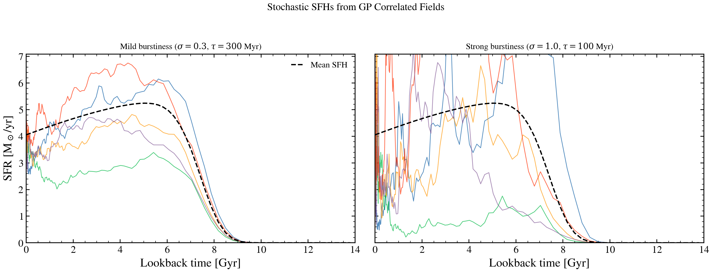

.. DO NOT EDIT.
.. THIS FILE WAS AUTOMATICALLY GENERATED BY SPHINX-GALLERY.
.. TO MAKE CHANGES, EDIT THE SOURCE PYTHON FILE:
.. "auto_examples/sfh/plot_stochastic_sfh.py"
.. LINE NUMBERS ARE GIVEN BELOW.

.. only:: html

    .. note::
        :class: sphx-glr-download-link-note

        :ref:`Go to the end <sphx_glr_download_auto_examples_sfh_plot_stochastic_sfh.py>`
        to download the full example code.

.. rst-class:: sphx-glr-example-title

.. _sphx_glr_auto_examples_sfh_plot_stochastic_sfh.py:

Stochastic SFH from GP Correlated Fields
=========================================

Generate stochastic star formation histories using the Fourier-space
GP correlated field model. The DRW (damped random walk) PSD governs
the burstiness: larger sigma means more variance, shorter tau means
more rapid fluctuations.

.. sphx-glr-precomputed-img:

.. GENERATED FROM PYTHON SOURCE LINES 17-74

.. code-block:: Python

    import jax
    import jax.numpy as jnp
    import matplotlib.pyplot as plt
    import numpy as np

    from tengri import (
        compute_sqrt_power_drw,
        generate_gp_fourier,
        make_log_age_grid,
        tsnorm,
    )
    from tengri.analysis.plotting import setup_style

    setup_style()

    # --- Grid setup ---
    n_grid = 256
    log_age_grid = make_log_age_grid(n_grid)
    d_log_age = float(log_age_grid[1] - log_age_grid[0])
    t_lookback = 10.0**log_age_grid
    t_gyr = np.array(t_lookback) / 1e9

    # --- Smooth mean SFH ---
    mean_sfr = tsnorm(t_lookback, log_peak_sfr=1.0, peak_lbt=6e9, width=2e9, skew=0.5, trunc=3.0)

    # --- Generate GP realizations at two different PSD settings ---
    fig, axes = plt.subplots(1, 2, figsize=(12, 4.5), sharey=True)
    configs = [
        {"sigma": 0.3, "tau_myr": 300, "title": r"Mild burstiness ($\sigma=0.3$, $\tau=300$ Myr)"},
        {"sigma": 1.0, "tau_myr": 100, "title": r"Strong burstiness ($\sigma=1.0$, $\tau=100$ Myr)"},
    ]

    for ax, cfg in zip(axes, configs):
        sqrt_p = compute_sqrt_power_drw(n_grid, d_log_age, cfg["sigma"], cfg["tau_myr"] * 1e6)
        ax.plot(t_gyr, np.array(mean_sfr), "k--", lw=1.5, label="Mean SFH", zorder=5)

        for i in range(5):
            key = jax.random.PRNGKey(i)
            gp = generate_gp_fourier(key, sqrt_p, n_grid)
            # Full SFH = mean * exp(GP - variance/2) for lognormal correction
            variance = float(jnp.var(gp))
            sfr = mean_sfr * jnp.exp(gp - variance / 2.0)
            ax.plot(t_gyr, np.array(sfr), lw=0.8, alpha=0.7)

        ax.set_xlabel("Lookback time [Gyr]")
        ax.set_title(cfg["title"], fontsize=10)
        ax.set_xlim(0, 14)
        ax.set_ylim(0, None)

    axes[0].set_ylabel("SFR [M$_\\odot$/yr]")
    axes[0].legend(fontsize=10, frameon=False)
    fig.suptitle("Stochastic SFHs from GP Correlated Fields", fontsize=12, y=1.02)
    fig.tight_layout()
    plt.savefig("plot_stochastic_sfh.png", dpi=150, bbox_inches="tight")
    plt.show()

.. _sphx_glr_download_auto_examples_sfh_plot_stochastic_sfh.py:

.. only:: html

  .. container:: sphx-glr-footer sphx-glr-footer-example

    .. container:: sphx-glr-download sphx-glr-download-jupyter

      :download:`Download Jupyter notebook: plot_stochastic_sfh.ipynb <plot_stochastic_sfh.ipynb>`

    .. container:: sphx-glr-download sphx-glr-download-python

      :download:`Download Python source code: plot_stochastic_sfh.py <plot_stochastic_sfh.py>`

    .. container:: sphx-glr-download sphx-glr-download-zip

      :download:`Download zipped: plot_stochastic_sfh.zip <plot_stochastic_sfh.zip>`

.. only:: html

 .. rst-class:: sphx-glr-signature

    `Gallery generated by Sphinx-Gallery <https://sphinx-gallery.github.io>`_
