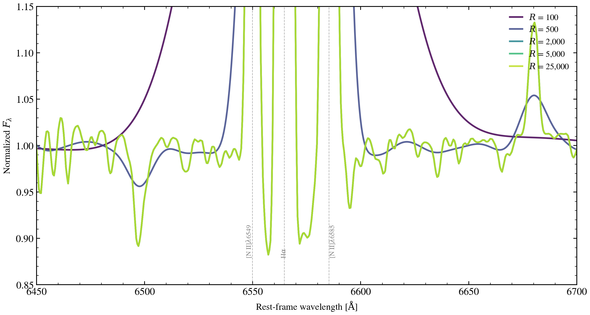

.. DO NOT EDIT.
.. THIS FILE WAS AUTOMATICALLY GENERATED BY SPHINX-GALLERY.
.. TO MAKE CHANGES, EDIT THE SOURCE PYTHON FILE:
.. "auto_examples/spectroscopy/plot_resolution_sweep.py"
.. LINE NUMBERS ARE GIVEN BELOW.

.. only:: html

    .. note::
        :class: sphx-glr-download-link-note

        :ref:`Go to the end <sphx_glr_download_auto_examples_spectroscopy_plot_resolution_sweep.py>`
        to download the full example code.

.. rst-class:: sphx-glr-example-title

.. _sphx_glr_auto_examples_spectroscopy_plot_resolution_sweep.py:

Instrumental Resolution Sweep
===============================

Sweep instrumental resolution R ∈ {500, 2000, 5000, 20000} to demonstrate how
spectral resolution affects line profile visibility. The Hα line (~6564.6 Å
vacuum) transforms from a single broad bump to a sharply resolved absorption
feature as resolution increases. High-res spectroscopy reveals kinematics.

.. sphx-glr-precomputed-img:

.. GENERATED FROM PYTHON SOURCE LINES 17-122

.. code-block:: Python

    import jax.numpy as jnp
    import matplotlib.pyplot as plt
    import numpy as np
    from scipy.ndimage import gaussian_filter1d

    from tengri import Fixed, Observation, Parameters, SEDModel, Spectroscopy, load_ssp
    from tengri.analysis.plotting import setup_style

    setup_style()

    ssp = load_ssp()

    # --- Setup ---
    WAVE_OBS = jnp.linspace(6000.0, 7100.0, 400)
    REDSHIFT = 0.1

    obs = Observation(
        spectroscopy=Spectroscopy(wave_obs=WAVE_OBS),
    )

    spec = Parameters(
        sfh_tsnorm_log_peak_sfr=Fixed(0.5),
        sfh_tsnorm_peak_lbt_gyr=Fixed(1.5),
        sfh_tsnorm_width_gyr=Fixed(1.2),
        sfh_tsnorm_skew=Fixed(-0.2),
        sfh_tsnorm_trunc=Fixed(2.0),
        met_logzsol=Fixed(0.1),
        dust_tau_bc=Fixed(0.2),
        dust_tau_diff=Fixed(0.1),
        dust_slope=Fixed(-0.7),
        redshift=Fixed(REDSHIFT),
    )
    model = SEDModel(spec, ssp, observation=obs)

    # --- Predict rest-frame spectrum ---
    pred = model.predict_rest_sed({})
    wave_rest = np.asarray(pred.wavelength)
    sed_rest = np.asarray(pred.sed)

    # --- Zoom to Hα region in the rest frame ---
    # wave_rest is already rest-frame Å from predict_rest_sed; no division by
    # (1+z) needed (that would double-blueshift and offset Hα by ~80 Å).
    zoom_mask = (wave_rest >= 6400) & (wave_rest <= 6750)
    wave_zoom = wave_rest[zoom_mask]
    sed_zoom = sed_rest[zoom_mask]

    # Normalize to continuum level
    sed_zoom = sed_zoom / np.median(sed_zoom)

    # --- Resolution sweep (R = λ / Δλ) ---
    resolution_vals = [500, 2000, 5000, 20000]
    colors = plt.cm.viridis(np.linspace(0.0, 0.85, len(resolution_vals)))

    # Wavelength pixel width
    dlam_pix = np.mean(np.diff(wave_zoom))

    fig, ax = plt.subplots(figsize=(9, 5))

    for r, color in zip(resolution_vals, colors):
        # Wavelength resolution element from R
        dlam = np.mean(wave_zoom) / r
        sigma_pix = dlam / (2.355 * dlam_pix)  # FWHM → sigma

        # Apply Gaussian broadening
        sed_conv = gaussian_filter1d(sed_zoom, sigma=sigma_pix)

        ax.plot(
            wave_zoom,
            sed_conv,
            lw=2.0,
            color=color,
            label=f"$R$ = {r:,}",
            alpha=0.85,
        )

    # Set limits FIRST so the H-alpha annotation places at the right y-coord.
    ax.set_xlabel(r"Rest Wavelength [$\AA$]")
    ax.set_ylabel("Normalized Flux")
    ax.set_title(r"H$\alpha$ Line: Instrumental Resolution Effects")
    # Zoom out enough to show the full Hα + [N II] λλ6549,6585 complex with
    # continuum context either side. Log-y keeps the bright emission peaks on
    # the same panel as the ~1% absorption-line wiggles in the continuum.
    ax.set_xlim(6450, 6700)
    ax.set_yscale("log")
    ax.set_ylim(0.7, 30.0)

    # Mark Hα center (vacuum) using axis-fraction transform so the text always
    # anchors to the visible top of the panel regardless of data range.
    ha_center = 6564.61
    ax.axvline(ha_center, ls=":", lw=1.0, color="grey", alpha=0.5)
    ax.text(
        ha_center,
        0.95,
        r"H$\alpha$",
        fontsize=11,
        ha="center",
        color="grey",
        transform=ax.get_xaxis_transform(),
    )
    ax.legend(frameon=False, loc="upper right", fontsize=10)
    fig.tight_layout()
    plt.savefig("plot_resolution_sweep.png", dpi=150, bbox_inches="tight")
    plt.show()

.. _sphx_glr_download_auto_examples_spectroscopy_plot_resolution_sweep.py:

.. only:: html

  .. container:: sphx-glr-footer sphx-glr-footer-example

    .. container:: sphx-glr-download sphx-glr-download-jupyter

      :download:`Download Jupyter notebook: plot_resolution_sweep.ipynb <plot_resolution_sweep.ipynb>`

    .. container:: sphx-glr-download sphx-glr-download-python

      :download:`Download Python source code: plot_resolution_sweep.py <plot_resolution_sweep.py>`

    .. container:: sphx-glr-download sphx-glr-download-zip

      :download:`Download zipped: plot_resolution_sweep.zip <plot_resolution_sweep.zip>`

.. only:: html

 .. rst-class:: sphx-glr-signature

    `Gallery generated by Sphinx-Gallery <https://sphinx-gallery.github.io>`_
