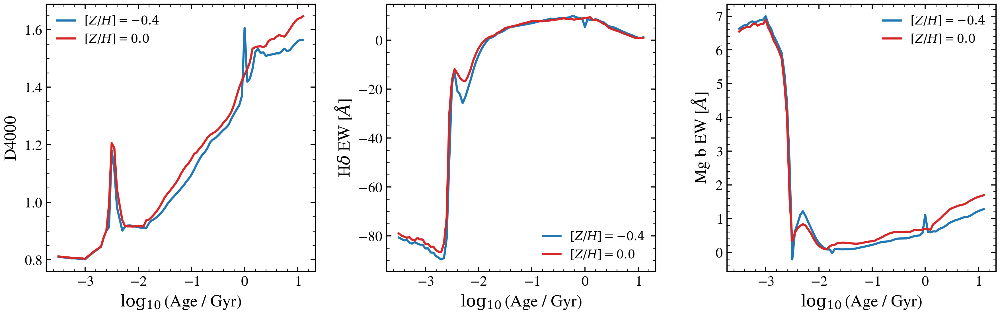

.. DO NOT EDIT.
.. THIS FILE WAS AUTOMATICALLY GENERATED BY SPHINX-GALLERY.
.. TO MAKE CHANGES, EDIT THE SOURCE PYTHON FILE:
.. "auto_examples/spectroscopy/plot_spectral_features.py"
.. LINE NUMBERS ARE GIVEN BELOW.

.. only:: html

    .. note::
        :class: sphx-glr-download-link-note

        :ref:`Go to the end <sphx_glr_download_auto_examples_spectroscopy_plot_spectral_features.py>`
        to download the full example code.

.. rst-class:: sphx-glr-example-title

.. _sphx_glr_auto_examples_spectroscopy_plot_spectral_features.py:

Key Spectral Features as Age and Metallicity Probes
====================================================

D4000, Hδ absorption, and the Mg b feature respond differently to stellar
age and metallicity, providing complementary constraints when used together.
D4000 rises with age; Hδ peaks at intermediate ages (A-star dominated);
Mg b traces metallicity on the RGB/AGB branch.

.. sphx-glr-precomputed-img:

.. GENERATED FROM PYTHON SOURCE LINES 17-115

.. code-block:: Python

    from pathlib import Path

    import jax
    import jax.numpy as jnp
    import matplotlib.pyplot as plt
    import numpy as np

    jax.config.update("jax_enable_x64", True)

    from tengri import load_ssp_data, setup_style

    setup_style()

    def _find_ssp():
        name = "ssp_prsc_miles_chabrier_wNE_logGasU-3.0_logGasZ0.0.h5"
        for p in [
            Path("data") / name,
            Path("../data") / name,
            Path("../../data") / name,
            Path("../../../data") / name,
        ]:
            if p.exists():
                return str(p)
        return None

    SSP_PATH = _find_ssp()
    if SSP_PATH is None:
        raise FileNotFoundError("SSP data not found — skipping example")

    ssp = load_ssp_data(SSP_PATH)

    # --- Index measurement helpers ---
    def _d4000(wave, flux):
        """D4000 break: flux ratio 4050–4250 Å / 3750–3950 Å."""
        b = (wave >= 3750) & (wave <= 3950)
        r = (wave >= 4050) & (wave <= 4250)
        fb = float(jnp.mean(flux[b])) if jnp.any(b) else 1e-30
        fr = float(jnp.mean(flux[r])) if jnp.any(r) else 0.0
        return fr / max(fb, 1e-30)

    def _hdelta_ew(wave, flux):
        """Hδ EW: simple continuum-normalized absorption at 4102 Å."""
        cont_lo = (wave >= 4030) & (wave <= 4082)
        cont_hi = (wave >= 4122) & (wave <= 4170)
        line = (wave >= 4082) & (wave <= 4122)
        c = float(jnp.mean(flux[cont_lo | cont_hi])) if jnp.any(cont_lo | cont_hi) else 1e-30
        dw = float(wave[line][1] - wave[line][0]) if jnp.any(line) else 1.0
        return float(jnp.sum((1 - flux[line] / c) * dw)) if jnp.any(line) else 0.0

    def _mgb_index(wave, flux):
        """Mg b feature strength: 5167–5197 Å absorption."""
        cont = (wave >= 5142) & (wave <= 5162) | (wave >= 5197) & (wave <= 5217)
        feat = (wave >= 5162) & (wave <= 5197)
        c = float(jnp.mean(flux[cont])) if jnp.any(cont) else 1e-30
        dw = float(wave[feat][1] - wave[feat][0]) if jnp.any(feat) else 1.0
        return float(jnp.sum((1 - flux[feat] / c) * dw)) if jnp.any(feat) else 0.0

    # --- Age grid from SSP ---
    ages_gyr = np.array(ssp.ssp_lg_age_gyr)  # log10(age/Gyr)
    # Use two metallicities: sub-solar and solar
    met_idxs = {r"$[Z/H] = -0.4$": 2, r"$[Z/H] = 0.0$": 3}
    wave = jnp.array(ssp.ssp_wave)

    fig, axes = plt.subplots(1, 3, figsize=(12, 4))
    colors = ["#1f77b4", "#d62728"]

    for (label, mid), color in zip(met_idxs.items(), colors):
        d4_vals, hd_vals, mgb_vals = [], [], []
        for ai in range(ssp.ssp_flux.shape[1]):
            flux = ssp.ssp_flux[mid, ai]
            d4_vals.append(_d4000(wave, flux))
            hd_vals.append(_hdelta_ew(wave, flux))
            mgb_vals.append(_mgb_index(wave, flux))
        axes[0].plot(ages_gyr, d4_vals, color=color, lw=1.8, label=label)
        axes[1].plot(ages_gyr, hd_vals, color=color, lw=1.8, label=label)
        axes[2].plot(ages_gyr, mgb_vals, color=color, lw=1.8, label=label)

    for ax, title, ylabel in [
        (axes[0], "D4000 Break", "D4000"),
        (axes[1], r"H$\delta$ EW", r"H$\delta$ EW [$\AA$]"),
        (axes[2], "Mg b Index", r"Mg b EW [$\AA$]"),
    ]:
        ax.set_xlabel(r"$\log_{10}$(Age / Gyr)")
        ax.set_ylabel(ylabel)
        ax.set_title(title)
        ax.legend(fontsize=10, frameon=False)

    fig.suptitle("Spectral Features: Age and Metallicity Probes", fontsize=11, y=1.02)
    fig.tight_layout()
    plt.savefig("plot_spectral_features.png", dpi=150, bbox_inches="tight")
    plt.show()

.. _sphx_glr_download_auto_examples_spectroscopy_plot_spectral_features.py:

.. only:: html

  .. container:: sphx-glr-footer sphx-glr-footer-example

    .. container:: sphx-glr-download sphx-glr-download-jupyter

      :download:`Download Jupyter notebook: plot_spectral_features.ipynb <plot_spectral_features.ipynb>`

    .. container:: sphx-glr-download sphx-glr-download-python

      :download:`Download Python source code: plot_spectral_features.py <plot_spectral_features.py>`

    .. container:: sphx-glr-download sphx-glr-download-zip

      :download:`Download zipped: plot_spectral_features.zip <plot_spectral_features.zip>`

.. only:: html

 .. rst-class:: sphx-glr-signature

    `Gallery generated by Sphinx-Gallery <https://sphinx-gallery.github.io>`_
