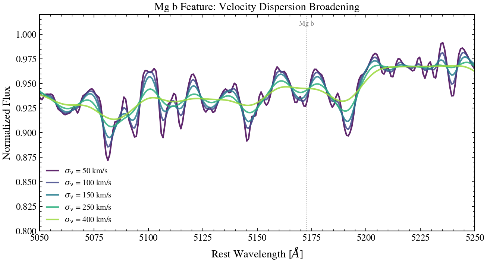

.. DO NOT EDIT.
.. THIS FILE WAS AUTOMATICALLY GENERATED BY SPHINX-GALLERY.
.. TO MAKE CHANGES, EDIT THE SOURCE PYTHON FILE:
.. "auto_examples/spectroscopy/plot_velocity_dispersion_sweep.py"
.. LINE NUMBERS ARE GIVEN BELOW.

.. only:: html

    .. note::
        :class: sphx-glr-download-link-note

        :ref:`Go to the end <sphx_glr_download_auto_examples_spectroscopy_plot_velocity_dispersion_sweep.py>`
        to download the full example code.

.. rst-class:: sphx-glr-example-title

.. _sphx_glr_auto_examples_spectroscopy_plot_velocity_dispersion_sweep.py:

Stellar Velocity Dispersion Sweep
===================================

Sweep stellar velocity dispersion σ_v ∈ {50, 100, 150, 250, 400} km/s to show
how line broadening increases with dynamical heating. The Mg b absorption
feature (~5170 Å) widens progressively, demonstrating the kinematic signature
of higher-velocity stellar populations.

.. sphx-glr-precomputed-img:

.. GENERATED FROM PYTHON SOURCE LINES 17-101

.. rst-class:: sphx-glr-script-out

.. code-block:: pytb

    Traceback (most recent call last):
      File "/tengri/examples/spectroscopy/plot_velocity_dispersion_sweep.py", line 30, in <module>
        import tengri
      File "/tengri/src/tengri/__init__.py", line 256, in <module>
        from tengri import builders, components as _components, preprocessing, presets, recipes
      File "/tengri/src/tengri/builders/__init__.py", line 58, in <module>
        from tengri.builders import agn, dust, igm, neb, radio, sfh, xray
      File "/tengri/src/tengri/builders/agn/__init__.py", line 67, in <module>
        from tengri.builders._factory import UNSET, _pop_wildcard, make_factory, short_form
      File "/tengri/src/tengri/builders/_factory.py", line 23, in <module>
        from tengri.parameters.sentinels import FIXED, FREE, WILDCARD_ALIAS
      File "/tengri/src/tengri/parameters/__init__.py", line 39, in <module>
        from tengri.parameters.groups import parse_groups
      File "/tengri/src/tengri/parameters/groups.py", line 106, in <module>
        from tengri.parameters._builders import _resolve_lazy_bucket
      File "/tengri/src/tengri/parameters/_builders.py", line 163, in <module>
        from tengri.components.dust._params import ATTENUATION_TWO_COMPONENT_ONLY
      File "/tengri/src/tengri/components/__init__.py", line 12, in <module>
        from tengri.components import agn, dust, igm, nebular, radio, stellar, xray
      File "/tengri/src/tengri/components/agn/__init__.py", line 44, in <module>
        from tengri.components.agn import blocks
      File "/tengri/src/tengri/components/agn/blocks/__init__.py", line 26, in <module>
        from tengri.components.agn.blocks import (
      File "/tengri/src/tengri/components/agn/blocks/alternates.py", line 33, in <module>
        from tengri.components.agn.reddening import redden_disc
      File "/tengri/src/tengri/components/agn/reddening.py", line 21, in <module>
        from tengri.components.dust.attenuation import prevot_smc
      File "/tengri/src/tengri/components/dust/__init__.py", line 49, in <module>
        from tengri.components.dust.attenuation import (
      File "/tengri/src/tengri/components/dust/attenuation.py", line 1752, in <module>
        from dust_extinction.grain_models import D03, HD23, WD01
      File "/Users/suchethacooray/Projects/tengri/.venv/lib/python3.12/site-packages/dust_extinction/grain_models.py", line 5, in <module>
        from astropy.table import Table
      File "/Users/suchethacooray/Projects/tengri/.venv/lib/python3.12/site-packages/astropy/table/__init__.py", line 6, in <module>
        from .column import Column, ColumnInfo, MaskedColumn, StringTruncateWarning
      File "/Users/suchethacooray/Projects/tengri/.venv/lib/python3.12/site-packages/astropy/table/column.py", line 12, in <module>
        from astropy.units import Quantity, StructuredUnit, Unit
      File "/Users/suchethacooray/Projects/tengri/.venv/lib/python3.12/site-packages/astropy/units/__init__.py", line 13, in <module>
        from . import (
      File "/Users/suchethacooray/Projects/tengri/.venv/lib/python3.12/site-packages/astropy/units/astrophys.py", line 10, in <module>
        from astropy.constants import si as _si
      File "/Users/suchethacooray/Projects/tengri/.venv/lib/python3.12/site-packages/astropy/constants/__init__.py", line 27, in <module>
        from . import cgs, si
      File "/Users/suchethacooray/Projects/tengri/.venv/lib/python3.12/site-packages/astropy/constants/cgs.py", line 7, in <module>
        from .config import codata, iaudata
      File "/Users/suchethacooray/Projects/tengri/.venv/lib/python3.12/site-packages/astropy/constants/config.py", line 15, in <module>
        codata = importlib.import_module(".constants." + phys_version, "astropy")
                 ^^^^^^^^^^^^^^^^^^^^^^^^^^^^^^^^^^^^^^^^^^^^^^^^^^^^^^^^^^^^^^^^
      File "/opt/anaconda3/lib/python3.12/importlib/__init__.py", line 90, in import_module
        return _bootstrap._gcd_import(name[level:], package, level)
               ^^^^^^^^^^^^^^^^^^^^^^^^^^^^^^^^^^^^^^^^^^^^^^^^^^^^
      File "/Users/suchethacooray/Projects/tengri/.venv/lib/python3.12/site-packages/astropy/constants/codata2018.py", line 9, in <module>
        from .constant import Constant, EMConstant
      File "/Users/suchethacooray/Projects/tengri/.venv/lib/python3.12/site-packages/astropy/constants/constant.py", line 10, in <module>
        from astropy.units.quantity import Quantity
      File "/Users/suchethacooray/Projects/tengri/.venv/lib/python3.12/site-packages/astropy/units/quantity.py", line 38, in <module>
        from .quantity_helper import can_have_arbitrary_unit, check_output, converters_and_unit
      File "/Users/suchethacooray/Projects/tengri/.venv/lib/python3.12/site-packages/astropy/units/quantity_helper/__init__.py", line 16, in <module>
        from . import erfa, function_helpers, helpers, scipy_special
      File "/Users/suchethacooray/Projects/tengri/.venv/lib/python3.12/site-packages/astropy/units/quantity_helper/function_helpers.py", line 1065, in <module>
        @function_helper  # np.in1d deprecated in not NUMPY_LT_2_0.
         ^^^^^^^^^^^^^^^
      File "/Users/suchethacooray/Projects/tengri/.venv/lib/python3.12/site-packages/astropy/units/quantity_helper/function_helpers.py", line 192, in __call__
        helps = getattr(module, f.__name__)
                ^^^^^^^^^^^^^^^^^^^^^^^^^^^
      File "/Users/suchethacooray/Projects/tengri/.venv/lib/python3.12/site-packages/numpy/__init__.py", line 769, in __getattr__
        raise AttributeError(f"module {__name__!r} has no attribute {attr!r}")
    AttributeError: module 'numpy' has no attribute 'in1d'

|

.. code-block:: Python

    import os

    os.environ["TF_CPP_MIN_LOG_LEVEL"] = "2"  # suppress XLA/PjRt C++ INFO+WARNING logs

    import warnings

    import jax
    import jax.numpy as jnp
    import matplotlib as mpl
    import matplotlib.pyplot as plt
    import numpy as np

    import tengri
    from tengri.plot import setup_style

    setup_style()
    warnings.filterwarnings("ignore", message=".*BakedInBackend.*")

    ssp = tengri.load_ssp()

    WAVE_OBS = jnp.linspace(4800.0, 5500.0, 300)
    REDSHIFT = 0.1

    obs = tengri.Observation(
        spectroscopy=tengri.Spectroscopy(wave_obs=WAVE_OBS),
    )

    model = tengri.SEDModel.build(
        ssp,
        observation=obs,
        sfh={
            "type": "tsnorm",
            "all_params": tengri.FIXED,
            "log_total_mass": 10.0,
            "peak_lbt_gyr": 2.5,
            "width_gyr": 1.8,
            "skew": 0.1,
            "trunc": 3.0,
        },
        dust={
            "type": "two_component",
            "all_params": tengri.FIXED,
            "tau_bc": 0.1,
            "tau_diff": 0.05,
            "slope": -0.7,
        },
        redshift=tengri.Fixed(REDSHIFT),
    )

    baseline = dict(model.spec.sample(jax.random.PRNGKey(0)))

    sigma_v_vals = np.array([50.0, 100.0, 150.0, 250.0, 400.0])
    norm = mpl.colors.Normalize(vmin=sigma_v_vals.min(), vmax=sigma_v_vals.max())
    cmap = plt.get_cmap("viridis")

    fig, ax = plt.subplots(figsize=(7.0, 4.6))

    wave_rest = np.linspace(5050.0, 5300.0, 600)
    for sigma in sigma_v_vals:
        params = {**baseline, "sigma_v_kms": jnp.float64(sigma)}
        spec_out = model.predict_spectrum(params, wave_obs=wave_rest * (1 + REDSHIFT))
        flux = np.asarray(spec_out)

        cont_mask = (wave_rest >= 5200.0) & (wave_rest <= 5230.0)
        f_cont = np.median(flux[cont_mask])
        ax.plot(wave_rest, flux / f_cont, color=cmap(norm(sigma)), lw=1.2)

    ax.axvline(5167.0, color="0.55", lw=0.4, ls=":")
    ax.axvline(5173.0, color="0.55", lw=0.4, ls=":")
    ax.axvline(5184.0, color="0.55", lw=0.4, ls=":")
    ax.text(5175.0, 1.06, "Mg b triplet", fontsize=8, color="0.4", ha="center")

    ax.set(
        xlim=(5050, 5300),
        ylim=(0.78, 1.10),
        xlabel=r"Rest-frame wavelength $\lambda$ [$\mathrm{\AA}$]",
        ylabel=r"$F_\lambda\,/\,F_{\rm cont}$ (normalized at 5200-5230 Å)",
    )
    cb = fig.colorbar(plt.cm.ScalarMappable(norm=norm, cmap=cmap), ax=ax, pad=0.01)
    cb.set_label(r"$\sigma_v$  [km s$^{-1}$]")

    fig.tight_layout()
    plt.savefig("plot_velocity_dispersion_sweep.png", dpi=150, bbox_inches="tight")

.. _sphx_glr_download_auto_examples_spectroscopy_plot_velocity_dispersion_sweep.py:

.. only:: html

  .. container:: sphx-glr-footer sphx-glr-footer-example

    .. container:: sphx-glr-download sphx-glr-download-jupyter

      :download:`Download Jupyter notebook: plot_velocity_dispersion_sweep.ipynb <plot_velocity_dispersion_sweep.ipynb>`

    .. container:: sphx-glr-download sphx-glr-download-python

      :download:`Download Python source code: plot_velocity_dispersion_sweep.py <plot_velocity_dispersion_sweep.py>`

    .. container:: sphx-glr-download sphx-glr-download-zip

      :download:`Download zipped: plot_velocity_dispersion_sweep.zip <plot_velocity_dispersion_sweep.zip>`

.. only:: html

 .. rst-class:: sphx-glr-signature

    `Gallery generated by Sphinx-Gallery <https://sphinx-gallery.github.io>`_
