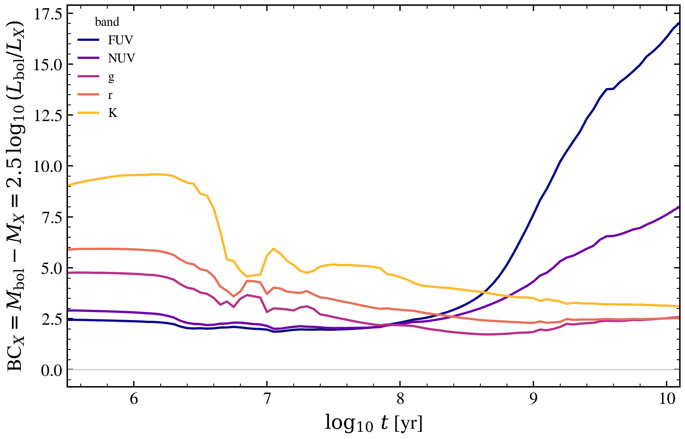

.. DO NOT EDIT.
.. THIS FILE WAS AUTOMATICALLY GENERATED BY SPHINX-GALLERY.
.. TO MAKE CHANGES, EDIT THE SOURCE PYTHON FILE:
.. "auto_examples/sps/plot_bolometric_correction_vs_age.py"
.. LINE NUMBERS ARE GIVEN BELOW.

.. only:: html

    .. note::
        :class: sphx-glr-download-link-note

        :ref:`Go to the end <sphx_glr_download_auto_examples_sps_plot_bolometric_correction_vs_age.py>`
        to download the full example code.

.. rst-class:: sphx-glr-example-title

.. _sphx_glr_auto_examples_sps_plot_bolometric_correction_vs_age.py:

Bolometric correction per band as a single burst ages
=====================================================

The bolometric correction in band ``X`` is
``BC_X = M_bol − M_X`` (equivalently ``2.5 log10(L_X / L_bol)`` up
to a sign). For a single-burst SSP it traces which part of the
spectrum carries the bolometric luminosity at each age: at young
ages the UV dominates so ``BC_UV`` is small and ``BC_K`` is large
(positive); as the population ages the SED reddens and the
correction inverts — ``BC_K`` shrinks while ``BC_UV`` blows up.

We integrate the FSPS Chabrier SSP spectrum to get ``L_bol`` and
mock-photometer it through five rectangular bands centred on
GALEX FUV/NUV and SDSS g, r, K to keep the demo independent of
the full filter machinery.

References:
- Conroy, Gunn, White 2009 ApJ 699 486.
- Bruzual & Charlot 2003 MNRAS 344 1000.

.. GENERATED FROM PYTHON SOURCE LINES 22-82

.. image-sg:: /auto_examples/sps/images/sphx_glr_plot_bolometric_correction_vs_age_001.png
   :alt: plot bolometric correction vs age
   :srcset: /auto_examples/sps/images/sphx_glr_plot_bolometric_correction_vs_age_001.png
   :class: sphx-glr-single-img

.. code-block:: Python

    import warnings

    import matplotlib.pyplot as plt
    import numpy as np

    import tengri
    from tengri.analysis.plotting import setup_style

    setup_style()
    warnings.filterwarnings("ignore")

    C_AA_S = 2.998e18

    ssp = tengri.load_ssp("fsps_prsc_miles_chabrier")
    wave = np.asarray(ssp.ssp_wave)
    log_age_yr = np.asarray(ssp.ssp_lg_age_gyr) + 9.0

    # pick the solar-metallicity slice (FSPS lgmet is log10(Z) absolute, Zsun = -1.848)
    i_zsun = int(np.argmin(np.abs(np.asarray(ssp.ssp_lgmet) + 1.848)))
    flux = np.asarray(ssp.ssp_flux)
    # shape may be (n_met, n_age, n_wave); take the solar slice
    L_nu = flux[i_zsun] if flux.ndim == 3 else flux

    bands = [
        ("FUV", 1350, 1750),
        ("NUV", 1900, 2700),
        ("g", 4000, 5500),
        ("r", 5500, 6800),
        ("K", 20000, 24000),
    ]

    nu = C_AA_S / wave
    # integrate -L_nu in frequency  (sign because freq decreases with lambda)
    ord_nu = np.argsort(nu)
    L_bol = np.trapz(L_nu[:, ord_nu], nu[ord_nu], axis=1)

    BC = {}
    for name, lo, hi in bands:
        mask = (wave >= lo) & (wave <= hi)
        nu_b = nu[mask]
        order = np.argsort(nu_b)
        L_b = np.trapz(L_nu[:, mask][:, order], nu_b[order], axis=1)
        BC[name] = 2.5 * np.log10(np.where(L_b > 0, L_bol / L_b, np.nan))

    fig, ax = plt.subplots(figsize=(7.0, 4.6))
    cmap_colors = plt.get_cmap("plasma")(np.linspace(0.0, 0.85, len(bands)))
    for (name, *_), c in zip(bands, cmap_colors):
        ax.plot(log_age_yr, BC[name], color=c, lw=1.6, label=name)

    ax.axhline(0, color="0.75", lw=0.6)
    ax.set(
        xlabel=r"$\log_{10}\,t$ [yr]",
        ylabel=r"BC$_X = M_{\rm bol} - M_X = 2.5\,\log_{10}(L_{\rm bol}/L_X)$",
        xlim=(log_age_yr.min(), log_age_yr.max()),
    )
    ax.legend(frameon=False, fontsize=9, title="band", title_fontsize=9)

    fig.tight_layout()
    plt.savefig("plot_bolometric_correction_vs_age.png", dpi=150, bbox_inches="tight")

.. _sphx_glr_download_auto_examples_sps_plot_bolometric_correction_vs_age.py:

.. only:: html

  .. container:: sphx-glr-footer sphx-glr-footer-example

    .. container:: sphx-glr-download sphx-glr-download-jupyter

      :download:`Download Jupyter notebook: plot_bolometric_correction_vs_age.ipynb <plot_bolometric_correction_vs_age.ipynb>`

    .. container:: sphx-glr-download sphx-glr-download-python

      :download:`Download Python source code: plot_bolometric_correction_vs_age.py <plot_bolometric_correction_vs_age.py>`

    .. container:: sphx-glr-download sphx-glr-download-zip

      :download:`Download zipped: plot_bolometric_correction_vs_age.zip <plot_bolometric_correction_vs_age.zip>`

.. only:: html

 .. rst-class:: sphx-glr-signature

    `Gallery generated by Sphinx-Gallery <https://sphinx-gallery.github.io>`_
