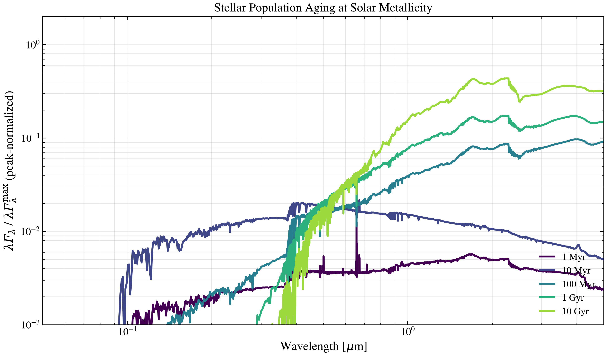

.. DO NOT EDIT.
.. THIS FILE WAS AUTOMATICALLY GENERATED BY SPHINX-GALLERY.
.. TO MAKE CHANGES, EDIT THE SOURCE PYTHON FILE:
.. "auto_examples/sps/plot_ssp_age_sweep.py"
.. LINE NUMBERS ARE GIVEN BELOW.

.. only:: html

    .. note::
        :class: sphx-glr-download-link-note

        :ref:`Go to the end <sphx_glr_download_auto_examples_sps_plot_ssp_age_sweep.py>`
        to download the full example code.

.. rst-class:: sphx-glr-example-title

.. _sphx_glr_auto_examples_sps_plot_ssp_age_sweep.py:

Stellar Population Aging: SSP at Solar Metallicity
===================================================

How does a single stellar population age from UV-dominated blue phase through
infrared-dominated red phase? This script selects five representative ages
from the DSPS SSP grid at solar metallicity and plots rest-frame λF_λ on
log-log axes to reveal the temperature inversion and dust signature.

.. sphx-glr-precomputed-img:

.. GENERATED FROM PYTHON SOURCE LINES 17-95

.. code-block:: Python

    from pathlib import Path

    import matplotlib.pyplot as plt
    import numpy as np

    from tengri import load_ssp_data
    from tengri.analysis.plotting import setup_style

    setup_style()

    def _find_ssp():
        """Find SSP data file in standard locations."""
        name = "ssp_prsc_miles_chabrier_wNE_logGasU-3.0_logGasZ0.0.h5"
        for p in [
            Path("data") / name,
            Path("../data") / name,
            Path("../../data") / name,
            Path("../../../data") / name,
        ]:
            if p.exists():
                return str(p)
        return None

    ssp_path = _find_ssp()
    if ssp_path is None:
        raise FileNotFoundError("SSP data not found — skipping example")

    ssp_data = load_ssp_data(ssp_path)

    # Extract grid
    age_gyr = 10 ** np.array(ssp_data.ssp_lg_age_gyr)
    log_z = np.array(ssp_data.ssp_lgmet)
    ssp_wave = np.array(ssp_data.ssp_wave)
    ssp_spec = np.array(ssp_data.ssp_flux)  # Shape: (n_z, n_age, n_wave)

    # Select solar metallicity
    z_idx_solar = np.argmin(np.abs(log_z - 0.0))

    # Select 5 ages: 1 Myr, 10 Myr, 100 Myr, 1 Gyr, 10 Gyr
    target_ages = [1e-3, 0.01, 0.1, 1.0, 10.0]  # Gyr
    age_indices = [np.argmin(np.abs(age_gyr - t)) for t in target_ages]
    age_labels = ["1 Myr", "10 Myr", "100 Myr", "1 Gyr", "10 Gyr"]

    # Clamp viridis colormap to 0.0–0.85
    colors = plt.cm.viridis(np.linspace(0.0, 0.85, len(target_ages)))

    fig, ax = plt.subplots(figsize=(10, 6))

    # Plot each age — peak-normalize so the *shape* (UV→IR aging) dominates the eye
    # rather than the absolute flux scale, which spans 30+ decades across ages.
    for age_idx, age_lbl, color in zip(age_indices, age_labels, colors):
        spec = np.asarray(ssp_spec[z_idx_solar, age_idx, :])
        lambda_f_lambda = ssp_wave * spec
        # Mask zero/negative entries (log of 0 → -inf artifacts) before normalising
        safe = np.where(lambda_f_lambda > 0, lambda_f_lambda, np.nan)
        norm = np.nanmax(safe)
        ax.loglog(ssp_wave / 1e4, safe / norm, lw=2.2, color=color, label=age_lbl)

    ax.set_xlabel(r"Wavelength [$\mu$m]", fontsize=12)
    ax.set_ylabel(
        r"$\lambda F_\lambda$ / $\lambda F_\lambda^{\rm max}$ (peak-normalized)",
        fontsize=12,
    )
    ax.set_title("Stellar Population Aging at Solar Metallicity", fontsize=14)
    ax.legend(fontsize=11, frameon=False, loc="lower right")
    ax.grid(True, alpha=0.3, which="both")
    # Focus on the UV-NIR where stellar SEDs live; clip the empty far-IR / X-ray
    # tails the SSP grid extends into.
    ax.set_xlim(0.05, 5.0)
    ax.set_ylim(1e-3, 2.0)

    fig.tight_layout()
    plt.savefig("plot_ssp_age_sweep.png", dpi=150, bbox_inches="tight")
    plt.show()

.. _sphx_glr_download_auto_examples_sps_plot_ssp_age_sweep.py:

.. only:: html

  .. container:: sphx-glr-footer sphx-glr-footer-example

    .. container:: sphx-glr-download sphx-glr-download-jupyter

      :download:`Download Jupyter notebook: plot_ssp_age_sweep.ipynb <plot_ssp_age_sweep.ipynb>`

    .. container:: sphx-glr-download sphx-glr-download-python

      :download:`Download Python source code: plot_ssp_age_sweep.py <plot_ssp_age_sweep.py>`

    .. container:: sphx-glr-download sphx-glr-download-zip

      :download:`Download zipped: plot_ssp_age_sweep.zip <plot_ssp_age_sweep.zip>`

.. only:: html

 .. rst-class:: sphx-glr-signature

    `Gallery generated by Sphinx-Gallery <https://sphinx-gallery.github.io>`_
