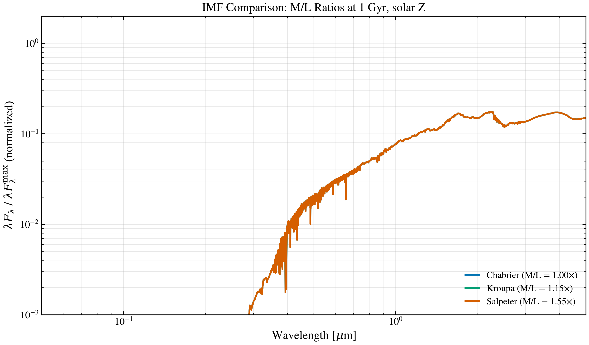

.. DO NOT EDIT.
.. THIS FILE WAS AUTOMATICALLY GENERATED BY SPHINX-GALLERY.
.. TO MAKE CHANGES, EDIT THE SOURCE PYTHON FILE:
.. "auto_examples/sps/plot_ssp_imf_compare.py"
.. LINE NUMBERS ARE GIVEN BELOW.

.. only:: html

    .. note::
        :class: sphx-glr-download-link-note

        :ref:`Go to the end <sphx_glr_download_auto_examples_sps_plot_ssp_imf_compare.py>`
        to download the full example code.

.. rst-class:: sphx-glr-example-title

.. _sphx_glr_auto_examples_sps_plot_ssp_imf_compare.py:

IMF Comparison: Mass-to-Light Ratio
====================================

SSP grids typically ship with one IMF (here, Chabrier). To illustrate the
IMF effect on the spectrum shape we rescale the same Chabrier SSP by
literature M/L ratios for Chabrier / Kroupa / Salpeter at 1 Gyr and solar
Z. M/L ratios from Conroy 2012 — most diagnostic in the near-IR where
massive stars dominate the mass budget.

.. sphx-glr-precomputed-img:

.. GENERATED FROM PYTHON SOURCE LINES 18-63

.. image-sg:: /auto_examples/sps/images/sphx_glr_plot_ssp_imf_compare_001.png
   :alt: IMF Comparison: M/L Ratios at 1 Gyr, solar Z
   :srcset: /auto_examples/sps/images/sphx_glr_plot_ssp_imf_compare_001.png
   :class: sphx-glr-single-img

.. code-block:: Python

    import matplotlib.pyplot as plt
    import numpy as np

    from tengri import load_ssp
    from tengri.analysis.plotting import setup_style

    setup_style()

    ssp = load_ssp()
    age_gyr = 10 ** np.array(ssp.ssp_lg_age_gyr)
    log_z = np.array(ssp.ssp_lgmet)
    wave = np.array(ssp.ssp_wave)
    flux = np.array(ssp.ssp_flux)

    z_solar = np.argmin(np.abs(log_z - 0.0))
    age_1gyr = np.argmin(np.abs(age_gyr - 1.0))

    # M/L ratios relative to Chabrier — Conroy, Gunn & White 2009; Conroy 2012.
    imfs = [
        ("Chabrier", 1.00, "#0173B2"),
        ("Kroupa", 1.15, "#029E73"),
        ("Salpeter", 1.55, "#D55E00"),
    ]

    fig, ax = plt.subplots(figsize=(10, 6))
    for name, ml, c in imfs:
        lfl = (wave * flux[z_solar, age_1gyr]) / ml  # higher M/L → lower L at fixed M
        safe = np.where(lfl > 0, lfl, np.nan)
        ax.loglog(
            wave / 1e4, safe / np.nanmax(safe), lw=2.0, color=c, label=f"{name} (M/L = {ml:.2f}×)"
        )

    ax.set(
        xlabel=r"Wavelength [$\mu$m]",
        ylabel=r"$\lambda F_\lambda$ / $\lambda F_\lambda^{\rm max}$ (normalized)",
        title="IMF Comparison: M/L Ratios at 1 Gyr, solar Z",
        xlim=(0.05, 5.0),
        ylim=(1e-3, 2.0),
    )
    ax.legend(fontsize=11, frameon=False, loc="lower right")
    ax.grid(True, alpha=0.3, which="both")
    fig.tight_layout()
    plt.savefig("plot_ssp_imf_compare.png", dpi=150, bbox_inches="tight")
    plt.show()

.. _sphx_glr_download_auto_examples_sps_plot_ssp_imf_compare.py:

.. only:: html

  .. container:: sphx-glr-footer sphx-glr-footer-example

    .. container:: sphx-glr-download sphx-glr-download-jupyter

      :download:`Download Jupyter notebook: plot_ssp_imf_compare.ipynb <plot_ssp_imf_compare.ipynb>`

    .. container:: sphx-glr-download sphx-glr-download-python

      :download:`Download Python source code: plot_ssp_imf_compare.py <plot_ssp_imf_compare.py>`

    .. container:: sphx-glr-download sphx-glr-download-zip

      :download:`Download zipped: plot_ssp_imf_compare.zip <plot_ssp_imf_compare.zip>`

.. only:: html

 .. rst-class:: sphx-glr-signature

    `Gallery generated by Sphinx-Gallery <https://sphinx-gallery.github.io>`_
