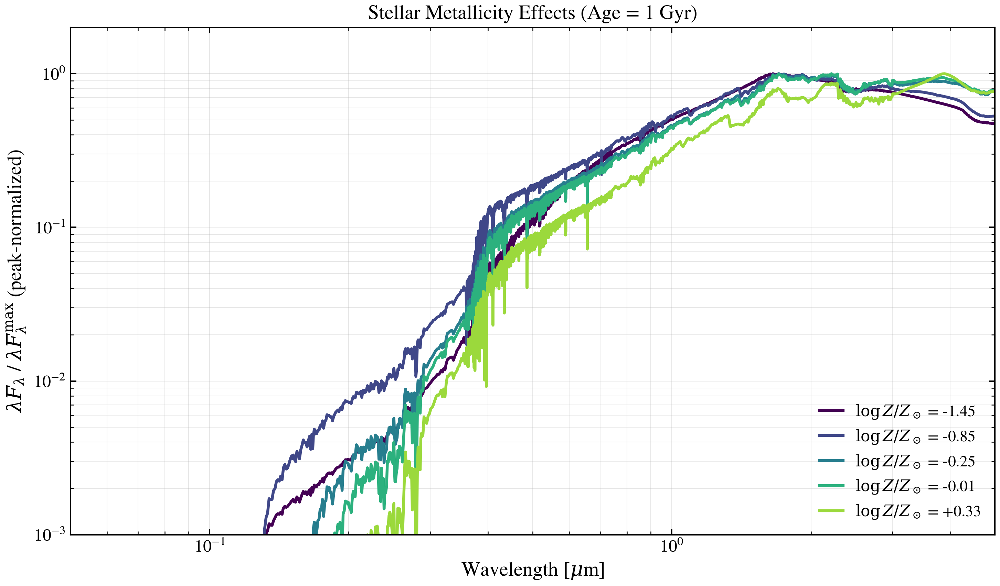

.. DO NOT EDIT.
.. THIS FILE WAS AUTOMATICALLY GENERATED BY SPHINX-GALLERY.
.. TO MAKE CHANGES, EDIT THE SOURCE PYTHON FILE:
.. "auto_examples/sps/plot_ssp_metallicity_sweep.py"
.. LINE NUMBERS ARE GIVEN BELOW.

.. only:: html

    .. note::
        :class: sphx-glr-download-link-note

        :ref:`Go to the end <sphx_glr_download_auto_examples_sps_plot_ssp_metallicity_sweep.py>`
        to download the full example code.

.. rst-class:: sphx-glr-example-title

.. _sphx_glr_auto_examples_sps_plot_ssp_metallicity_sweep.py:

Stellar Metallicity Effects on SED
==================================

Five metallicity points spanning the SSP grid at fixed age 1 Gyr.
Metallicity reddens the optical and shifts iron-peak features in the
near-IR. Peak-normalized λF_λ shows shape changes without the absolute
luminosity scale washing them out.

.. sphx-glr-precomputed-img:

.. GENERATED FROM PYTHON SOURCE LINES 17-60

.. image-sg:: /auto_examples/sps/images/sphx_glr_plot_ssp_metallicity_sweep_001.png
   :alt: Stellar Metallicity Effects (Age = 1 Gyr)
   :srcset: /auto_examples/sps/images/sphx_glr_plot_ssp_metallicity_sweep_001.png
   :class: sphx-glr-single-img

.. code-block:: Python

    import matplotlib.pyplot as plt
    import numpy as np

    from tengri import load_ssp
    from tengri.analysis.plotting import setup_style

    setup_style()

    ssp = load_ssp()
    age_gyr = 10 ** np.array(ssp.ssp_lg_age_gyr)
    log_z = np.array(ssp.ssp_lgmet)
    wave = np.array(ssp.ssp_wave)
    flux = np.array(ssp.ssp_flux)

    age_1gyr = np.argmin(np.abs(age_gyr - 1.0))

    # ssp_lgmet stores ABSOLUTE log10(Z); convert user-facing log10(Z/Z☉)
    # targets via LOG10_ZSUN so the requested values land on distinct grid points.
    LOG10_ZSUN = -1.848
    targets_zsol = [-1.5, -1.0, -0.3, 0.0, 0.3]
    met_idx = [np.argmin(np.abs(log_z - (t + LOG10_ZSUN))) for t in targets_zsol]
    colors = plt.cm.viridis(np.linspace(0.0, 0.85, len(met_idx)))

    fig, ax = plt.subplots(figsize=(10, 6))
    for i, c in zip(met_idx, colors):
        lfl = wave * flux[i, age_1gyr]
        safe = np.where(lfl > 0, lfl, np.nan)
        label = rf"$\log Z/Z_\odot$ = {log_z[i] - LOG10_ZSUN:+.2f}"
        ax.loglog(wave / 1e4, safe / np.nanmax(safe), lw=2.0, color=c, label=label)

    ax.set(
        xlabel=r"Wavelength [$\mu$m]",
        ylabel=r"$\lambda F_\lambda$ / $\lambda F_\lambda^{\rm max}$ (peak-normalized)",
        title="Stellar Metallicity Effects (Age = 1 Gyr)",
        xlim=(0.05, 5.0),
        ylim=(1e-3, 2.0),
    )
    ax.legend(fontsize=11, frameon=False, loc="lower right")
    ax.grid(True, alpha=0.3, which="both")
    fig.tight_layout()
    plt.savefig("plot_ssp_metallicity_sweep.png", dpi=150, bbox_inches="tight")
    plt.show()

.. _sphx_glr_download_auto_examples_sps_plot_ssp_metallicity_sweep.py:

.. only:: html

  .. container:: sphx-glr-footer sphx-glr-footer-example

    .. container:: sphx-glr-download sphx-glr-download-jupyter

      :download:`Download Jupyter notebook: plot_ssp_metallicity_sweep.ipynb <plot_ssp_metallicity_sweep.ipynb>`

    .. container:: sphx-glr-download sphx-glr-download-python

      :download:`Download Python source code: plot_ssp_metallicity_sweep.py <plot_ssp_metallicity_sweep.py>`

    .. container:: sphx-glr-download sphx-glr-download-zip

      :download:`Download zipped: plot_ssp_metallicity_sweep.zip <plot_ssp_metallicity_sweep.zip>`

.. only:: html

 .. rst-class:: sphx-glr-signature

    `Gallery generated by Sphinx-Gallery <https://sphinx-gallery.github.io>`_
