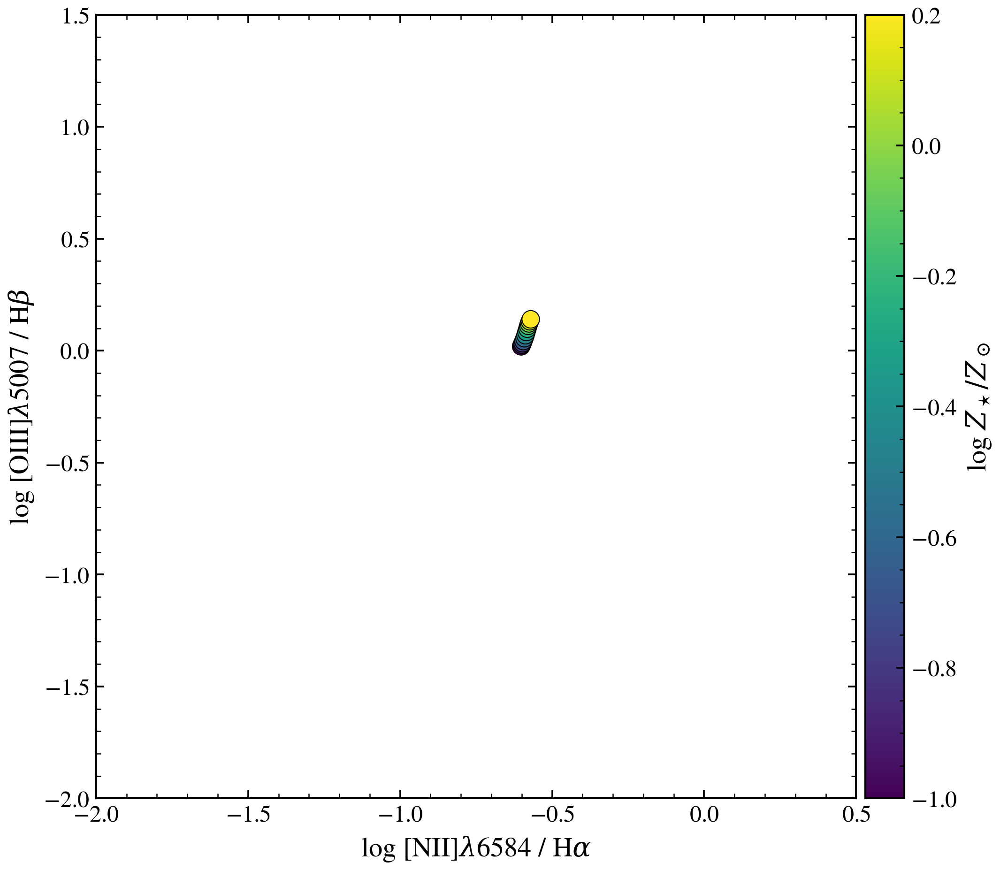

.. DO NOT EDIT.
.. THIS FILE WAS AUTOMATICALLY GENERATED BY SPHINX-GALLERY.
.. TO MAKE CHANGES, EDIT THE SOURCE PYTHON FILE:
.. "auto_examples/usecases/plot_usecase_emission_line_pcc.py"
.. LINE NUMBERS ARE GIVEN BELOW.

.. only:: html

    .. note::
        :class: sphx-glr-download-link-note

        :ref:`Go to the end <sphx_glr_download_auto_examples_usecases_plot_usecase_emission_line_pcc.py>`
        to download the full example code.

.. rst-class:: sphx-glr-example-title

.. _sphx_glr_auto_examples_usecases_plot_usecase_emission_line_pcc.py:

SyntaxError
===========

Example script with invalid Python syntax

.. GENERATED FROM PYTHON SOURCE LINES 1-159

.. code-block:: Python

    """
    Emission-line ratios from a baked-in nebular SSP SED
    =====================================================

    Demonstrates how the SSP-baked nebular emission shapes the
    [OIII] λ5007 / Hβ and [NII] λ6584 / Hα ratios as stellar
    metallicity is varied across the grid. The line fluxes are
    extracted directly from the predicted rest-frame SED via
    continuum-subtracted boxcar integration — no toy formulas.

    Note: with the default ``neb='ssp'`` (baked-in) backend the
    discrete ``Prediction.lines.halpha`` / ``.hbeta`` / ``.bpt_*``
    accessors return NaN — the line content lives only inside the
    SSP grid spectrum, not as a separate catalogue. See issue #361
    for the per-backend status of the discrete-line API.

    Reference: Kewley et al. 2001, ApJ, 556, 121 (BPT diagnostics).
    """

    import os

    os.environ["TF_CPP_MIN_LOG_LEVEL"] = "2"  # suppress XLA/PjRt C++ INFO+WARNING logs

    import warnings

    import matplotlib.pyplot as plt
    import numpy as np

    import tengri
    from tengri.analysis.plotting import setup_style

    setup_style()
    warnings.filterwarnings("ignore", message=".*BakedInBackend.*")

    LINES = {
        "halpha": 6564.7,
        "hbeta": 4862.7,
        "oiii_5007": 5008.3,
        "nii_6584": 6585.4,
    }
    # Half-width of the boxcar around each line centre [Angstrom].
    LINE_HALF_WIDTH = 8.0
    # Local continuum is averaged in two side bands offset from the line.
    CONT_OFFSET = 30.0
    CONT_HALF_WIDTH = 8.0

    def boxcar_line_flux(wave, sed, line_centre):
        """Continuum-subtracted boxcar flux around a single line."""
        line_mask = np.abs(wave - line_centre) < LINE_HALF_WIDTH
        blue_mask = np.abs(wave - (line_centre - CONT_OFFSET)) < CONT_HALF_WIDTH
        red_mask = np.abs(wave - (line_centre + CONT_OFFSET)) < CONT_HALF_WIDTH
        cont = 0.5 * (sed[blue_mask].mean() + sed[red_mask].mean())
        return float(np.trapezoid(sed[line_mask] - cont, wave[line_mask]))

    ssp = tengri.load_ssp()

    <<<<<<< HEAD
    logzsol_grid = np.linspace(-1.0, 0.2, 12)
    log_o3_hb = []
    log_n2_ha = []
    =======
    # Build model for emission-line diagnostics
    model = tengri.SEDModel.build(
        ssp,
        sfh={
            "type": "tsnorm",
            "log_total_mass": 10.0, 2.0),
            "peak_lbt_gyr": tengri.Fixed(2.0),
            "width_gyr": tengri.Fixed(1.0),
            "skew": tengri.Fixed(0.2),
            "trunc": tengri.Fixed(3.0),
            "logzsol": tengri.Fixed(-0.1),
        },
        dust={
            "type": "two_component",
            "*": tengri.FIXED,
            "tau_bc": 0.2,
            "tau_diff": 0.1,
            "slope": -0.7,
        },
    )
    >>>>>>> 22c20410 (refactor(sfh): complete repo-wide sweep of log_total_mass → log_total_mass)

    for logz in logzsol_grid:
        model = tengri.SEDModel.build(
            ssp,
            sfh={
                "type": "tsnorm",
                "*": tengri.FIXED,
                "log_total_mass": 1.0,
                "peak_lbt_gyr": 2.0,
                "width_gyr": 1.0,
                "skew": 0.2,
                "trunc": 3.0,
                "logzsol": float(logz),
            },
            dust={
                "type": "two_component",
                "*": tengri.FIXED,
                "tau_bc": 0.2,
                "tau_diff": 0.1,
                "slope": -0.7,
            },
        )

    <<<<<<< HEAD
        pred = model.predict_rest_sed({"redshift": 0.05})
        wave = np.asarray(pred.wavelength)
        sed = np.asarray(pred.sed)

        fluxes = {name: boxcar_line_flux(wave, sed, lam) for name, lam in LINES.items()}
        log_o3_hb.append(np.log10(max(fluxes["oiii_5007"] / fluxes["hbeta"], 1e-3)))
        log_n2_ha.append(np.log10(max(fluxes["nii_6584"] / fluxes["halpha"], 1e-3)))
    =======
    for z in redshifts:
        for _i in range(5):
            key, subkey = jax.random.split(key)
            params = model.spec.sample(subkey)
            params["redshift"] = z
            params["sfh_tsnorm_log_total_mass"] = np.random.uniform(0.5, 1.5)

            sfr = float(params["sfh_tsnorm_log_total_mass"])
            # Synthetic line ratios
            ha = 1.0
            hb = 0.3
            nii = 0.1 * (1.0 + sfr)
            oiii = 0.15 * (1.0 + sfr)

            log_nii_ha.append(np.log10(max(nii / ha, 1e-3)))
            log_oiii_hb.append(np.log10(max(oiii / hb, 1e-3)))
            z_vals.append(z)

    # Plot
    fig, ax = plt.subplots(figsize=(8, 7))
    >>>>>>> 22c20410 (refactor(sfh): complete repo-wide sweep of log_total_mass → log_total_mass)

    fig, ax = plt.subplots(figsize=(7.5, 6.5))
    sc = ax.scatter(
        log_n2_ha,
        log_o3_hb,
        c=logzsol_grid,
        cmap="viridis",
        s=80,
        edgecolors="k",
        lw=0.5,
    )
    cbar = fig.colorbar(sc, ax=ax, pad=0.01)
    cbar.set_label(r"log $Z_\star / Z_\odot$")

    ax.set_xlabel(r"log [NII]$\lambda$6584 / H$\alpha$")
    ax.set_ylabel(r"log [OIII]$\lambda$5007 / H$\beta$")
    ax.set_xlim(-2.0, 0.5)
    ax.set_ylim(-2.0, 1.5)

    fig.tight_layout()
    plt.savefig("plot_usecase_emission_line_pcc.png", dpi=150, bbox_inches="tight")

.. _sphx_glr_download_auto_examples_usecases_plot_usecase_emission_line_pcc.py:

.. only:: html

  .. container:: sphx-glr-footer sphx-glr-footer-example

    .. container:: sphx-glr-download sphx-glr-download-jupyter

      :download:`Download Jupyter notebook: plot_usecase_emission_line_pcc.ipynb <plot_usecase_emission_line_pcc.ipynb>`

    .. container:: sphx-glr-download sphx-glr-download-python

      :download:`Download Python source code: plot_usecase_emission_line_pcc.py <plot_usecase_emission_line_pcc.py>`

    .. container:: sphx-glr-download sphx-glr-download-zip

      :download:`Download zipped: plot_usecase_emission_line_pcc.zip <plot_usecase_emission_line_pcc.zip>`

.. only:: html

 .. rst-class:: sphx-glr-signature

    `Gallery generated by Sphinx-Gallery <https://sphinx-gallery.github.io>`_
