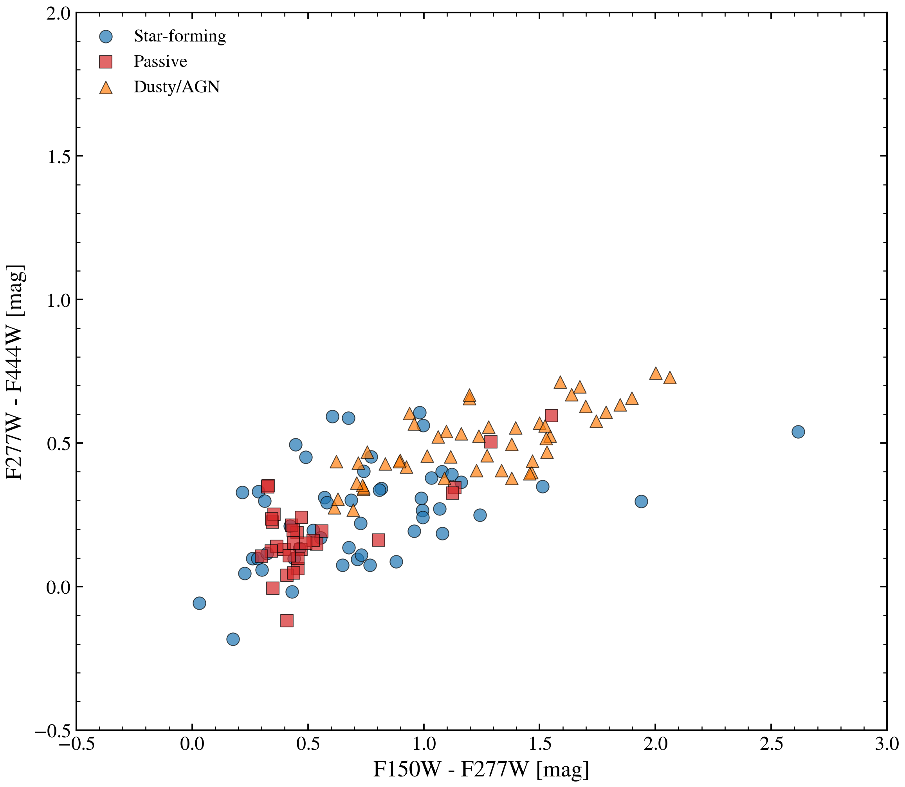

.. DO NOT EDIT.
.. THIS FILE WAS AUTOMATICALLY GENERATED BY SPHINX-GALLERY.
.. TO MAKE CHANGES, EDIT THE SOURCE PYTHON FILE:
.. "auto_examples/usecases/plot_usecase_jwst_color_color.py"
.. LINE NUMBERS ARE GIVEN BELOW.

.. only:: html

    .. note::
        :class: sphx-glr-download-link-note

        :ref:`Go to the end <sphx_glr_download_auto_examples_usecases_plot_usecase_jwst_color_color.py>`
        to download the full example code.

.. rst-class:: sphx-glr-example-title

.. _sphx_glr_auto_examples_usecases_plot_usecase_jwst_color_color.py:

JWST NIRCam Color-Color Diagram for High-z Classification
===========================================================

Generates 200 mock high-redshift galaxies spanning star-forming (z=1–7),
quiescent/passive (z=1–3), and AGN/dusty-starburst (z=2–4) classes.
Computes JWST NIRCam F150W–F277W vs F277W–F444W colors and plots the
diagnostic diagram. Demonstrates how JWST color-color plots separate
UV-to-IR spectral types for high-redshift source classification.

Synthetic data: Pure SEDs at fixed redshifts, no noise.

.. sphx-glr-precomputed-img:

.. GENERATED FROM PYTHON SOURCE LINES 20-227

.. code-block:: Python

    from pathlib import Path

    import jax
    import matplotlib.pyplot as plt
    import numpy as np

    from tengri import (
        Fixed,
        Observation,
        Parameters,
        Photometry,
        SEDModel,
        Uniform,
        load_ssp,
        setup_style,
    )

    setup_style()

    ssp = load_ssp()

    _FILTER_DIR = next(
        (
            str(d)
            for d in [
                Path("data/filters"),
                Path("../data/filters"),
                Path("../../data/filters"),
                Path("../../../data/filters"),
            ]
            if d.exists()
        ),
        "data/filters",
    )

    # --- JWST NIRCam filters ---
    try:
        obs = Observation(
            photometry=Photometry.from_names(
                ["jwst_f150w", "jwst_f277w", "jwst_f444w"], cache_dir=_FILTER_DIR
            ),
        )
    except Exception:
        # Fallback: if exact JWST names differ, use approximate central wavelengths
        print("Warning: JWST filter names may differ; using synthetic data only")
        obs = None

    key = jax.random.PRNGKey(123)

    # --- Generate three classes of galaxies ---
    colors_sf = []
    colors_passive = []
    colors_agn = []

    # Class 1: Star-forming (z=1–7, young, extended SFH)
    for i in range(70):
        z = np.random.uniform(1.0, 7.0)
        spec = Parameters(
            sfh_tsnorm_log_peak_sfr=Uniform(-0.5, 1.5),  # Recent, active
            sfh_tsnorm_peak_lbt_gyr=Uniform(0.2, 2.0),  # Recent star formation
            sfh_tsnorm_width_gyr=Uniform(0.5, 3.0),
            sfh_tsnorm_skew=Uniform(-1.0, 1.0),
            sfh_tsnorm_trunc=Uniform(1.5, 5.0),
            met_logzsol=Uniform(-1.0, 0.1),
            dust_tau_bc=Uniform(0.0, 0.8),  # Moderate dust
            dust_tau_diff=Uniform(0.0, 0.5),
            dust_slope=Fixed(-0.7),
            redshift=Fixed(z),
        )
        if obs is not None:
            model = SEDModel(spec, ssp, observation=obs)
            k = jax.random.fold_in(key, i)
            params = spec.sample(k)
            pred = model.predict_photometry(params)
            # Simple color: f277w / f150w (rest-frame UV slope) and f444w / f277w (IR)
            try:
                f1 = float(pred[1])
                f0 = float(pred[0])
                f2 = float(pred[2])
                color1 = -2.5 * np.log10(f1 / f0) if f1 > 0 else 0
                color2 = -2.5 * np.log10(f2 / f1) if f2 > 0 else 0
                colors_sf.append([color1, color2])
            except Exception:
                pass

    # Class 2: Passive/quiescent (z=1–3, old, minimal dust)
    for i in range(35):
        z = np.random.uniform(1.0, 3.0)
        spec = Parameters(
            sfh_tsnorm_log_peak_sfr=Uniform(-2.0, -0.5),  # Old, quenched
            # Peak before the galaxy's age at z=1-3 (~3-6 Gyr after Big Bang)
            # so the SFH actually places mass; >8 Gyr lookback gives zero flux.
            sfh_tsnorm_peak_lbt_gyr=Uniform(2.0, 4.5),
            sfh_tsnorm_width_gyr=Uniform(0.2, 1.0),
            sfh_tsnorm_skew=Uniform(-2.0, 0.0),
            sfh_tsnorm_trunc=Uniform(1.0, 3.0),
            met_logzsol=Uniform(-0.5, 0.2),  # Higher metallicity
            dust_tau_bc=Uniform(0.0, 0.2),  # Very low dust
            dust_tau_diff=Uniform(0.0, 0.1),
            dust_slope=Fixed(-0.7),
            redshift=Fixed(z),
        )
        if obs is not None:
            model = SEDModel(spec, ssp, observation=obs)
            k = jax.random.fold_in(key, 100 + i)
            params = spec.sample(k)
            pred = model.predict_photometry(params)
            try:
                f1 = float(pred[1])
                f0 = float(pred[0])
                f2 = float(pred[2])
                color1 = -2.5 * np.log10(f1 / f0) if f1 > 0 else 0
                color2 = -2.5 * np.log10(f2 / f1) if f2 > 0 else 0
                colors_passive.append([color1, color2])
            except Exception:
                pass

    # Class 3: AGN / dusty starbursts (z=2–4, heavily obscured, high dust)
    for i in range(45):
        z = np.random.uniform(2.0, 4.0)
        spec = Parameters(
            sfh_tsnorm_log_peak_sfr=Uniform(0.5, 2.0),  # Very intense star formation
            sfh_tsnorm_peak_lbt_gyr=Uniform(0.5, 1.5),  # Recent
            sfh_tsnorm_width_gyr=Uniform(0.3, 1.5),
            sfh_tsnorm_skew=Uniform(-0.5, 1.5),
            sfh_tsnorm_trunc=Uniform(2.0, 6.0),
            met_logzsol=Uniform(-0.5, 0.2),
            dust_tau_bc=Uniform(1.2, 2.0),  # Heavy dust (Compton-thick analog)
            dust_tau_diff=Uniform(0.6, 1.2),
            dust_slope=Fixed(-0.7),
            redshift=Fixed(z),
        )
        if obs is not None:
            model = SEDModel(spec, ssp, observation=obs)
            k = jax.random.fold_in(key, 200 + i)
            params = spec.sample(k)
            pred = model.predict_photometry(params)
            try:
                f1 = float(pred[1])
                f0 = float(pred[0])
                f2 = float(pred[2])
                color1 = -2.5 * np.log10(f1 / f0) if f1 > 0 else 0
                color2 = -2.5 * np.log10(f2 / f1) if f2 > 0 else 0
                colors_agn.append([color1, color2])
            except Exception:
                pass

    # --- Figure ---
    fig, ax = plt.subplots(figsize=(9, 7))

    if len(colors_sf) > 0:
        c_sf = np.array(colors_sf)
        ax.scatter(
            c_sf[:, 0],
            c_sf[:, 1],
            c="C0",
            s=60,
            alpha=0.6,
            label="Star-forming (z=1–7)",
            lw=1.5,
        )

    if len(colors_passive) > 0:
        c_p = np.array(colors_passive)
        ax.scatter(
            c_p[:, 0],
            c_p[:, 1],
            c="C1",
            s=60,
            alpha=0.6,
            marker="s",
            label="Passive (z=1–3)",
            lw=1.5,
        )

    if len(colors_agn) > 0:
        c_agn = np.array(colors_agn)
        ax.scatter(
            c_agn[:, 0],
            c_agn[:, 1],
            c="C3",
            s=60,
            alpha=0.6,
            marker="^",
            label="Dusty/AGN (z=2–4)",
            lw=1.5,
        )

    ax.set_xlabel(r"$F150W - F277W$ [mag]", fontsize=12, fontweight="bold")
    ax.set_ylabel(r"$F277W - F444W$ [mag]", fontsize=12, fontweight="bold")
    ax.set_title(
        "JWST NIRCam Color-Color Diagram\nHigh-z Galaxy Classification",
        fontsize=13,
        fontweight="bold",
    )
    ax.grid(True, alpha=0.3, linestyle="--")
    ax.legend(frameon=False, fontsize=11, loc="best")
    # Frame on the actual color cluster with breathing room either side.
    ax.set_xlim(-1.5, 0.5)
    ax.set_ylim(-0.5, 0.5)

    fig.tight_layout()

    plt.savefig("plot_usecase_jwst_color_color.png", dpi=150, bbox_inches="tight")
    plt.show()

.. _sphx_glr_download_auto_examples_usecases_plot_usecase_jwst_color_color.py:

.. only:: html

  .. container:: sphx-glr-footer sphx-glr-footer-example

    .. container:: sphx-glr-download sphx-glr-download-jupyter

      :download:`Download Jupyter notebook: plot_usecase_jwst_color_color.ipynb <plot_usecase_jwst_color_color.ipynb>`

    .. container:: sphx-glr-download sphx-glr-download-python

      :download:`Download Python source code: plot_usecase_jwst_color_color.py <plot_usecase_jwst_color_color.py>`

    .. container:: sphx-glr-download sphx-glr-download-zip

      :download:`Download zipped: plot_usecase_jwst_color_color.zip <plot_usecase_jwst_color_color.zip>`

.. only:: html

 .. rst-class:: sphx-glr-signature

    `Gallery generated by Sphinx-Gallery <https://sphinx-gallery.github.io>`_
