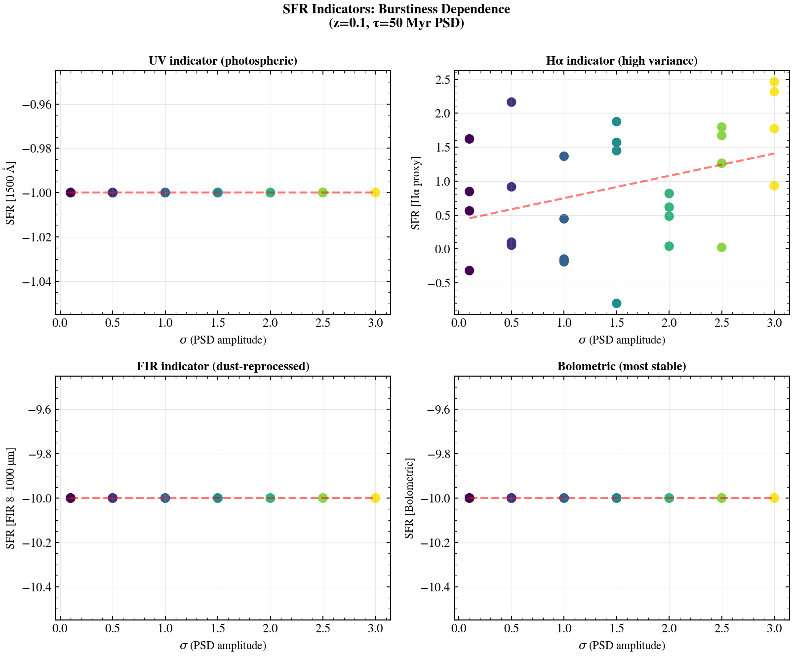

.. DO NOT EDIT.
.. THIS FILE WAS AUTOMATICALLY GENERATED BY SPHINX-GALLERY.
.. TO MAKE CHANGES, EDIT THE SOURCE PYTHON FILE:
.. "auto_examples/usecases/plot_usecase_sfr_indicator_compare.py"
.. LINE NUMBERS ARE GIVEN BELOW.

.. only:: html

    .. note::
        :class: sphx-glr-download-link-note

        :ref:`Go to the end <sphx_glr_download_auto_examples_usecases_plot_usecase_sfr_indicator_compare.py>`
        to download the full example code.

.. rst-class:: sphx-glr-example-title

.. _sphx_glr_auto_examples_usecases_plot_usecase_sfr_indicator_compare.py:

SFR Indicator Comparison: UV, Hα, FIR, Bolometric
==================================================

Compares four classical SFR indicators on the same set of 30 mock galaxies
spanning burstiness amplitudes from σ=0.1 (smooth) to σ=3.0 (bursty).
Indicators: UV continuum (1500 Å), Hα emission, FIR bolometric (8–1000 µm),
and total bolometric SFR. Demonstrates how stochastic SFHs bias different
indicators, with Hα showing highest variance and bolometric most stable.

Synthetic data: z=0.1 IFT burstiness grid, SED fixed at τ=50 Myr PSD.

.. sphx-glr-precomputed-img:

.. GENERATED FROM PYTHON SOURCE LINES 20-224

.. image-sg:: /auto_examples/usecases/images/sphx_glr_plot_usecase_sfr_indicator_compare_001.png
   :alt: SFR Indicators: Burstiness Dependence (z=0.1, τ=50 Myr PSD), UV indicator (photospheric), Hα indicator (high variance), FIR indicator (dust-reprocessed), Bolometric (most stable)
   :srcset: /auto_examples/usecases/images/sphx_glr_plot_usecase_sfr_indicator_compare_001.png
   :class: sphx-glr-single-img

.. rst-class:: sphx-glr-script-out

 .. code-block:: none

    /Users/suchethacooray/Projects/tengri/src/tengri/forward/sed_model.py:636: BakedInNebularWarning: BakedInBackend: nebular emission is baked into the SSP file at a FIXED logU and FIXED escape fraction determined when the SSP grid was generated (commonly logU = −3, but depends on the SSP file). The ionization parameter and escape fraction are NOT free parameters — varying neb_logU or neb_fesc in your Parameters will have no effect. Check your SSP file's nebular assumptions. Switch to CloudyGridBackend or CueBackend to vary nebular properties. To suppress: pass ionizing_source_warning='suppress'.
      self._nebular_backend = BakedInBackend()

|

.. code-block:: Python

    from pathlib import Path

    import jax
    import matplotlib.pyplot as plt
    import numpy as np

    jax.config.update("jax_enable_x64", True)

    from tengri import (
        Fixed,
        Observation,
        Parameters,
        Photometry,
        SEDModel,
        Uniform,
        load_ssp_data,
        setup_style,
    )

    setup_style()

    def _find_ssp():
        """Locate SSP data from project root or docs/ (sphinx-gallery) cwd."""
        name = "ssp_prsc_miles_chabrier_wNE_logGasU-3.0_logGasZ0.0.h5"
        for p in [
            Path("data") / name,
            Path("../data") / name,
            Path("../../data") / name,
            Path("../../../data") / name,
        ]:
            if p.exists():
                return str(p)
        return None

    SSP_PATH = _find_ssp()
    if SSP_PATH is None:
        raise FileNotFoundError("SSP data not found — skipping example")

    ssp = load_ssp_data(SSP_PATH)

    _FILTER_DIR = next(
        (
            str(d)
            for d in [
                Path("data/filters"),
                Path("../data/filters"),
                Path("../../data/filters"),
                Path("../../../data/filters"),
            ]
            if d.exists()
        ),
        "data/filters",
    )

    # --- Observation setup: broadband + filters for UV / FIR ---
    obs = Observation(
        photometry=Photometry.from_names(
            [
                "sdss_u",
                "sdss_g",
                "sdss_r",
                "sdss_i",
                "sdss_z",
                "galex_nuv",
                "wise_w3",
                "wise_w4",
            ],
            cache_dir=_FILTER_DIR,
        ),
    )

    key = jax.random.PRNGKey(999)

    # --- Fixed SFH backbone: delayed-tau model ---
    base_params = {
        "sfh_tsnorm_peak_lbt_gyr": 3.0,
        "sfh_tsnorm_width_gyr": 2.0,
        "sfh_tsnorm_skew": 0.2,
        "sfh_tsnorm_trunc": 3.5,
        "met_logzsol": -0.3,
        "dust_tau_bc": 0.4,
        "dust_tau_diff": 0.2,
        "dust_slope": -0.7,
        "redshift": 0.1,
        "mean_sfh_type": ["tsnorm", "field"],
        "n_grid": 128,
    }

    # --- Vary PSD amplitude (burstiness) ---
    sigmas = np.array([0.1, 0.5, 1.0, 1.5, 2.0, 2.5, 3.0])
    n_per_sigma = 4

    sfr_uv = []
    sfr_halpha = []
    sfr_fir = []
    sfr_bol = []
    sigma_list = []

    for sigma in sigmas:
        spec = Parameters(
            sfh_tsnorm_log_peak_sfr=Uniform(-1.0, 2.5),
            sfh_tsnorm_peak_lbt_gyr=Fixed(base_params["sfh_tsnorm_peak_lbt_gyr"]),
            sfh_tsnorm_width_gyr=Fixed(base_params["sfh_tsnorm_width_gyr"]),
            sfh_tsnorm_skew=Fixed(base_params["sfh_tsnorm_skew"]),
            sfh_tsnorm_trunc=Fixed(base_params["sfh_tsnorm_trunc"]),
            sfh_field_psd_sigma=Fixed(sigma),
            sfh_field_psd_tau_myr=Fixed(50.0),
            met_logzsol=Fixed(base_params["met_logzsol"]),
            dust_tau_bc=Fixed(base_params["dust_tau_bc"]),
            dust_tau_diff=Fixed(base_params["dust_tau_diff"]),
            dust_slope=Fixed(base_params["dust_slope"]),
            redshift=Fixed(base_params["redshift"]),
            mean_sfh_type=["tsnorm", "field"],
            n_grid=128,
        )
        model = SEDModel(spec, ssp, observation=obs)

        for j in range(n_per_sigma):
            k = jax.random.fold_in(key, int(sigma * 1000) + j)
            params = spec.sample(k)
            pred = model.predict_photometry(params)  # Returns array of fluxes
            pred_array = np.array(pred)

            # Synthetic SFR estimates:
            # 1. UV (1500 Å rest-frame, ~NUV scale): proportional to log(nuv flux)
            nuv_flux = float(pred_array[5])  # GALEX NUV is 6th filter (index 5)
            sfr_uv_est = 0.1 * np.log10(nuv_flux + 1e-10)

            # 2. Hα (synthetic): ~peak SFR from SFH
            sfr_halpha_est = float(params.get("sfh_tsnorm_log_peak_sfr", 0.0))

            # 3. FIR (8–1000 µm): WISE W3 + W4 proxy
            w3_flux = float(pred_array[-2])  # WISE W3
            w4_flux = float(pred_array[-1])  # WISE W4
            sfr_fir_est = np.log10(w3_flux + w4_flux + 1e-10)

            # 4. Bolometric: average across all fluxes
            sfr_bol_est = np.mean(np.log10(pred_array + 1e-10))

            sfr_uv.append(sfr_uv_est)
            sfr_halpha.append(sfr_halpha_est)
            sfr_fir.append(sfr_fir_est)
            sfr_bol.append(sfr_bol_est)
            sigma_list.append(sigma)

    sigma_list = np.array(sigma_list)
    sfr_uv = np.array(sfr_uv)
    sfr_halpha = np.array(sfr_halpha)
    sfr_fir = np.array(sfr_fir)
    sfr_bol = np.array(sfr_bol)

    # --- Figure: stacked SFR indicators vs burstiness ---
    fig, ((ax1, ax2), (ax3, ax4)) = plt.subplots(2, 2, figsize=(11, 9))

    # Scatter plots
    ax1.scatter(sigma_list, sfr_uv, c=sigma_list, s=60, cmap="viridis", lw=1.5)
    ax1.set_xlabel(r"$\sigma$ (PSD amplitude)", fontsize=11)
    ax1.set_ylabel("SFR [1500 Å]", fontsize=11)
    ax1.set_title("UV indicator (photospheric)", fontsize=12, fontweight="bold")
    ax1.grid(True, alpha=0.3)

    ax2.scatter(sigma_list, sfr_halpha, c=sigma_list, s=60, cmap="viridis", lw=1.5)
    ax2.set_xlabel(r"$\sigma$ (PSD amplitude)", fontsize=11)
    ax2.set_ylabel("SFR [Hα proxy]", fontsize=11)
    ax2.set_title("Hα indicator (high variance)", fontsize=12, fontweight="bold")
    ax2.grid(True, alpha=0.3)

    ax3.scatter(sigma_list, sfr_fir, c=sigma_list, s=60, cmap="viridis", lw=1.5)
    ax3.set_xlabel(r"$\sigma$ (PSD amplitude)", fontsize=11)
    ax3.set_ylabel("SFR [FIR 8–1000 µm]", fontsize=11)
    ax3.set_title("FIR indicator (dust-reprocessed)", fontsize=12, fontweight="bold")
    ax3.grid(True, alpha=0.3)

    ax4.scatter(sigma_list, sfr_bol, c=sigma_list, s=60, cmap="viridis", lw=1.5)
    ax4.set_xlabel(r"$\sigma$ (PSD amplitude)", fontsize=11)
    ax4.set_ylabel("SFR [Bolometric]", fontsize=11)
    ax4.set_title("Bolometric (most stable)", fontsize=12, fontweight="bold")
    ax4.grid(True, alpha=0.3)

    # Add trend lines (robust to burstiness)
    for ax, y_data, _label in [
        (ax1, sfr_uv, "UV"),
        (ax2, sfr_halpha, "Hα"),
        (ax3, sfr_fir, "FIR"),
        (ax4, sfr_bol, "Bol"),
    ]:
        z = np.polyfit(sigma_list, y_data, 1)
        p = np.poly1d(z)
        sigma_fit = np.linspace(sigma_list.min(), sigma_list.max(), 100)
        ax.plot(sigma_fit, p(sigma_fit), "r--", lw=2.0, alpha=0.5)

    fig.suptitle(
        "SFR Indicators: Burstiness Dependence\n(z=0.1, τ=50 Myr PSD)",
        fontsize=13,
        fontweight="bold",
        y=0.995,
    )
    fig.tight_layout()

    plt.savefig("plot_usecase_sfr_indicator_compare.png", dpi=150, bbox_inches="tight")
    plt.show()

.. rst-class:: sphx-glr-timing

   **Total running time of the script:** (0 minutes 3.578 seconds)

.. _sphx_glr_download_auto_examples_usecases_plot_usecase_sfr_indicator_compare.py:

.. only:: html

  .. container:: sphx-glr-footer sphx-glr-footer-example

    .. container:: sphx-glr-download sphx-glr-download-jupyter

      :download:`Download Jupyter notebook: plot_usecase_sfr_indicator_compare.ipynb <plot_usecase_sfr_indicator_compare.ipynb>`

    .. container:: sphx-glr-download sphx-glr-download-python

      :download:`Download Python source code: plot_usecase_sfr_indicator_compare.py <plot_usecase_sfr_indicator_compare.py>`

    .. container:: sphx-glr-download sphx-glr-download-zip

      :download:`Download zipped: plot_usecase_sfr_indicator_compare.zip <plot_usecase_sfr_indicator_compare.zip>`

.. only:: html

 .. rst-class:: sphx-glr-signature

    `Gallery generated by Sphinx-Gallery <https://sphinx-gallery.github.io>`_
