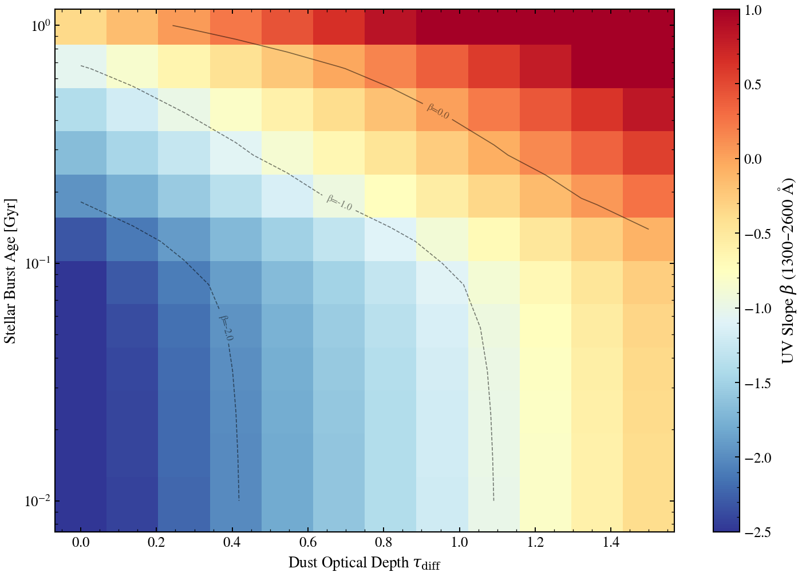

.. DO NOT EDIT.
.. THIS FILE WAS AUTOMATICALLY GENERATED BY SPHINX-GALLERY.
.. TO MAKE CHANGES, EDIT THE SOURCE PYTHON FILE:
.. "auto_examples/usecases/plot_usecase_tau_age_2d_uv_slope.py"
.. LINE NUMBERS ARE GIVEN BELOW.

.. only:: html

    .. note::
        :class: sphx-glr-download-link-note

        :ref:`Go to the end <sphx_glr_download_auto_examples_usecases_plot_usecase_tau_age_2d_uv_slope.py>`
        to download the full example code.

.. rst-class:: sphx-glr-example-title

.. _sphx_glr_auto_examples_usecases_plot_usecase_tau_age_2d_uv_slope.py:

2D Degeneracy: Dust Optical Depth vs Stellar Age via UV Slope
==============================================================

UV slope (β) is degenerate between dust optical depth and stellar age:
young dusty and old dust-free populations both show red UV continua.
This script sweeps BOTH dust (τ_diff ∈ [0, 1.5]) and stellar age
(t_burst ∈ [0.01, 10] Gyr) on a single-burst SFH (tsnorm) and plots
the resulting UV slope β as a 2D heatmap. We expect the age and dust
axes to BOTH affect β: old stars are redder, dust reddens UV.

Heads-up: spec keys for the ``two_component`` dust block are flattened to
``dust_tau_diff`` / ``dust_tau_bc`` (no ``two_component_`` infix), whereas
the ``tsnorm`` SFH block uses ``sfh_tsnorm_peak_lbt_gyr``. Passing the
wrong key in a dict-merge override is silently dropped at predict time
— see issue #314 for the broader fix.

Reference: Meurer et al. 1999, ApJ, 521, 64 (β as UV slope diagnostic).

.. GENERATED FROM PYTHON SOURCE LINES 20-146

.. code-block:: Python

    import os

    os.environ["TF_CPP_MIN_LOG_LEVEL"] = "2"  # suppress XLA/PjRt C++ INFO+WARNING logs

    import warnings

    import jax
    import jax.numpy as jnp
    import matplotlib.pyplot as plt
    import numpy as np

    import tengri
    from tengri.analysis.plotting import setup_style

    setup_style()
    warnings.filterwarnings("ignore", message=".*BakedInBackend.*")
    warnings.filterwarnings("ignore", message=".*deprecated.*")

    C_AA_PER_S = 2.998e18

    # Calzetti+1994 windows for the UV slope fit.
    WINDOWS = np.array([
        [1268, 1284], [1309, 1316], [1342, 1371], [1407, 1515],
        [1562, 1583], [1677, 1740], [1760, 1833], [1866, 1890],
        [1930, 1950], [2400, 2580],
    ])

    def _beta_uv(wave, l_nu):
        """Compute UV slope β where F_λ ∝ λ^β using Calzetti+1994 windows."""
        f_lam = l_nu * C_AA_PER_S / wave**2
        mask = np.zeros_like(wave, dtype=bool)
        for lo, hi in WINDOWS:
            mask |= (wave >= lo) & (wave <= hi)
        if mask.sum() < 2:
            return np.nan
        slope, _ = np.polyfit(np.log10(wave[mask]), np.log10(f_lam[mask]), 1)
        return float(slope)

    # Build model with FIXED peak_lbt_gyr and dust parameters, then override them during sampling.
    model = tengri.SEDModel.build(
        tengri.load_ssp(),
        sfh={"type": "tsnorm", "*": tengri.FIXED,
             "peak_lbt_gyr": 0.5,  # Fixed default; we'll override later
             "width_gyr": 0.05, "log_total_mass": 10.0,
             "skew": 0.0, "trunc": 1.0},  # Limit burst age range to physics-valid region
        dust={"type": "two_component", "*": tengri.FIXED,
              "tau_diff": 0.0, "tau_bc": 0.0},
        redshift=tengri.Fixed(0.01),
    )

    print("=" * 70)
    print("Free parameters in the spec:")
    print("=" * 70)
    model.spec.summary()
    print("=" * 70)

    baseline = dict(model.spec.sample(jax.random.PRNGKey(0)))

    # Sanity check: compute β at two ages (fixed dust).
    print("\nSanity check: β at fixed dust (tau_diff=0.0) across two ages:")
    print("-" * 70)

    for age in [0.01, 1.0]:
        p = {**baseline, "sfh_tsnorm_peak_lbt_gyr": jnp.float64(age), "dust_tau_diff": 0.0}
        out = model.predict_rest_sed(p)  # Use full SSP wavelength grid
        beta = _beta_uv(np.asarray(out.wavelength), np.asarray(out.sed))
        print(f"  Age = {age:6.2f} Gyr: β = {beta:7.3f}")

    print("-" * 70)

    # 2D sweep: age × dust
    # Age range limited to 0.01–1.0 Gyr (above 1 Gyr, default SSP has IR artifact)
    age_values = np.logspace(np.log10(0.01), np.log10(1.0), 12)
    tau_values = np.linspace(0.0, 1.5, 12)

    beta_2d = np.zeros((len(age_values), len(tau_values)))

    print(f"\nRunning 2D sweep: {len(age_values)} ages × {len(tau_values)} dust values")
    print("Progress:")

    for age_idx, age in enumerate(age_values):
        for tau_idx, tau in enumerate(tau_values):
            p = {
                **baseline,
                "sfh_tsnorm_peak_lbt_gyr": jnp.float64(age),
                "dust_tau_diff": jnp.float64(tau),
            }
            out = model.predict_rest_sed(p)  # Use full SSP wavelength grid
            beta_2d[age_idx, tau_idx] = _beta_uv(np.asarray(out.wavelength), np.asarray(out.sed))

        if (age_idx + 1) % 3 == 0 or age_idx == 0:
            print(f"  ... {age_idx + 1}/{len(age_values)}")

    print(f"Beta range: min={np.nanmin(beta_2d):.3f}, max={np.nanmax(beta_2d):.3f}")
    print()

    # Plot 2D heatmap.
    fig, ax = plt.subplots(figsize=(10, 7))

    im = ax.pcolormesh(
        tau_values,
        age_values,
        beta_2d,
        shading="auto",
        cmap="RdYlBu_r",
        vmin=-2.5,
        vmax=1.0,
    )

    ax.set_xlabel(r"Dust Optical Depth $\tau_{\rm diff}$", fontsize=13)
    ax.set_ylabel(r"Stellar Burst Age [Gyr]", fontsize=13)
    ax.set_yscale("log")

    cbar = plt.colorbar(im, ax=ax, label=r"UV Slope $\beta$ (1300–2600 Å)")

    # Add contours for key β values.
    levels = [-2.0, -1.0, 0.0]
    contours = ax.contour(tau_values, age_values, beta_2d, levels=levels, colors="black", linewidths=0.8, alpha=0.5)
    ax.clabel(contours, inline=True, fontsize=8, fmt="β=%.1f")

    fig.tight_layout()
    plt.savefig("plot_usecase_tau_age_2d_uv_slope.png", dpi=150, bbox_inches="tight")
    print("Saved: plot_usecase_tau_age_2d_uv_slope.png")

.. _sphx_glr_download_auto_examples_usecases_plot_usecase_tau_age_2d_uv_slope.py:

.. only:: html

  .. container:: sphx-glr-footer sphx-glr-footer-example

    .. container:: sphx-glr-download sphx-glr-download-jupyter

      :download:`Download Jupyter notebook: plot_usecase_tau_age_2d_uv_slope.ipynb <plot_usecase_tau_age_2d_uv_slope.ipynb>`

    .. container:: sphx-glr-download sphx-glr-download-python

      :download:`Download Python source code: plot_usecase_tau_age_2d_uv_slope.py <plot_usecase_tau_age_2d_uv_slope.py>`

    .. container:: sphx-glr-download sphx-glr-download-zip

      :download:`Download zipped: plot_usecase_tau_age_2d_uv_slope.zip <plot_usecase_tau_age_2d_uv_slope.zip>`

.. only:: html

 .. rst-class:: sphx-glr-signature

    `Gallery generated by Sphinx-Gallery <https://sphinx-gallery.github.io>`_
