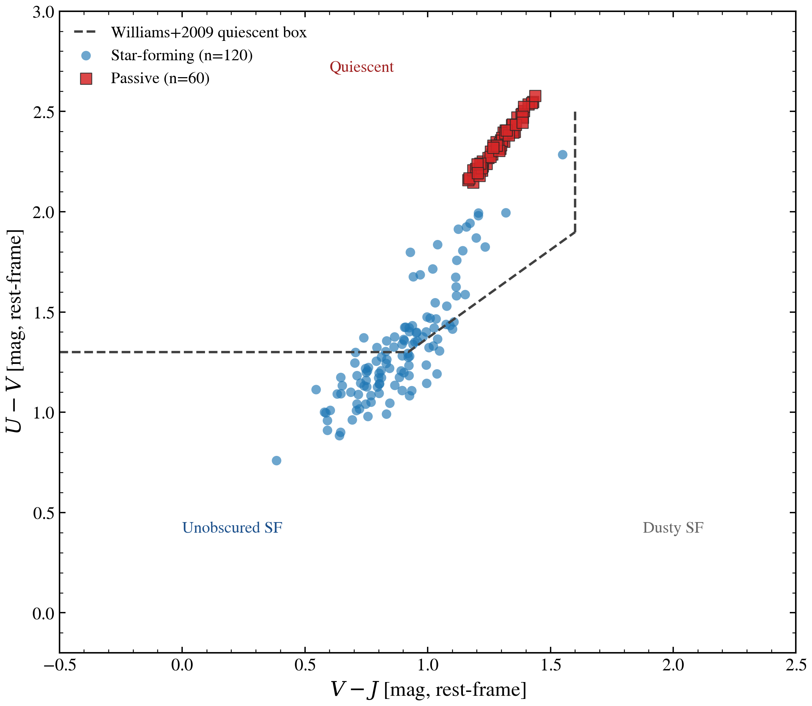

.. DO NOT EDIT.
.. THIS FILE WAS AUTOMATICALLY GENERATED BY SPHINX-GALLERY.
.. TO MAKE CHANGES, EDIT THE SOURCE PYTHON FILE:
.. "auto_examples/usecases/plot_usecase_uvj_diagram.py"
.. LINE NUMBERS ARE GIVEN BELOW.

.. only:: html

    .. note::
        :class: sphx-glr-download-link-note

        :ref:`Go to the end <sphx_glr_download_auto_examples_usecases_plot_usecase_uvj_diagram.py>`
        to download the full example code.

.. rst-class:: sphx-glr-example-title

.. _sphx_glr_auto_examples_usecases_plot_usecase_uvj_diagram.py:

UVJ Diagram: Star-Forming vs Passive Galaxy Population
========================================================

Generates a mock galaxy population (star-forming + passive) and plots
each galaxy on the rest-frame UVJ color-color plane (U-V vs V-J).
The UVJ diagram (Wuyts+2007, Williams+2009) is the workhorse diagnostic
for separating quiescent galaxies from dusty star-forming galaxies, which
are degenerate in single-color cuts.

The Williams+2009 quiescent wedge (z < 1) is overplotted:

    (U - V) > 1.3
    (V - J) < 1.6
    (U - V) > 0.88 * (V - J) + 0.49

Galaxies above the wedge: passive / quiescent.
Galaxies below the wedge: star-forming, including dusty starbursts that
extend to red V-J.

.. sphx-glr-precomputed-img:

.. GENERATED FROM PYTHON SOURCE LINES 28-176

.. code-block:: Python

    from pathlib import Path

    import jax
    import matplotlib.pyplot as plt
    import numpy as np

    from tengri import (
        Fixed,
        Observation,
        Parameters,
        Photometry,
        SEDModel,
        Uniform,
        load_ssp_data,
        setup_style,
    )

    setup_style()

    def _find(rel: str) -> Path | None:
        for d in [Path(rel), Path("..") / rel, Path("../..") / rel, Path("../../..") / rel]:
            if d.exists():
                return d
        return None

    SSP_PATH = _find("data/ssp_prsc_miles_chabrier_wNE_logGasU-3.0_logGasZ0.0.h5")
    FILTER_DIR = _find("data/filters")
    if SSP_PATH is None or FILTER_DIR is None:
        raise FileNotFoundError("SSP data or filters not found")

    ssp = load_ssp_data(str(SSP_PATH))

    # Rest-frame UVJ: Johnson U/V + 2MASS J. Using a tiny redshift z=0.01
    # keeps the colors effectively rest-frame (1% wavelength shift) while
    # avoiding the D_L → 0 singularity at z = 0 that makes f_nu blow up.
    obs = Observation(
        photometry=Photometry.from_names(
            ["johnson_u", "johnson_v", "2mass_j"], cache_dir=str(FILTER_DIR)
        ),
    )

    def _color(flux: np.ndarray) -> tuple[float, float]:
        """Return (U-V, V-J) AB-magnitude colors from f_nu."""
        f_u, f_v, f_j = float(flux[0]), float(flux[1]), float(flux[2])
        if f_u <= 0 or f_v <= 0 or f_j <= 0:
            return np.nan, np.nan
        uv = -2.5 * np.log10(f_u / f_v)
        vj = -2.5 * np.log10(f_v / f_j)
        return uv, vj

    def _sample_population(spec: Parameters, n: int, seed: int) -> np.ndarray:
        model = SEDModel(spec, ssp, observation=obs)
        out = np.full((n, 2), np.nan)
        for i in range(n):
            params = spec.sample(jax.random.fold_in(jax.random.PRNGKey(seed), i))
            flux = np.asarray(model.predict_photometry(params))
            out[i] = _color(flux)
        return out

    # --- Star-forming population: ongoing SF, modest dust spread, broad SFH ---
    sf_spec = Parameters(
        sfh_tsnorm_log_peak_sfr=Uniform(0.0, 1.5),
        sfh_tsnorm_peak_lbt_gyr=Uniform(0.5, 4.0),
        sfh_tsnorm_width_gyr=Uniform(1.0, 4.0),
        sfh_tsnorm_skew=Uniform(-0.5, 1.0),
        sfh_tsnorm_trunc=Uniform(2.0, 6.0),
        met_logzsol=Uniform(-0.5, 0.2),
        dust_tau_bc=Uniform(0.1, 1.5),
        dust_tau_diff=Uniform(0.1, 1.0),
        dust_slope=Fixed(-0.7),
        redshift=Fixed(0.01),
    )

    # --- Passive population: old peak, narrow burst, very low dust ---
    passive_spec = Parameters(
        sfh_tsnorm_log_peak_sfr=Uniform(-0.5, 0.5),
        sfh_tsnorm_peak_lbt_gyr=Uniform(7.0, 11.0),
        sfh_tsnorm_width_gyr=Uniform(0.5, 1.5),
        sfh_tsnorm_skew=Uniform(-1.5, 0.0),
        sfh_tsnorm_trunc=Uniform(1.5, 3.0),
        met_logzsol=Uniform(-0.2, 0.3),
        dust_tau_bc=Uniform(0.0, 0.15),
        dust_tau_diff=Uniform(0.0, 0.1),
        dust_slope=Fixed(-0.7),
        redshift=Fixed(0.01),
    )

    sf_uvj = _sample_population(sf_spec, n=120, seed=0)
    passive_uvj = _sample_population(passive_spec, n=60, seed=1)

    # --- Plot ---
    fig, ax = plt.subplots(figsize=(8, 7))

    # Williams+2009 quiescent wedge (z<1):  (U-V)>1.3, (V-J)<1.6, (U-V)>0.88*(V-J)+0.49
    vj_grid = np.linspace(-0.5, 1.6, 100)
    uv_diag = 0.88 * vj_grid + 0.49
    ax.plot(
        vj_grid,
        np.maximum(uv_diag, 1.3),
        color="0.25",
        lw=1.6,
        ls="--",
        label="Williams+2009 quiescent box",
    )
    ax.plot([1.6, 1.6], [0.88 * 1.6 + 0.49, 2.5], color="0.25", lw=1.6, ls="--")

    ax.scatter(
        sf_uvj[:, 1],
        sf_uvj[:, 0],
        s=42,
        alpha=0.65,
        edgecolor="none",
        color="#1f77b4",
        label=f"Star-forming (n={(~np.isnan(sf_uvj[:, 0])).sum()})",
    )
    ax.scatter(
        passive_uvj[:, 1],
        passive_uvj[:, 0],
        s=58,
        alpha=0.85,
        marker="s",
        edgecolor="0.15",
        linewidth=0.6,
        color="#d62728",
        label=f"Passive (n={(~np.isnan(passive_uvj[:, 0])).sum()})",
    )

    ax.set_xlim(-0.5, 2.5)
    ax.set_ylim(-0.2, 3.0)
    ax.set_xlabel(r"$V - J$ [mag, rest-frame]")
    ax.set_ylabel(r"$U - V$ [mag, rest-frame]")
    ax.set_title("UVJ diagram: star-forming vs passive galaxy population")
    ax.legend(frameon=False, loc="upper left")

    # Annotate the regions
    ax.text(0.6, 2.7, "Quiescent", fontsize=11, color="#a02020", ha="left")
    ax.text(2.0, 0.4, "Dusty SF", fontsize=11, color="#666666", ha="center")
    ax.text(0.0, 0.4, "Unobscured SF", fontsize=11, color="#1a4f8b", ha="left")

    fig.tight_layout()
    plt.savefig("plot_usecase_uvj_diagram.png", dpi=150, bbox_inches="tight")
    plt.show()

.. _sphx_glr_download_auto_examples_usecases_plot_usecase_uvj_diagram.py:

.. only:: html

  .. container:: sphx-glr-footer sphx-glr-footer-example

    .. container:: sphx-glr-download sphx-glr-download-jupyter

      :download:`Download Jupyter notebook: plot_usecase_uvj_diagram.ipynb <plot_usecase_uvj_diagram.ipynb>`

    .. container:: sphx-glr-download sphx-glr-download-python

      :download:`Download Python source code: plot_usecase_uvj_diagram.py <plot_usecase_uvj_diagram.py>`

    .. container:: sphx-glr-download sphx-glr-download-zip

      :download:`Download zipped: plot_usecase_uvj_diagram.zip <plot_usecase_uvj_diagram.zip>`

.. only:: html

 .. rst-class:: sphx-glr-signature

    `Gallery generated by Sphinx-Gallery <https://sphinx-gallery.github.io>`_
